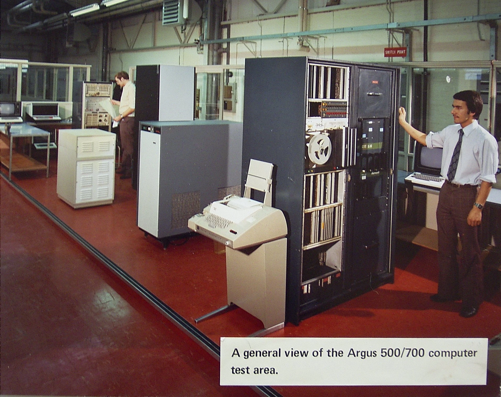
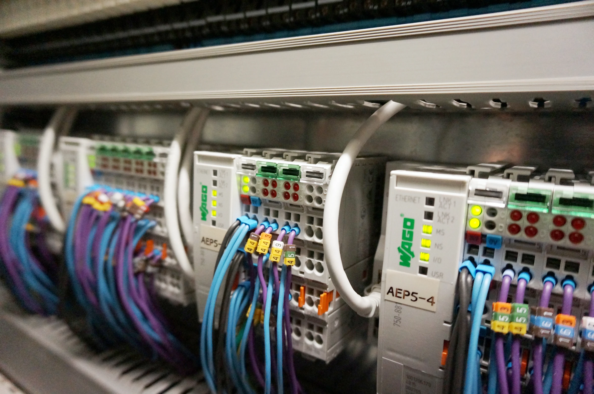
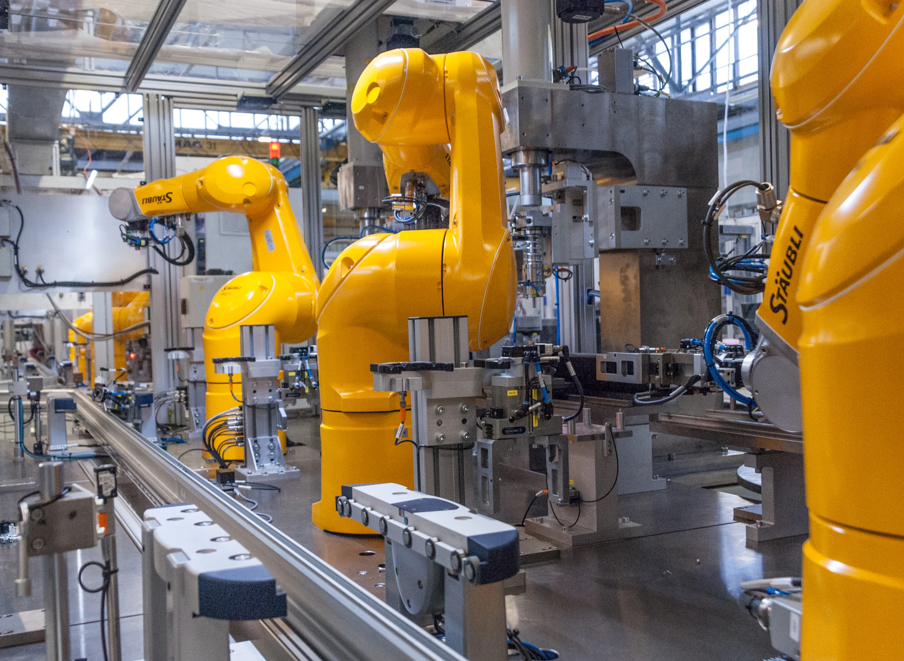

Sources current to 5 October 2026

Global scope, with emphasis on China, Europe and the United States. Market measures retain their exact regions, periods, currencies and definitions. Supporting Evidence appears in a separate appendix after Parts 1–4.

## Part 1: Industry Story

On 5 October 2026, Schneider Electric and PTC announced that they had signed a definitive acquisition agreement. The proposed cash price was US$205 per share, valuing PTC&#x27;s equity at approximately US$22.6 billion. A supplier with automation and operations software was seeking to acquire a company whose products manage engineering and product information. The announcement offers a concrete way into a larger industry question: what changes when the information used to design a product is connected to the systems used to make it? The agreement was an announced transaction at this report&#x27;s cutoff; completion is not assumed. [<a class="evidence-cite" href="#evidence-E025" aria-label="Evidence E025">E025</a>, <a class="evidence-cite" href="#evidence-E003" aria-label="Evidence E003">E003</a>, <a class="evidence-cite" href="#evidence-E008" aria-label="Evidence E008">E008</a>, <a class="evidence-cite" href="#evidence-E009" aria-label="Evidence E009">E009</a>]

The products make the connection concrete. PTC describes Windchill as a system for product data, lifecycle collaboration and controlled changes, including information from multiple CAD tools. AVEVA, whose remaining shares Schneider acquired in 2023, offers operations software for visualizing equipment, collecting process records and supporting operational decisions. One helps establish and manage what a product is supposed to be. The other helps people understand how an operating process is behaving. Linking those responsibilities is a manufacturing problem with a software and automation business built around it. [<a class="evidence-cite" href="#evidence-E009" aria-label="Evidence E009">E009</a>, <a class="evidence-cite" href="#evidence-E003" aria-label="Evidence E003">E003</a>, <a class="evidence-cite" href="#evidence-E008" aria-label="Evidence E008">E008</a>]

Consider an engineering change as an analytical example. A revised product definition may require a different production instruction, inspection requirement or machine configuration. The useful outcome is a controlled path through those changes: the relevant people see the approved information, the right system executes it, and the factory can trace what happened. A single corporate owner could make some coordination easier, but ownership alone supplies none of those operating results. Models, interfaces, permissions, testing and responsibility still have to align. This example explains the workflow; it does not describe an undisclosed Schneider or PTC customer project. [<a class="evidence-cite" href="#evidence-E007" aria-label="Evidence E007">E007</a>, <a class="evidence-cite" href="#evidence-E009" aria-label="Evidence E009">E009</a>, <a class="evidence-cite" href="#evidence-E013" aria-label="Evidence E013">E013</a>, <a class="evidence-cite" href="#evidence-E016" aria-label="Evidence E016">E016</a>]

The industry&#x27;s central question follows: who can carry engineering information into reliable production, and maintain that connection as products, equipment and security requirements change? The answer involves a long history of translating information into machine actions, a value chain spanning chips to factory operations, and commercial models that reward different kinds of delivery and support. This report follows that sequence. Its global comparison concentrates on China, Europe and the United States, while keeping narrower statistical regions and product categories explicit.

## Part 2: Industry History

### Putting motion into instructions

A useful starting point is the moment when a machine&#x27;s movements could be described as information. In a 1959 MIT programme, researcher J. Francis Reintjes traced the demonstration of numerical-control feasibility to 1952. Encoded numbers on punched tape directed electronic equipment and servomechanisms that moved a machine tool. Douglas Ross then explained APT, which translated descriptions of part geometry and tool movements into machine instructions. The important connection was already visible: engineering information could become a sequence of physical operations. [<a class="evidence-cite" href="#evidence-H001" aria-label="Evidence H001">H001</a>]

We can see the beginnings of a recurring division of labour here. The machine, its motion equipment, the programming system and the person translating manufacturing requirements into instructions each contributed something different. Better hardware alone could not remove the work of describing the part and preparing its operations. This helps explain why industrial software developed alongside machinery: the useful product was a working route from design requirements to repeatable execution, with expertise needed at the boundaries. [<a class="evidence-cite" href="#evidence-H001" aria-label="Evidence H001">H001</a>]

Computer drawing developed a complementary route. Ivan Edward Sutherland&#x27;s January 1963 dissertation described Sketchpad, in which a light pen let a user draw and modify objects on a display. The system stored relationships, reused symbols and applied geometric conditions such as parallel lines. This research example matters because engineering information could carry relationships that changed with a drawing. It was an early technical demonstration, rather than evidence that a commercial CAD market was already established. [<a class="evidence-cite" href="#evidence-H010" aria-label="Evidence H010">H010</a>]

### Making factory control reconfigurable

Programmable control extended this principle to the logic governing factory equipment. Schneider Electric&#x27;s 2019 retrospective dates Modicon&#x27;s conception to 1968 and describes General Motors&#x27; demand for a more flexible alternative to relay wiring. Dick Morley&#x27;s team developed the Modicon 084, allowing functions to be changed through programming without rebuilding the relay connections. The historical significance lies in moving part of the change process into software. It created a continuing role for controller programming, commissioning and maintenance around the physical equipment. [<a class="evidence-cite" href="#evidence-H002" aria-label="Evidence H002">H002</a>]

Process plants developed another important control architecture. Yokogawa&#x27;s anniversary account records the announcement of CENTUM in June 1975 and describes its early use of microprocessors and a CRT interface. We can read this DCS milestone as an expansion of the commercial task: suppliers needed to support monitoring and control across a plant, bringing equipment, operator interfaces and engineering together. These capabilities still occupy distinct positions in the industry. Making control programmable also increased the importance of preserving the knowledge embedded in a configured system when a plant later changed or expanded. [<a class="evidence-cite" href="#evidence-H002" aria-label="Evidence H002">H002</a>, <a class="evidence-cite" href="#evidence-H003" aria-label="Evidence H003">H003</a>]

<figure class="research-photo" id="photo-history-01">

<figcaption>A Ferranti Argus 500 computer system in Edinburgh, photographed in 1980. <small>Photo: <a href="https://commons.wikimedia.org/wiki/User:Leocapaldi" target="_blank" rel="noopener">Leocapaldi</a> · <a href="https://commons.wikimedia.org/wiki/File:Argus_500_1.JPG" target="_blank" rel="noopener">Wikimedia Commons</a> · <a href="https://commons.wikimedia.org/wiki/File:Argus_500_1.JPG#Licensing" target="_blank" rel="noopener">Public domain (author&#x27;s release)</a>. Original linked above; web copies resized and converted to WebP, without cropping.</small></figcaption>
</figure>

### Building product and production models

The engineering side was changing too. PTC&#x27;s product history records the launch of Pro/ENGINEER in 1988. Parameters, constraints and associative updates allowed design intent to be carried within a three-dimensional model, so a change could propagate through related elements. This was one company&#x27;s milestone in a much longer CAD history. Its relevance today is the growing value of the model itself: engineering software became a place to maintain relationships and decisions, which could become as consequential to a manufacturer as the drawing or final physical component. [<a class="evidence-cite" href="#evidence-H004" aria-label="Evidence H004">H004</a>]

PTC introduced Windchill in 1998, using a shared web architecture for lifecycle collaboration. The scope widened from creating a design to coordinating product information across teams. Manufacturing operations needed another kind of shared model. ISA&#x27;s committee history dates the first publication of ISA-95 to 2000: Parts 1 and 2 defined enterprise–control exchanges and their framework, while later parts formalised manufacturing operations management at level 3. These were logical integration boundaries, giving different systems a clearer way to describe their responsibilities and information. [<a class="evidence-cite" href="#evidence-H004" aria-label="Evidence H004">H004</a>, <a class="evidence-cite" href="#evidence-H006" aria-label="Evidence H006">H006</a>]

This history helps explain today&#x27;s separate CAD, PLM and manufacturing-operations markets. They grew around different decisions, users and information structures. Connecting them requires agreement on what a product, resource or production operation means, as well as a technical interface. We therefore see migration and integration as work on accumulated models and practices. Moving files or buying a new application addresses only part of that work; the business value depends on preserving useful relationships across the workflow. [<a class="evidence-cite" href="#evidence-H004" aria-label="Evidence H004">H004</a>, <a class="evidence-cite" href="#evidence-H006" aria-label="Evidence H006">H006</a>]

### Connecting systems and renewing software

Interoperability became an explicit collective project. The OPC Foundation traces its standards activity to 1996. Its joint group with PLCopen began in 2008, and a controller client specification followed in 2014, supporting exchanges between controllers and with systems such as MES and ERP. The significance was a common route across suppliers and system levels. That route still required implementation and integration. Standardised communication and information models still needed to be matched to the meaning, quality and use of data in a particular plant. [<a class="evidence-cite" href="#evidence-H005" aria-label="Evidence H005">H005</a>]

Germany&#x27;s Industrie 4.0 initiative, launched in early 2011, gave this integration ambition a broader policy framework. The April 2013 working-group report called for horizontal integration through value networks, engineering integration across the value chain, and vertical integration of networked manufacturing. Those were recommendations requiring further research and implementation. We can see why platform strategies later became attractive: the proposed value depended on connecting previously separate activities. It also made standards, system complexity and the installed factory important to the commercial proposition. [<a class="evidence-cite" href="#evidence-H007" aria-label="Evidence H007">H007</a>]

Licensing changed alongside this wider scope. PTC announced in January 2018 a broader subscription-only policy for new core-software and ThingWorx licences from January 2019, following a January 2018 transition in the Americas and Western Europe. China and several other markets remained exceptions; existing perpetual licences stayed usable, and Kepware retained both forms. Subscription created a continuing renewal relationship, changing how access, upgrades and spending could be organised. It did not by itself determine where software ran. This distinction remains central when comparing recurring revenue with cloud deployment. [<a class="evidence-cite" href="#evidence-H008" aria-label="Evidence H008">H008</a>]

### Bringing AI into industrial engineering

On 31 October 2023, Siemens and Microsoft introduced Siemens Industrial Copilot, a jointly developed generative-AI assistant for manufacturing. The announcement described generating, optimising and debugging automation code by combining industrial information with Azure OpenAI Service. The engineering workflow became a meeting point for control expertise and cloud AI capabilities. We can interpret this as another extension of the industry&#x27;s long-running effort to translate intentions into usable instructions, with a new method for interacting with the information and software already involved. [<a class="evidence-cite" href="#evidence-H009" aria-label="Evidence H009">H009</a>]

The resulting industry carries several generations of capability at once. Motion and control equipment remain necessary; product and operations models organise decisions; interoperability connects them; licences and services shape the ongoing commercial relationship. AI adds another engineering capability within this accumulated structure. Our reading of the history is that competitive value depends on making these layers work together through actual manufacturing changes. That explains the continuing importance of component suppliers, software specialists, platform companies and integrators, each serving a different part of the same practical task. [<a class="evidence-cite" href="#evidence-H001" aria-label="Evidence H001">H001</a>, <a class="evidence-cite" href="#evidence-H002" aria-label="Evidence H002">H002</a>, <a class="evidence-cite" href="#evidence-H003" aria-label="Evidence H003">H003</a>, <a class="evidence-cite" href="#evidence-H004" aria-label="Evidence H004">H004</a>, <a class="evidence-cite" href="#evidence-H005" aria-label="Evidence H005">H005</a>, <a class="evidence-cite" href="#evidence-H006" aria-label="Evidence H006">H006</a>, <a class="evidence-cite" href="#evidence-H007" aria-label="Evidence H007">H007</a>, <a class="evidence-cite" href="#evidence-H008" aria-label="Evidence H008">H008</a>, <a class="evidence-cite" href="#evidence-H009" aria-label="Evidence H009">H009</a>]

## Part 3: Market Landscape

### The value chain begins with a physical measurement

Industrial automation turns measurements into actions: a sensor detects a condition, a controller evaluates it, and a drive or actuator changes the physical process. Industrial software also defines the product, tests its design, schedules and records production, and manages changes across its life. The useful industry boundary therefore follows the manufacturing workflow. It includes components, control systems, engineering and operations software, robotic equipment, machine integration and factory use. This is the working scope of this report; individual market statistics below retain their publishers&#x27; definitions. [<a class="evidence-cite" href="#evidence-E004" aria-label="Evidence E004">E004</a>, <a class="evidence-cite" href="#evidence-E006" aria-label="Evidence E006">E006</a>, <a class="evidence-cite" href="#evidence-E007" aria-label="Evidence E007">E007</a>, <a class="evidence-cite" href="#evidence-E020" aria-label="Evidence E020">E020</a>]

Upstream suppliers make the ingredients of an automation system. Texas Instruments lists analog and embedded devices for sensing, communication, motor control and power conversion. SICK&#x27;s 2022 business description covers sensors, cameras and encoders; Inovance&#x27;s product directory includes AC drives, servo drives and motors. Their immediate customers can be equipment and system manufacturers rather than the final factory alone. These examples establish product roles, without establishing a procurement relationship between any two named companies. [<a class="evidence-cite" href="#evidence-E004" aria-label="Evidence E004">E004</a>, <a class="evidence-cite" href="#evidence-E005" aria-label="Evidence E005">E005</a>, <a class="evidence-cite" href="#evidence-E021" aria-label="Evidence E021">E021</a>, <a class="evidence-cite" href="#evidence-E023" aria-label="Evidence E023">E023</a>]

The value of this layer is application fitness. A sensor must capture the relevant physical signal, a processor must handle the required computation, and a drive must work with the selected motor and machine. In our analysis, a lower component price creates value only if qualification, replacement availability and engineering work remain acceptable over the equipment&#x27;s service life. NIST&#x27;s discussion of long-lived operational technology explains why support and compatibility belong in the purchasing decision. The available product descriptions do not measure global component shortages or any country&#x27;s import dependence. [<a class="evidence-cite" href="#evidence-E004" aria-label="Evidence E004">E004</a>, <a class="evidence-cite" href="#evidence-E005" aria-label="Evidence E005">E005</a>, <a class="evidence-cite" href="#evidence-E013" aria-label="Evidence E013">E013</a>, <a class="evidence-cite" href="#evidence-E021" aria-label="Evidence E021">E021</a>]

### Control, operations and engineering solve different tasks

In the middle of the chain, PLCs execute machine logic and motion tasks; distributed control systems coordinate process operations. Siemens&#x27; 2024 SIMATIC S7-1200 G2 announcement describes TIA Portal engineering and motion functions. SUPCON describes the ECS-700 DCS within an architecture of instruments, I/O, operator and engineering stations, process records and related systems. Inovance&#x27;s H5U PLC provides another disclosed machine-control example. A comparison between these products must start with the process and required control functions, rather than treating every controller as a substitute for every other controller. [<a class="evidence-cite" href="#evidence-E006" aria-label="Evidence E006">E006</a>, <a class="evidence-cite" href="#evidence-E019" aria-label="Evidence E019">E019</a>, <a class="evidence-cite" href="#evidence-E024" aria-label="Evidence E024">E024</a>]

<figure class="research-photo" id="photo-control-01">

<figcaption>A WAGO controller in a pharmaceutical monitoring setup, photographed in 2016. <small>Photo: <a href="https://commons.wikimedia.org/wiki/User:Pierre75000" target="_blank" rel="noopener">Pierre75000</a> · <a href="https://commons.wikimedia.org/wiki/File:Automate_industriel_WAGO_pour_un_syst%C3%A8me_de_monitoring_en_industrie_pharmaceutique.jpg" target="_blank" rel="noopener">Wikimedia Commons</a> · <a href="https://creativecommons.org/licenses/by-sa/4.0/" target="_blank" rel="noopener">CC BY-SA 4.0 International</a>. Original linked above; web copies resized and converted to WebP, without cropping.</small></figcaption>
</figure>

Above the immediate control task, HMI and SCADA present operating conditions, while historians preserve process data. AVEVA Operations Control packages visualization, historian, reporting and communication tools with subscription entitlements. MES addresses production execution: recipes, work in progress, quality, material tracking and product genealogy. Rockwell places this software between enterprise systems and shop-floor controls and identifies FactoryTalk ProductionCentre and Plex as examples. For the factory, the commercial question is whether the software can make production information usable at the point of a decision, and whether its interfaces and support fit existing operations. [<a class="evidence-cite" href="#evidence-E007" aria-label="Evidence E007">E007</a>, <a class="evidence-cite" href="#evidence-E008" aria-label="Evidence E008">E008</a>]

Engineering software acts earlier in the workflow. CAD models product geometry; simulation tests engineering behaviour; PLM governs product information, revisions and change processes. Dassault Systèmes assigns these roles to CATIA, SIMULIA and ENOVIA, and describes DELMIA across manufacturing planning and execution. PTC&#x27;s Windchill manages lifecycle data and collaboration, including multi-CAD information and change traceability. The economic asset here is the accumulated product definition and the work built around it. We infer that migration must preserve usable relationships and revision history, in addition to transferring files; this is a consequence of the disclosed functions, not a measured switching-cost estimate. [<a class="evidence-cite" href="#evidence-E009" aria-label="Evidence E009">E009</a>, <a class="evidence-cite" href="#evidence-E020" aria-label="Evidence E020">E020</a>]

Robotic equipment occupies another middle-chain role: it carries out physical manufacturing tasks under a configured control system. Inovance&#x27;s portfolio includes industrial robots as well as drives and controllers, showing how a supplier can span several branches. A machine builder or factory engineering team must turn the equipment into an application. Our commercial analysis separates the robot delivery from tooling, programming, cell integration and ongoing support; the agreed contract determines which party provides each. The map below separates functions so that a broad company portfolio is not mistaken for a single product market. It also includes named examples of a machine builder and a factory user, rather than assuming that a robot sale completes an entire production system. [<a class="evidence-cite" href="#evidence-E021" aria-label="Evidence E021">E021</a>, <a class="evidence-cite" href="#evidence-E023" aria-label="Evidence E023">E023</a>, <a class="evidence-cite" href="#evidence-E012" aria-label="Evidence E012">E012</a>]

<figure class="research-photo" id="photo-robot-01">

<figcaption>Stäubli industrial robots on a manufacturing line, photographed in January 2023. <small>Photo: <a href="https://commons.wikimedia.org/wiki/User:Clemenspool" target="_blank" rel="noopener">Clemenspool</a> · <a href="https://commons.wikimedia.org/wiki/File:Staeubli_Robots_line.jpg" target="_blank" rel="noopener">Wikimedia Commons</a> · <a href="https://creativecommons.org/publicdomain/zero/1.0/" target="_blank" rel="noopener">CC0 1.0</a>. Original linked above; web copies resized and converted to WebP, without cropping.</small></figcaption>
</figure>



Figure 1. Industry value chain: global representative products and users. The hierarchy is industry → upstream, midstream and downstream → functional segment → company or product. Source references appear at the leaves; branches classify roles. A company can supply equipment and software while also operating its own factory. [<a class="evidence-cite" href="#evidence-E004" aria-label="Evidence E004">E004</a>, <a class="evidence-cite" href="#evidence-E005" aria-label="Evidence E005">E005</a>, <a class="evidence-cite" href="#evidence-E006" aria-label="Evidence E006">E006</a>, <a class="evidence-cite" href="#evidence-E007" aria-label="Evidence E007">E007</a>, <a class="evidence-cite" href="#evidence-E008" aria-label="Evidence E008">E008</a>, <a class="evidence-cite" href="#evidence-E009" aria-label="Evidence E009">E009</a>, <a class="evidence-cite" href="#evidence-E012" aria-label="Evidence E012">E012</a>, <a class="evidence-cite" href="#evidence-E019" aria-label="Evidence E019">E019</a>, <a class="evidence-cite" href="#evidence-E020" aria-label="Evidence E020">E020</a>, <a class="evidence-cite" href="#evidence-E021" aria-label="Evidence E021">E021</a>, <a class="evidence-cite" href="#evidence-E024" aria-label="Evidence E024">E024</a>]

<a href="value-chain.svg" download>Download printable map (SVG)</a> · <a href="value-chain-nodes.en.csv" download>Download map nodes (CSV)</a>

### The downstream customer buys a working production process

Machine builders and integrators connect mechanical equipment, control programs and information flows for an application. Factory operators then run, maintain and modify the resulting assets. Siemens&#x27; November 2024 release identifies thyssenkrupp Automation Engineering as a special-machine and plant builder using its engineering copilot in a battery quality-inspection machine. The same release describes an operations-copilot application on soldering machines at Siemens&#x27; Electronics Factory Erlangen. These are distinct positions in the chain, even though a common supplier supports both. The disclosure verifies the applications; it supplies no independently audited payback period. [<a class="evidence-cite" href="#evidence-E012" aria-label="Evidence E012">E012</a>]

Business models consequently follow different deliverables. A component supplier provides devices; a controls supplier combines equipment with engineering tools and support; an engineering-software vendor licenses software supporting a workflow; and a service organization provides agreed implementation, maintenance or continuing support. AVEVA explicitly offers subscription software across on-premises, cloud and hybrid deployments. PTC&#x27;s licensing transition also left existing perpetual rights intact. Subscription describes a payment and entitlement relationship; deployment describes where the software runs. Keeping these dimensions separate is essential when comparing commercial offers. [<a class="evidence-cite" href="#evidence-E008" aria-label="Evidence E008">E008</a>, <a class="evidence-cite" href="#evidence-H008" aria-label="Evidence H008">H008</a>, <a class="evidence-cite" href="#evidence-E104" aria-label="Evidence E104">E104</a>]

For the buyer, our suggested comparison is the cost of the complete operating workflow: equipment and licences, integration and validation, training, support, future changes and a feasible exit. For the supplier, the corresponding questions are what is delivered once, what must be maintained over time, and which party bears the cost of an implementation problem. This framework explains why recurring revenue can coexist with substantial engineering work. It also explains why a vendor&#x27;s software label cannot, on its own, establish either its profit margin or the customer&#x27;s total cost. The segment disclosures later in this section provide concrete accounting evidence. [<a class="evidence-cite" href="#evidence-E008" aria-label="Evidence E008">E008</a>, <a class="evidence-cite" href="#evidence-E013" aria-label="Evidence E013">E013</a>, <a class="evidence-cite" href="#evidence-E104" aria-label="Evidence E104">E104</a>]

### Market size depends on what is being counted

The available evidence describes several substantial markets. Three figures are useful because each points to a different source of demand: engineering software used to develop products, industrial-software product revenue reported in China, and control systems sold into Chinese process industries. Their boundaries need to remain visible when discussing market size. [<a class="evidence-cite" href="#evidence-E207" aria-label="Evidence E207">E207</a>, <a class="evidence-cite" href="#evidence-E208" aria-label="Evidence E208">E208</a>, <a class="evidence-cite" href="#evidence-E201" aria-label="Evidence E201">E201</a>]

<table data-report-block="P3-17"><thead><tr><th scope="col">Scope and source</th><th scope="col">Statistical year; amount</th><th scope="col">Published growth</th></tr></thead><tbody><tr><td>Global broad PLM economy — CIMdata estimate</td><td>2025; USD 88.3bn</td><td>+9.9%</td></tr><tr><td>China industrial-software products — MIIT</td><td>2025; RMB 333.0bn</td><td>+9.7%</td></tr><tr><td>China DCS — MIR estimate</td><td>2024; approximately RMB 11.76bn</td><td>−3.6%</td></tr></tbody></table>

These are separately defined revenue/value measures, in their original currencies. They are not components of a combined total. Sources: [<a class="evidence-cite" href="#evidence-E207" aria-label="Evidence E207">E207</a>, <a class="evidence-cite" href="#evidence-E208" aria-label="Evidence E208">E208</a>, <a class="evidence-cite" href="#evidence-E201" aria-label="Evidence E201">E201</a>].

CIMdata’s PLM definition stretches well beyond a product-data-management application. It includes engineering tools such as mechanical CAD, CAM, simulation and analysis, electronic-design automation and architecture/engineering/construction software, alongside innovation platforms and digital manufacturing. Its release identifies notable growth in EDA and AEC. This helps explain why a broad engineering-software economy can grow for reasons extending beyond manufacturers’ spending on shop-floor systems. China’s MIIT product-revenue category covers a different geography and statistical boundary; DCS includes hardware, software, services and engineering. Adding the three amounts would therefore mix different years, overlap software categories and combine unlike businesses. [<a class="evidence-cite" href="#evidence-E207" aria-label="Evidence E207">E207</a>, <a class="evidence-cite" href="#evidence-E208" aria-label="Evidence E208">E208</a>, <a class="evidence-cite" href="#evidence-E201" aria-label="Evidence E201">E201</a>]

MIIT reports RMB 333.0bn of industrial-software product revenue for 2025 and growth of 9.7%. Its earlier 2024 release reported RMB 294.0bn. Dividing those two published amounts produces approximately 13.3%: (333.0/294.0 − 1) × 100. The basis for reconciling those amounts with the official growth rate has not been established here, so 9.7% remains the cited growth rate and the two releases are not turned into a continuous growth chart. [<a class="evidence-cite" href="#evidence-E208" aria-label="Evidence E208">E208</a>, <a class="evidence-cite" href="#evidence-E209" aria-label="Evidence E209">E209</a>]

MIR’s public DCS estimate offers a different competitive signal: a market can contract while an established domestic supplier retains a substantial position. The excerpt places SUPCON at 40.4% of China’s 2024 DCS market, whose delivered offering includes services and engineering. This attributed estimate identifies a specific process-control position; it does not establish supplier profitability or individual system prices. [<a class="evidence-cite" href="#evidence-E201" aria-label="Evidence E201">E201</a>, <a class="evidence-cite" href="#evidence-E202" aria-label="Evidence E202">E202</a>]

### Different regions, different installation cycles

Industrial-robot installations provide a cleaner physical comparison across regions. IFR reports that global additions exceeded 600,000 in 2025, up 11%. China expanded faster than that global pace, the United States also grew, and EU27 installations fell. These figures describe new industrial robots installed during the same calendar year, making the direction of demand comparable even though the regions differ greatly in population and manufacturing scale. [<a class="evidence-cite" href="#evidence-E204" aria-label="Evidence E204">E204</a>, <a class="evidence-cite" href="#evidence-E205" aria-label="Evidence E205">E205</a>, <a class="evidence-cite" href="#evidence-E206" aria-label="Evidence E206">E206</a>]

<table data-report-block="P3-23"><thead><tr><th scope="col">Market</th><th scope="col">2025 new installations (units)</th><th scope="col">Year-on-year change</th></tr></thead><tbody><tr><td>China</td><td>354,000</td><td>+20%</td></tr><tr><td>United States</td><td>38,400</td><td>+12%</td></tr><tr><td>EU27</td><td>60,500</td><td>−11%</td></tr></tbody></table>

IFR public releases. US value follows the country-specific release; the global summary says almost 38,500. EU27 is not all Europe. Counts retain published precision. Sources: [<a class="evidence-cite" href="#evidence-E204" aria-label="Evidence E204">E204</a>, <a class="evidence-cite" href="#evidence-E205" aria-label="Evidence E205">E205</a>, <a class="evidence-cite" href="#evidence-E206" aria-label="Evidence E206">E206</a>].

China represented 59% of global deployments according to IFR. Chinese suppliers installed 195,000 units in their home market, up 15%, but their category share fell from 57% to 55% as total Chinese installations grew faster. The point is economically useful: increasing domestic suppliers’ volume can coexist with a lower share of a faster-growing market. The evidence does not identify a single cause, such as price, quality or policy, for that change. [<a class="evidence-cite" href="#evidence-E204" aria-label="Evidence E204">E204</a>]



Figure 2. China industrial-robot installations by supplier origin, 2025: Chinese suppliers 55%; all other supplier origins 45%. The second category is calculated as 100% − 55%. Denominator: annual new installations in China; source: IFR [<a class="evidence-cite" href="#evidence-E204" aria-label="Evidence E204">E204</a>].

The chart is a supplier-origin split, not a ranking of individual robot manufacturers. It also counts installations rather than sales revenue: a unit installed in one application need not have the same selling price or integration cost as a unit in another. Its value is to show how much of China’s annual deployment is supplied by the domestic category, without pretending to measure the whole value captured by automation suppliers. A common vendor-share denominator covering this report&#x27;s combined global scope was not established in the reviewed public evidence. ARC/Control&#x27;s automation definition, for example, excludes robotics and several other categories. The chart consequently uses the explicitly defined robot submarket and installation measure. [<a class="evidence-cite" href="#evidence-E204" aria-label="Evidence E204">E204</a>, <a class="evidence-cite" href="#evidence-E212" aria-label="Evidence E212">E212</a>]

The United States illustrates the distinction between robot manufacturing and deployment capability. IFR describes many domestic system integrators, while saying that most robots are still imported from Japan and Europe. Automotive remained its largest customer sector, with 13,500 installations, down 1%, even as total installations rose 12%; food and beverage grew 30% to 2,900. Those figures support a reading of demand spreading beyond the largest established customer sector, rather than an automotive-led explanation for all growth. [<a class="evidence-cite" href="#evidence-E205" aria-label="Evidence E205">E205</a>]

EU27 presents a large installed base with weaker new investment. Its operating stock reached 712,000 units at year-end 2025, while new installations fell 11%. Automotive additions declined 25% to 14,900 and metal-industry additions 13% to 13,000; food and beverage increased 4% to 5,300. This sector pattern helps explain the aggregate decline without claiming that it exhausts the causes. Germany accounted for 41% of EU27 installations, making the largest national market particularly important to regional equipment demand. A declining annual flow does not erase the existing base that may need maintenance, integration and upgrades; that last implication is an analytical inference, not a measured service-market estimate. [<a class="evidence-cite" href="#evidence-E206" aria-label="Evidence E206">E206</a>]

### Reading company results through their business models

Recent company disclosures show where growth and profit appeared within large suppliers. Siemens and Rockwell report fiscal third quarters ending 30 June 2026; Schneider’s comparison below uses the six months ending on that date. Each operates globally, so these are company operating results rather than indicators of demand in its home country. [<a class="evidence-cite" href="#evidence-E101" aria-label="Evidence E101">E101</a>, <a class="evidence-cite" href="#evidence-E102" aria-label="Evidence E102">E102</a>, <a class="evidence-cite" href="#evidence-E105" aria-label="Evidence E105">E105</a>]

<table data-report-block="P3-31"><thead><tr><th scope="col">Business; reporting period</th><th scope="col">Revenue and growth</th><th scope="col">Profit and recurring-business measures</th></tr></thead><tbody><tr><td>Siemens Digital Industries; Q3 FY2026</td><td>EUR 4.9bn; +10% comparable. Software subset EUR 1.8bn; +15%.</td><td>Segment profit EUR 923m; margin 18.7%. ARR EUR 5.7bn; +11% organic.</td></tr><tr><td>Rockwell Software &amp; Control; Q3 FY2026</td><td>USD 751m; +19% reported/+18% organic.</td><td>Segment operating earnings USD 261m; margin 34.8%. Group organic ARR +6%.</td></tr><tr><td>Schneider Industrial Automation; H1 calendar 2026</td><td>EUR 3.585bn; +7.7% organic.</td><td>Adjusted EBITA EUR 501m; margin 14.0%. AVEVA ARR +11% at 30 June.</td></tr></tbody></table>

Currencies and reporting periods remain separate. Schneider’s Q2 Industrial Automation growth was 11% organic [<a class="evidence-cite" href="#evidence-E103" aria-label="Evidence E103">E103</a>]; the table uses H1 amounts from <a class="evidence-cite" href="#evidence-E105" aria-label="Evidence E105">E105</a>. Profit measures are company-defined; group ARR and AVEVA ARR are labelled separately. Sources: [<a class="evidence-cite" href="#evidence-E101" aria-label="Evidence E101">E101</a>, <a class="evidence-cite" href="#evidence-E102" aria-label="Evidence E102">E102</a>, <a class="evidence-cite" href="#evidence-E103" aria-label="Evidence E103">E103</a>, <a class="evidence-cite" href="#evidence-E105" aria-label="Evidence E105">E105</a>].

Siemens provides a direct link between the software contribution and segment profitability: Digital Industries’ profit rose 44%, and the company identified software as the largest contributor to the improvement. The segment margin rose from 14.5% to 18.7%. Orders were EUR 4.9bn, up 9% comparably, alongside revenue of the same rounded amount, up 10%. Orders indicate incoming business; revenue records what was recognized in the quarter. ARR supplies a separate view of recurring business. Their different growth rates describe different commercial stages, rather than three versions of the same sale. [<a class="evidence-cite" href="#evidence-E101" aria-label="Evidence E101">E101</a>]

Rockwell permits a useful comparison within one company and quarter. Segment operating margins were 34.8% in Software &amp; Control, 20.0% in Intelligent Devices and 15.1% in Lifecycle Services. Its filing describes predominantly point-in-time product revenue in Intelligent Devices, a product/software combination in Software &amp; Control, and predominantly over-time solutions/services revenue in Lifecycle Services. Large systems and services are mainly sold directly; products also rely on distributors. Our interpretation is that product reuse, engineering delivery and the timing of contract performance create different operating demands, so an automation supplier needs more than one earnings model. [<a class="evidence-cite" href="#evidence-E102" aria-label="Evidence E102">E102</a>, <a class="evidence-cite" href="#evidence-E104" aria-label="Evidence E104">E104</a>]

Higher volume was Rockwell’s stated main driver of Software &amp; Control margin improvement. Strong project execution and the Sensia dissolution benefited Lifecycle Services’ margin despite lower sales. Schneider similarly reported support-function cost leverage while Industrial Automation’s gross margin slipped slightly because productivity and pricing did not fully offset raw-material inflation and tariffs. Its adjusted EBITA margin nevertheless improved from 13.7% to 14.0%. These disclosures show why revenue growth and margin movement need separate explanations; they do not isolate software subscriptions as the sole cause of profitability. [<a class="evidence-cite" href="#evidence-E102" aria-label="Evidence E102">E102</a>, <a class="evidence-cite" href="#evidence-E105" aria-label="Evidence E105">E105</a>]

Contract indicators add another dimension. Rockwell disclosed about USD 1.375bn of remaining performance obligations, of which about USD 820m was expected to become revenue within 12 months. The measure excludes specified short contracts, invoice-based services and unexercised renewals. Its ARR instead represents the annual contract value of active recurring contracts and is expressly separate from revenue, contract liabilities and backlog. A growing ARR can help track a recurring relationship; RPO can help assess committed work still to be recognized. Neither alone supplies a complete forecast of future sales or cash. [<a class="evidence-cite" href="#evidence-E102" aria-label="Evidence E102">E102</a>, <a class="evidence-cite" href="#evidence-E104" aria-label="Evidence E104">E104</a>]

Schneider’s Industrial Automation business also grew unevenly by geography: H1 organic growth was 5% in North America, 7% in Europe and 12% in China and East Asia. The company associated Chinese growth with discrete automation, packaging/material handling and improving OEM activity, while AVEVA contributed across regions. These are segment-specific explanations for 2026 sales, alongside the different 2025 robot-installation cycle. Read together, the evidence points to a market whose direction depends on application, geography and how the supplier earns and recognizes revenue. [<a class="evidence-cite" href="#evidence-E105" aria-label="Evidence E105">E105</a>, <a class="evidence-cite" href="#evidence-E204" aria-label="Evidence E204">E204</a>, <a class="evidence-cite" href="#evidence-E205" aria-label="Evidence E205">E205</a>, <a class="evidence-cite" href="#evidence-E206" aria-label="Evidence E206">E206</a>]

### Competition moves across the workflow

The competitive landscape has three overlapping forms. Controls companies can add engineering and operations software to their installed equipment base. Software specialists can deepen the product model or manufacturing workflow. Integrators can combine products from different suppliers for a particular process. These positions are visible in the portfolios and applications above. In our analysis, the practical dividing line is where a supplier takes responsibility: an interface, a software task, a configured machine or a continuing production outcome. Portfolio breadth and implementation responsibility should therefore be assessed separately. [<a class="evidence-cite" href="#evidence-E006" aria-label="Evidence E006">E006</a>, <a class="evidence-cite" href="#evidence-E007" aria-label="Evidence E007">E007</a>, <a class="evidence-cite" href="#evidence-E008" aria-label="Evidence E008">E008</a>, <a class="evidence-cite" href="#evidence-E009" aria-label="Evidence E009">E009</a>, <a class="evidence-cite" href="#evidence-E012" aria-label="Evidence E012">E012</a>, <a class="evidence-cite" href="#evidence-E020" aria-label="Evidence E020">E020</a>]

Completed acquisitions show established suppliers extending that scope. Schneider Electric completed the purchase of the AVEVA shares it did not already own on 18 January 2023. Emerson completed its purchase of the remaining AspenTech shares on 12 March 2025, making it a wholly owned subsidiary within Control Systems &amp; Software. Siemens completed its Altair acquisition on 26 March 2025 for an enterprise value of approximately US$10 billion, adding simulation, high-performance computing, data science and AI capabilities. These transactions have different histories; in particular, buying remaining shares is a change from an existing ownership position. [<a class="evidence-cite" href="#evidence-E003" aria-label="Evidence E003">E003</a>, <a class="evidence-cite" href="#evidence-E002" aria-label="Evidence E002">E002</a>, <a class="evidence-cite" href="#evidence-E001" aria-label="Evidence E001">E001</a>]

The strategic attraction is a broader route from engineering decisions to operating information. Our interpretation is that a connected portfolio can reduce handoffs if models, permissions and change processes actually align. It can also concentrate dependency in one supplier and create a larger migration task when a customer changes platforms. Acquisition announcements establish ownership and stated intentions; the buyer still needs evidence of compatible versions, usable interfaces, support terms and application-level results. The disclosed transactions do not supply a common measure of global industry concentration. [<a class="evidence-cite" href="#evidence-E001" aria-label="Evidence E001">E001</a>, <a class="evidence-cite" href="#evidence-E002" aria-label="Evidence E002">E002</a>, <a class="evidence-cite" href="#evidence-E003" aria-label="Evidence E003">E003</a>, <a class="evidence-cite" href="#evidence-E009" aria-label="Evidence E009">E009</a>, <a class="evidence-cite" href="#evidence-E016" aria-label="Evidence E016">E016</a>]

For a supplier, this makes the renewal and expansion of a working customer process a useful test of competitiveness. For a customer, it makes continuity through the next product change, equipment upgrade or security update a useful test of value. These are our proposed evaluation criteria, rather than a ranking of companies. They connect the regional demand and segment economics above to the central industry question: which supplier can carry engineering information into dependable production while keeping the system supportable over time? [<a class="evidence-cite" href="#evidence-E009" aria-label="Evidence E009">E009</a>, <a class="evidence-cite" href="#evidence-E012" aria-label="Evidence E012">E012</a>, <a class="evidence-cite" href="#evidence-E013" aria-label="Evidence E013">E013</a>, <a class="evidence-cite" href="#evidence-E104" aria-label="Evidence E104">E104</a>]

## Part 4: Industry Challenges

### Existing factories make verification part of the product

A factory upgrade must fit a process that already works. NIST&#x27;s OT security guidance describes requirements for predictable response, safety and continuity, alongside legacy systems that may run unsupported operating systems. Routine rebooting can be unsuitable, and software changes require testing and staged implementation. The resulting challenge extends beyond installing a newer application: a change in communications, controller software or equipment behaviour can affect production and safety together. In our assessment, the scarce resource in a brownfield project is often a controlled opportunity to verify the whole workflow, including its response when a component fails. [<a class="evidence-cite" href="#evidence-E013" aria-label="Evidence E013">E013</a>]

A practical approach is to document dependencies, test changes away from the live process where feasible, agree an acceptance window, and prepare recovery steps before deployment. Buyers also need a support plan covering controller firmware, operating systems, application versions and available engineering expertise. These are analytical recommendations derived from the operating constraints, rather than a universal installation recipe. A test environment may omit physical conditions present in production; a successful trial therefore reduces uncertainty without removing the need for site acceptance. Support commitments also have to survive future version changes and changes of supplier. [<a class="evidence-cite" href="#evidence-E013" aria-label="Evidence E013">E013</a>]

### Interoperability needs meaning, permission and responsibility

The OPC Foundation describes OPC UA as a framework combining communications, information models and access mechanisms, with authentication, encryption and auditing. IDTA&#x27;s 10 June 2025 AAS announcement adds fine-grained access control for properties, submodels and registry or repository services. These mechanisms offer a useful route through a basic integration problem: two systems may exchange a value yet interpret its identity, units, revision or permitted use differently. Their availability in a standard establishes a design path; implementation in a particular product and agreement between particular systems still require verification. [<a class="evidence-cite" href="#evidence-E016" aria-label="Evidence E016">E016</a>, <a class="evidence-cite" href="#evidence-E017" aria-label="Evidence E017">E017</a>]

Our proposed starting point is a bounded workflow, such as carrying an approved engineering change into production records. PTC describes Windchill&#x27;s multi-CAD management, controlled product changes and traceability, giving that workflow an identifiable information-management role. Implementation then needs agreed identifiers, version rules, authorized users and responsibility for exceptions. Technical permissions can restrict access to selected fields, while contracts must establish who may retain, reuse or transfer the data. Neither layer resolves every semantic disagreement. Buyers should therefore assess export and migration arrangements alongside the interface demonstration, with validation costs included in the commercial decision. [<a class="evidence-cite" href="#evidence-E009" aria-label="Evidence E009">E009</a>, <a class="evidence-cite" href="#evidence-E016" aria-label="Evidence E016">E016</a>, <a class="evidence-cite" href="#evidence-E017" aria-label="Evidence E017">E017</a>]

### AI assistance shifts work towards review and verification

Siemens and Microsoft introduced Industrial Copilot on 31 October 2023 with functions for generating, optimizing and debugging automation code. Siemens&#x27; November 2024 release described a thyssenkrupp Automation Engineering battery-inspection machine using the engineering assistant, and an operations assistant used on soldering machines at Siemens&#x27; Erlangen factory. These vendor-disclosed applications show where assistance enters engineering and maintenance. The difficult transition is from a plausible answer to an approved machine change: code must fit the controller, process sequence and failure conditions, while maintenance advice must match the installed equipment and current documentation. [<a class="evidence-cite" href="#evidence-H009" aria-label="Evidence H009">H009</a>, <a class="evidence-cite" href="#evidence-E012" aria-label="Evidence E012">E012</a>, <a class="evidence-cite" href="#evidence-E013" aria-label="Evidence E013">E013</a>]

We would evaluate an assistant through a reviewed workflow: identify its information sources and versions, restrict access, test proposed code, and retain human approval for deployment. Evaluation should count review time, integration, computing and ongoing support alongside time saved in drafting. Rockwell&#x27;s filing distinguishes product, software and services delivery, a reminder that the commercial package extends beyond an assistant&#x27;s licence. The cited AI announcements provide no independently measured return on investment. A useful pilot should consequently measure accepted work and its total cost at the customer site, including corrections, rather than treating the volume of generated code as the outcome. [<a class="evidence-cite" href="#evidence-H009" aria-label="Evidence H009">H009</a>, <a class="evidence-cite" href="#evidence-E012" aria-label="Evidence E012">E012</a>, <a class="evidence-cite" href="#evidence-E013" aria-label="Evidence E013">E013</a>, <a class="evidence-cite" href="#evidence-E104" aria-label="Evidence E104">E104</a>]

### Security duties continue after installation

Europe&#x27;s Cyber Resilience Act gives lifecycle security a concrete timetable. Reporting obligations began on 11 September 2026: the Commission describes an early warning within 24 hours of awareness and full notification within 72 hours for relevant actively exploited vulnerabilities and severe security incidents. These are reporting deadlines. The main product obligations apply from 11 December 2027. Application depends on the product and statutory scope, so a manufacturer needs to establish its actual role before assigning responsibilities. The operational consequence is already clear for covered reporting: someone must recognize an incident, gather information and escalate it in time. [<a class="evidence-cite" href="#evidence-E014" aria-label="Evidence E014">E014</a>, <a class="evidence-cite" href="#evidence-E022" aria-label="Evidence E022">E022</a>]

NIST&#x27;s recommended segmentation, authorized communications and OT-specific training provide practical engineering paths. Our analysis is that these measures work best when linked to maintenance ownership and recovery procedures: a restricted network still needs necessary production traffic, and trained staff still need access to current equipment information. China&#x27;s AI + Manufacturing policy, published on 7 January 2026, similarly emphasizes industrial reliability, safety, data governance and evaluation, with objectives for 2027. Those objectives indicate policy direction. Project results must be assessed separately through operating evidence, with responsibilities and validation suited to the process in each jurisdiction. [<a class="evidence-cite" href="#evidence-E013" aria-label="Evidence E013">E013</a>, <a class="evidence-cite" href="#evidence-E015" aria-label="Evidence E015">E015</a>]

### Supply choices and delivery economics meet at acceptance

Industrial software depends on physical equipment. Texas Instruments describes sensing, communications, motor-control and power-conversion components; Inovance lists drives, motors, controllers and interfaces. These product roles help locate dependencies, while establishing neither a particular supplier relationship nor a current shortage. Our supply-chain analysis therefore starts with qualification: replacing a component or drive may require checking electrical behaviour, interfaces, software compatibility and support arrangements. Alternative suppliers can create options, but each qualified configuration takes engineering work. Procurement should weigh that work against price and availability instead of assuming that products in the same category are interchangeable. [<a class="evidence-cite" href="#evidence-E004" aria-label="Evidence E004">E004</a>, <a class="evidence-cite" href="#evidence-E021" aria-label="Evidence E021">E021</a>, <a class="evidence-cite" href="#evidence-E013" aria-label="Evidence E013">E013</a>]

Delivery economics differ across the chain. Rockwell&#x27;s quarterly filing for the period ended 30 June 2026 describes product revenue recognized predominantly at a point in time for Intelligent Devices, a product-and-software mix in Software &amp; Control, and mainly over-time solutions and services in Lifecycle Services. In our assessment, reusable software and standard configurations can spread development work across customers, while site integration, acceptance and continuing support consume resources with each deployment. Revenue-recognition categories alone establish neither cash timing nor software-only profitability. A sound decision therefore asks what will be accepted, who will maintain it, how a change will be verified, and what the full supported workflow will cost. [<a class="evidence-cite" href="#evidence-E104" aria-label="Evidence E104">E104</a>, <a class="evidence-cite" href="#evidence-E013" aria-label="Evidence E013">E013</a>]

## Appendix: Supporting Evidence

Each record identifies the claim, source, dates, statistical scope and limits. Company disclosures establish what the company reports; third-party estimates retain their original definitions. The evidence cutoff is 5 October 2026; verification includes reading on 6 October. Original research materials are linked to their publishers.

<a href="report-en-v02.txt" download>Download the complete English report (TXT)</a> · <a href="evidence-register.en.json" download>Download source records (JSON)</a>

<section class="research-evidence" id="evidence-E025"><h3>[E025] Schneider Electric to acquire PTC, creating the next level of Energy and Industrial Intelligence</h3>
<strong>Supported claim:</strong> On 5 October 2026, Schneider Electric and PTC announced that they had signed a definitive acquisition agreement. The proposed cash price is US$205 per share, valuing PTC equity at approximately US$22.6 billion.

Schneider Electric and PTC; financial release hosted by Schneider Electric · Primary joint acquisition-agreement announcement, original PDF first page visually read

<a href="https://www.se.com/ww/en/assets/pdf/Schneider-Electric-to-acquire-PTC" target="_blank" rel="noopener">Read the original source</a>

Dates, definitions and reading limits
<dl><dt>Publication date</dt><dd>5 October 2026, release dateline and official index.</dd><dt>Event date</dt><dd>Announcement of a signed agreement on 5 October 2026; actual execution date and completion not established from the read page.</dd><dt>Statistical period</dt><dd>Announcement event at the report&#x27;s evidence cutoff.</dd><dt>Source location</dt><dd>Original 10-page PDF, file/printed page 1: dateline, first paragraph and first Key Highlights bullet. Official index corroborates date and announcement identity.</dd><dt>Geography</dt><dd>France and United States, as in the joint-release dateline; global industrial-software transaction.</dd><dt>Metric and units</dt><dd>US$205 per share; approximately US$22.6 billion equity value for 100% of share capital. Equity value is distinct from enterprise value, revenue and market size.</dd><dt>Definition</dt><dd>An agreement to acquire PTC, distinct from a completed acquisition and from market revenue.</dd><dt>Support and limits</dt><dd>Only original page 1 was visually read. Completion conditions, closing timetable, financing and the remaining nine pages are not used. Stated strategic benefits and synergies are management expectations, not achieved integration results.</dd><dt>Calculation</dt><dd>None.</dd><dt>Reading status</dt><dd>First page actually viewed at readable original resolution by both reference researcher and root on 6 October 2026. Official index actually read. Full PDF not read; inaccessible SEC/search excerpts are not the verification basis.</dd><dt>Reuse of original material</dt><dd>Issuer link only; no original material redistributed.</dd><dt>Read date</dt><dd>2026-10-06</dd></dl>
</section>

<section class="research-evidence" id="evidence-E003"><h3>[E003] Schneider Electric announces completion of transaction to acquire entire share capital of AVEVA</h3>
<strong>Supported claim:</strong> Schneider Electric announced on 18 January 2023 that the scheme to acquire the AVEVA shares it did not already own had become effective and the transaction was complete.

Schneider Electric · Primary company transaction-completion announcement

<a href="https://www.se.com/ww/en/assets/564/document/373415/release-completion-acquisition-aveva.pdf" target="_blank" rel="noopener">Read the original source</a>

Dates, definitions and reading limits
<dl><dt>Publication date</dt><dd>18 January 2023</dd><dt>Event date</dt><dd>Transaction completed on 18 January 2023.</dd><dt>Statistical period</dt><dd>Not applicable: transaction event.</dd><dt>Source location</dt><dd>Single-page PDF, file page 1, title and first two body paragraphs; lines 16–27. No printed page number.</dd><dt>Geography</dt><dd>French acquirer, UK software business; global operations.</dd><dt>Metric and units</dt><dd>Ownership and completion date. No market metric used.</dd><dt>Definition</dt><dd>Company ownership, not a market denominator.</dd><dt>Support and limits</dt><dd>Supports the ownership note for AVEVA. It is an earlier portfolio example, not a 2025 event or evidence that later product integration has been completed.</dd><dt>Calculation</dt><dd>None.</dd><dt>Reading status</dt><dd>Read the cited sections of the publisher&#x27;s original on 5 October 2026. This is not a claim that the entire source was read.</dd><dt>Reuse of original material</dt><dd>Publisher link only; no original material redistributed.</dd><dt>Read date</dt><dd>2026-10-05</dd></dl>
</section>

<section class="research-evidence" id="evidence-E008"><h3>[E008] AVEVA Operations Control Software</h3>
<strong>Supported claim:</strong> AVEVA Operations Control offers subscription entitlements including HMI/SCADA, historian, reporting, communication drivers and collaboration, with on-premises, cloud and hybrid deployment options and disclosed MQTT, OPC UA and REST interfaces.

AVEVA · Primary vendor product, deployment and subscription description

<a href="https://www.aveva.com/en/products/aveva-operations-control/" target="_blank" rel="noopener">Read the original source</a>

Dates, definitions and reading limits
<dl><dt>Publication date</dt><dd>Publication and update dates not disclosed.</dd><dt>Event date</dt><dd>Not applicable: product and subscription description.</dd><dt>Statistical period</dt><dd>Not applicable: no market statistics.</dd><dt>Source location</dt><dd>Product overview, lines 17–21; Deployment options, lines 108–115; interface support, lines 119–121; Subscription Entitlements, lines 124–126.</dd><dt>Geography</dt><dd>Global vendor product description; regional contract terms not disclosed.</dd><dt>Metric and units</dt><dd>Subscription portfolio and deployment options, not market revenue.</dd><dt>Definition</dt><dd>Operations-control software bundle spanning visualization, data collection and related tools.</dd><dt>Support and limits</dt><dd>Verifies the subscription and deployment choices. It does not independently verify unlimited performance, customer ROI or effortless interoperability. Features cannot be backdated to unspecified earlier versions.</dd><dt>Calculation</dt><dd>None.</dd><dt>Reading status</dt><dd>Read the cited sections of the publisher&#x27;s original on 5 October 2026. This is not a claim that the entire source was read.</dd><dt>Reuse of original material</dt><dd>Publisher link only; no original material redistributed.</dd><dt>Read date</dt><dd>2026-10-05</dd></dl>
</section>

<section class="research-evidence" id="evidence-E009"><h3>[E009] Windchill PLM Software | Enterprise PLM System</h3>
<strong>Supported claim:</strong> PTC identifies Windchill as enterprise PLM connecting product data, processes and people across the product lifecycle, with multi-CAD management and connectors. Its regulated-industry section also describes traceability for product data and changes, document control and audit trails.

PTC · Primary vendor product description

<a href="https://www.ptc.com/en/products/windchill" target="_blank" rel="noopener">Read the original source</a>

Dates, definitions and reading limits
<dl><dt>Publication date</dt><dd>Publication and update dates not disclosed.</dd><dt>Event date</dt><dd>Not applicable: product functions and roles.</dd><dt>Statistical period</dt><dd>Not applicable: no market statistics.</dd><dt>Source location</dt><dd>What is Windchill?, web lines 1–3; multi-CAD section, lines 401–408; regulated-industry section, lines 409–418.</dd><dt>Geography</dt><dd>Global vendor product description; regional deployment and sales breakdowns are not disclosed.</dd><dt>Metric and units</dt><dd>PLM functions and product identity; no customer improvement or market figures used.</dd><dt>Definition</dt><dd>Enterprise product lifecycle and data/process management, distinct from CAD geometric design and PLC real-time control.</dd><dt>Support and limits</dt><dd>Supports the disclosed PLM, change-traceability and multi-CAD roles. It does not prove cost-free migration, universal lossless format conversion, achieved regulatory compliance or industry-wide customer benefits.</dd><dt>Calculation</dt><dd>None.</dd><dt>Reading status</dt><dd>Read the cited sections of the publisher&#x27;s original on 5 October 2026. This is not a claim that the entire source was read.</dd><dt>Reuse of original material</dt><dd>Publisher link only; no original material redistributed.</dd><dt>Read date</dt><dd>2026-10-05</dd></dl>
</section>

<section class="research-evidence" id="evidence-E007"><h3>[E007] What is Manufactuing Execution System?</h3>
<strong>Supported claim:</strong> Rockwell Automation places MES between shop-floor controls and enterprise systems, with recipe, quality, work-in-progress and genealogy, performance and material-tracking functions, and lists FactoryTalk ProductionCentre and cloud-native Plex as examples.

Rockwell Automation / FactoryTalk · Primary vendor MES product and application explanation

<a href="https://www.rockwellautomation.com/en-us/products/software/factorytalk/operationsuite/mes/what-is-manufacturing-execution-system.html" target="_blank" rel="noopener">Read the original source</a>

Dates, definitions and reading limits
<dl><dt>Publication date</dt><dd>Publication and update dates not disclosed.</dd><dt>Event date</dt><dd>Not applicable: product and architecture description.</dd><dt>Statistical period</dt><dd>Not applicable: no market statistics.</dd><dt>Source location</dt><dd>What is MES?, lines 44–61; Do I Need an MES?, lines 83–94; MES and ERP, lines 113–117; examples, lines 145–146.</dd><dt>Geography</dt><dd>US vendor site describing general manufacturing applications; no regional sales data.</dd><dt>Metric and units</dt><dd>Functions and product categories.</dd><dt>Definition</dt><dd>Manufacturing execution software between enterprise planning and shop-floor control.</dd><dt>Support and limits</dt><dd>Supports MES functionality and product identity. It does not establish that MES replaces PLC/DCS, that every customer achieves value in three months or that cloud deployment itself proves a particular pricing model.</dd><dt>Calculation</dt><dd>None.</dd><dt>Reading status</dt><dd>Read the cited sections of the publisher&#x27;s original on 5 October 2026. This is not a claim that the entire source was read.</dd><dt>Reuse of original material</dt><dd>Publisher link only; no original material redistributed.</dd><dt>Read date</dt><dd>2026-10-05</dd></dl>
</section>

<section class="research-evidence" id="evidence-E013"><h3>[E013] Guide to Operational Technology (OT) Security</h3>
<strong>Supported claim:</strong> NIST describes OT requirements for deterministic response, safety and continuity, warns that routine rebooting can be unsuitable, and calls for testing and staged software changes. Its guidance also covers network segmentation, authorized flows and training tailored to OT roles. Its typical OT component-life illustration is 10–15 years, and legacy systems may use unsupported operating systems.

National Institute of Standards and Technology (NIST); Keith Stouffer et al. · Primary official technical guidance; not a universal mandatory law

<a href="https://nvlpubs.nist.gov/nistpubs/SpecialPublications/NIST.SP.800-82r3.pdf" target="_blank" rel="noopener">Read the original source</a>

Dates, definitions and reading limits
<dl><dt>Publication date</dt><dd>September 2023; exact day not disclosed.</dd><dt>Event date</dt><dd>Not applicable: published guidance. The CSRC page notes a Revision 4 initial public draft dated 21 September 2026; that draft is not adopted final guidance.</dd><dt>Statistical period</dt><dd>Not applicable: technical guidance, not a market or lifetime survey.</dd><dt>Source location</dt><dd>Section 2.3 and Table 1, printed pp.28–31 / file pp.45–48; network architecture printed pp.71–72 / file pp.88–89; segmentation printed p.102 / file p.119; training printed p.108 / file p.125.</dd><dt>Geography</dt><dd>US NIST guidance; technical discussion can inform global OT analysis, without imposing US law abroad.</dd><dt>Metric and units</dt><dd>A typical OT component-life comparison of 10–15 years is a guide-level illustration, not every installation&#x27;s lifetime.</dd><dt>Definition</dt><dd>Operational technology controlling or interacting with physical systems, including industrial control; not limited to manufacturing.</dd><dt>Support and limits</dt><dd>Supports the E013 engineering mechanisms, segmentation and training paths. It does not quantify a skills shortage, retrofit budget, failure probability or guaranteed security result. Deployment must account for the specific process, safety and communications. The Revision 4 initial public draft is not adopted final guidance.</dd><dt>Calculation</dt><dd>No calculation. File pages are one-based; cited zero-based PDF indices are converted by adding one.</dd><dt>Reading status</dt><dd>Section 2.3 and Table 1 reread on 6 October 2026. Architecture, segmentation and training sections read on 5 October 2026; entire 316-page guide not read.</dd><dt>Reuse of original material</dt><dd>Publisher link only; no original material redistributed.</dd><dt>Read date</dt><dd>2026-10-06</dd></dl>
</section>

<section class="research-evidence" id="evidence-E016"><h3>[E016] Unified Architecture – Landingpage</h3>
<strong>Supported claim:</strong> The OPC Foundation describes OPC UA as a platform-independent framework combining communications, information models and access mechanisms, with encryption, signing, authentication and audit functions for information exchange from devices to enterprise and cloud systems.

OPC Foundation · Primary technical explanation by the standard-maintaining organization

<a href="https://opcfoundation.org/about/opc-technologies/opc-ua/" target="_blank" rel="noopener">Read the original source</a>

Dates, definitions and reading limits
<dl><dt>Publication date</dt><dd>Page publication and update dates not disclosed; 2008 is the original UA release date, not this page&#x27;s version date.</dd><dt>Event date</dt><dd>Not applicable: architecture and mechanism description.</dd><dt>Statistical period</dt><dd>Not applicable: no adoption statistics.</dd><dt>Source location</dt><dd>Architecture, Platform Independence and Security; Information Modeling and Access, web lines 103–157, particularly lines 128 and 144–157.</dd><dt>Geography</dt><dd>Global industrial interoperability standard.</dd><dt>Metric and units</dt><dd>Technical features only; companion-specification counts not used.</dd><dt>Definition</dt><dd>Communications, information modelling and access infrastructure; not a substitute for MES or PLM application functions.</dd><dt>Support and limits</dt><dd>Supports a path to common interfaces and semantics. It does not show that connecting via OPC UA automatically removes model, real-time, version or engineering differences. Security depends on configuration and operations.</dd><dt>Calculation</dt><dd>None.</dd><dt>Reading status</dt><dd>Cited original sections reread on 6 October 2026; earlier verification on 5 October 2026.</dd><dt>Reuse of original material</dt><dd>Publisher link only; no original material redistributed.</dd><dt>Read date</dt><dd>2026-10-06</dd></dl>
</section>

<section class="research-evidence" id="evidence-H001"><h3>[H001] MIT Science Reporter—Automatically Programmed Tools (1959)</h3>
<strong>Supported claim:</strong> In this 1959 programme, MIT researchers date the demonstration of numerical-control feasibility to 1952. They explain how APT translated descriptions of part geometry and tool movements into machine-control instructions.

Massachusetts Institute of Technology; J. Francis Reintjes and Douglas Ross interviewed by Robert Woodbury · Primary historical programme, preserved by MIT with a transcript

<a href="https://infinite.mit.edu/video/mit-science-reporter%E2%80%94automatically-programmed-tools-1959/" target="_blank" rel="noopener">Read the original source</a>

Dates, definitions and reading limits
<dl><dt>Publication date</dt><dd>1959 programme; archive posting date not disclosed.</dd><dt>Event date</dt><dd>1952 feasibility demonstration; APT demonstrated and explained in the 1959 programme.</dd><dt>Statistical period</dt><dd>Historical events, not market statistics.</dd><dt>Source location</dt><dd>Transcript: Reintjes on numerical control, web lines 30–36; Ross on the APT workflow, lines 57–66.</dd><dt>Geography</dt><dd>United States; MIT and aircraft manufacturing.</dd><dt>Metric and units</dt><dd>Dates and technical workflow; no sales or productivity measurement.</dd><dt>Definition</dt><dd>Numerical control using encoded instructions and servomechanisms; APT part programming. This is not a claim that these machines had modern CNC architecture.</dd><dt>Support and limits</dt><dd>Supports a specific demonstration and programming mechanism. It does not establish sole invention, a universal first, or quantified commercial impact. Archive upload timing is unknown; the preserved programme itself dates to 1959.</dd><dt>Calculation</dt><dd>None. Connections to today&#x27;s software-controlled manufacturing are author interpretation.</dd><dt>Reading status</dt><dd>Original archive transcript sections cited above read on 6 October 2026; video not watched.</dd><dt>Reuse of original material</dt><dd>Link to MIT; no original video or transcript redistributed.</dd><dt>Read date</dt><dd>2026-10-06</dd></dl>
</section>

<section class="research-evidence" id="evidence-H010"><h3>[H010] Sketchpad A man-machine graphical communication system</h3>
<strong>Supported claim:</strong> Ivan Edward Sutherland&#x27;s January 1963 dissertation describes Sketchpad: drawing directly on a display with a light pen, reusing symbols and imposing geometric conditions while preserving drawing relationships.

Ivan Edward Sutherland; University of Cambridge Computer Laboratory archival edition; original dissertation at MIT · Primary research dissertation in an archival reprint

<a href="https://www.cl.cam.ac.uk/techreports/UCAM-CL-TR-574.pdf" target="_blank" rel="noopener">Read the original source</a>

Dates, definitions and reading limits
<dl><dt>Publication date</dt><dd>Original dissertation January 1963; Cambridge technical report September 2003.</dd><dt>Event date</dt><dd>Research system described in the January 1963 dissertation.</dd><dt>Statistical period</dt><dd>Historical research, not commercial market statistics.</dd><dt>Source location</dt><dd>Archival PDF file pp.1–2 date and origin; file pp.9–10 Abstract; file pp.17–18 Introduction. MIT catalogue separately dates the dissertation to 1963.</dd><dt>Geography</dt><dd>United States research; UK archival publication.</dd><dt>Metric and units</dt><dd>Dates and system functions; no sales or productivity figures.</dd><dt>Definition</dt><dd>Interactive computer drawing and geometric constraints, a research milestone relevant to CAD.</dd><dt>Support and limits</dt><dd>Not a claim that CAD began here or that a commercial industry was established in 1963. Original printed pagination differs from archival file pagination.</dd><dt>Calculation</dt><dd>None.</dd><dt>Reading status</dt><dd>Specified archival original-text sections and MIT catalogue actually read on 6 October 2026; entire 149-page reprint not read.</dd><dt>Reuse of original material</dt><dd>Publisher link only; no dissertation or image redistributed.</dd><dt>Read date</dt><dd>2026-10-06</dd></dl>
</section>

<section class="research-evidence" id="evidence-H002"><h3>[H002] Schneider Electric celebrates 50 years of Modicon, the programmable controller that maximizes operational profitability (translated title)</h3>
<strong>Supported claim:</strong> Schneider&#x27;s 2019 retrospective dates Modicon&#x27;s conception to 1968. It describes a General Motors request, Dick Morley&#x27;s team and the Modicon 084: electronic programmable control allowed changes without reconfiguring relay wiring.

Schneider Electric · Primary company historical retrospective, in French

<a href="https://www.se.com/ww/fr/about-us/newsroom/news/press-releases/schneider-electric-f%C3%AAte-les-50-ans-de-modicon-l%E2%80%99automate-programmable-qui-maximise-la-rentabilit%C3%A9-op%C3%A9rationnelle-5c3c67826267e570aa0ef255/" target="_blank" rel="noopener">Read the original source</a>

Dates, definitions and reading limits
<dl><dt>Publication date</dt><dd>14 January 2019</dd><dt>Event date</dt><dd>1968 conception; Modicon 084 development in the late 1960s.</dd><dt>Statistical period</dt><dd>Historical product development, not market statistics.</dd><dt>Source location</dt><dd>Date and history paragraphs, web lines 19–28.</dd><dt>Geography</dt><dd>United States development; French company retrospective.</dd><dt>Metric and units</dt><dd>Historical dates and reconfiguration mechanism; no cost estimate used.</dd><dt>Definition</dt><dd>Programmable logic control replacing hard-wired relay logic in the described application.</dd><dt>Support and limits</dt><dd>The world&#x27;s-first wording belongs to the vendor and is not independently established. The source dates conception, not a verified first installation; avoid treating 1968 and 1969 as interchangeable milestones.</dd><dt>Calculation</dt><dd>None. Do not use the release&#x27;s later controller instruction-rate comparison as a market or ROI measure.</dd><dt>Reading status</dt><dd>Read the cited French original on 6 October 2026.</dd><dt>Reuse of original material</dt><dd>Publisher link only; original redistribution permission not established.</dd><dt>Read date</dt><dd>2026-10-06</dd></dl>
</section>

<section class="research-evidence" id="evidence-H003"><h3>[H003] Yokogawa Celebrates the 50th Anniversary of the CENTUM Distributed Control Systems: A Pioneering Achievement</h3>
<strong>Supported claim:</strong> Yokogawa&#x27;s anniversary announcement dates CENTUM&#x27;s announcement to June 1975 and describes early use of microprocessors and a CRT interface in this distributed control system.

Yokogawa Electric Corporation · Primary company anniversary announcement

<a href="https://www.yokogawa.com/eu/news/briefs/2025/2025-06-19/" target="_blank" rel="noopener">Read the original source</a>

Dates, definitions and reading limits
<dl><dt>Publication date</dt><dd>19 June 2025</dd><dt>Event date</dt><dd>CENTUM announced in June 1975.</dd><dt>Statistical period</dt><dd>Historical product launch, not market statistics.</dd><dt>Source location</dt><dd>Announcement date and first two body paragraphs, web lines 584–588.</dd><dt>Geography</dt><dd>Japan; process-industry applications internationally.</dd><dt>Metric and units</dt><dd>Launch month and technology description; no market-share or availability percentage used.</dd><dt>Definition</dt><dd>CENTUM DCS for plant and process monitoring and control.</dd><dt>Support and limits</dt><dd>The world&#x27;s-first claim is Yokogawa&#x27;s own retrospective wording. Use a representative early DCS milestone without asserting independent priority or a precisely measured productivity effect.</dd><dt>Calculation</dt><dd>None. The impact on today&#x27;s process-control supplier structure is author analysis.</dd><dt>Reading status</dt><dd>Read the cited original announcement on 6 October 2026.</dd><dt>Reuse of original material</dt><dd>Publisher link only; original redistribution permission not established.</dd><dt>Read date</dt><dd>2026-10-06</dd></dl>
</section>

<section class="research-evidence" id="evidence-H004"><h3>[H004] A Quick History of Creo at PTC: From Parametric to the Cloud and AI</h3>
<strong>Supported claim:</strong> PTC&#x27;s dated history records the 1988 launch of Pro/ENGINEER and the 1998 introduction of Windchill. It describes parameter- and constraint-based modelling, associative updates and shared web-based lifecycle collaboration.

PTC · Primary company product-history retrospective

<a href="https://www.ptc.com/en/blogs/cad/a-quick-history-of-ptc-creo" target="_blank" rel="noopener">Read the original source</a>

Dates, definitions and reading limits
<dl><dt>Publication date</dt><dd>16 February 2026</dd><dt>Event date</dt><dd>Pro/ENGINEER in 1988; Windchill in 1998.</dd><dt>Statistical period</dt><dd>Historical product launches, not market statistics.</dd><dt>Source location</dt><dd>Date; Origins and Scaling the digital thread sections, web lines 5–18.</dd><dt>Geography</dt><dd>United States-based supplier; global engineering software.</dd><dt>Metric and units</dt><dd>Launch years and product mechanisms; no market share used.</dd><dt>Definition</dt><dd>Parametric 3D CAD and web-based product lifecycle management; distinct product functions.</dd><dt>Support and limits</dt><dd>Vendor claims about first commercial success and first internet-based PLM are not independently verified. These dates are PTC product milestones, not the beginning of all CAD or PLM.</dd><dt>Calculation</dt><dd>None. Effects on switching costs and competitive boundaries require explicit author-analysis wording.</dd><dt>Reading status</dt><dd>Read the cited dated original on 6 October 2026; published before the cutoff.</dd><dt>Reuse of original material</dt><dd>Publisher link only; original redistribution permission not established.</dd><dt>Read date</dt><dd>2026-10-06</dd></dl>
</section>

<section class="research-evidence" id="evidence-H006"><h3>[H006] The ISA-95 Enterprise-Control System Integration standards</h3>
<strong>Supported claim:</strong> ISA&#x27;s committee-participant retrospective dates the first publication of ISA-95 to 2000. Parts 1 and 2 defined enterprise–control data exchanges and a model framework; later Parts 3 and 4 formalized manufacturing operations management at level 3.

International Society of Automation; Chris Monchinski · Primary standards-body retrospective by a committee participant

<a href="https://www.isa.org/intech/2020/september-october/the-isa-95-enterprise-control-system-integration-s" target="_blank" rel="noopener">Read the original source</a>

Dates, definitions and reading limits
<dl><dt>Publication date</dt><dd>September/October 2020 InTech special edition.</dd><dt>Event date</dt><dd>First ISA-95 publication in 2000; later multipart development.</dd><dt>Statistical period</dt><dd>Standard history, not software market statistics.</dd><dt>Source location</dt><dd>Web lines 38–51; edition identification at line 61.</dd><dt>Geography</dt><dd>US-based standards organization; international manufacturing use.</dd><dt>Metric and units</dt><dd>Publication year, standard parts and logical levels; no market metric.</dd><dt>Definition</dt><dd>Enterprise–control integration and manufacturing operations management. Levels describe logical boundaries, not compulsory physical network topology.</dd><dt>Support and limits</dt><dd>Does not establish when MES was invented or prove universal adoption. Formalising level 3 does not mean manufacturing software began in 2000; no licensed standard text was accessed or reproduced.</dd><dt>Calculation</dt><dd>None. Integration-cost implications are objectives or analysis, not measured savings.</dd><dt>Reading status</dt><dd>Read the cited public retrospective on 6 October 2026; full standards not read.</dd><dt>Reuse of original material</dt><dd>Publisher link only; no standard or publication reproduced.</dd><dt>Read date</dt><dd>2026-10-06</dd></dl>
</section>

<section class="research-evidence" id="evidence-H005"><h3>[H005] OPC Foundation and PLCopen release version 1.02 of the OPC UA for IEC61131-3 specification</h3>
<strong>Supported claim:</strong> The OPC Foundation identifies its standards work as dating from 1996. Its joint PLCopen group began in 2008; the controller client specification was first released in 2014, enabling data exchanges between controllers and with MES/ERP systems.

OPC Foundation and PLCopen · Primary standards-body release with historical context

<a href="https://opcfoundation.org/news/press-releases/opc-foundation-and-plcopen-release-version-1-02-of-the-opc-ua-for-iec61131-3-specification/" target="_blank" rel="noopener">Read the original source</a>

Dates, definitions and reading limits
<dl><dt>Publication date</dt><dd>Web date 24 November 2020; release dateline 25 November 2020.</dd><dt>Event date</dt><dd>1996 standards activity; 2008 working group; 2014 client specification; v1.02 in November 2020.</dd><dt>Statistical period</dt><dd>Specification milestones, not installed-base statistics.</dd><dt>Source location</dt><dd>Date/dateline, lines 86–90; group and client history, lines 97–102; foundation background, line 110.</dd><dt>Geography</dt><dd>International standards ecosystem; US announcement and PLCopen collaboration.</dd><dt>Metric and units</dt><dd>Years and specification versions; no adoption share used.</dd><dt>Definition</dt><dd>OPC UA exposes PLC information and supports horizontal and vertical information exchange.</dd><dt>Support and limits</dt><dd>Specification functionality does not guarantee plug-and-play integration or deployment coverage. This source does not establish a single OPC UA launch date; specification development proceeded through multiple stages.</dd><dt>Calculation</dt><dd>None. Keep both publication dates instead of silently resolving the one-day discrepancy.</dd><dt>Reading status</dt><dd>Read the cited original on 6 October 2026; no paid specification accessed.</dd><dt>Reuse of original material</dt><dd>Publisher link only; original redistribution permission not established.</dd><dt>Read date</dt><dd>2026-10-06</dd></dl>
</section>

<section class="research-evidence" id="evidence-H007"><h3>[H007] Recommendations for implementing the strategic initiative INDUSTRIE 4.0: Final report of the Industrie 4.0 Working Group</h3>
<strong>Supported claim:</strong> The April 2013 working-group report organized Industrie 4.0 around horizontal integration, engineering integration across the value chain, and vertical integration of networked manufacturing. It presented an implementation and research agenda rather than completed deployment results.

Forschungsunion / acatech; Henning Kagermann, Wolfgang Wahlster and Johannes Helbig · Primary policy and engineering working-group report

<a href="https://www.acatech.de/wp-content/uploads/2018/03/Final_report__Industrie_4.0_accessible.pdf" target="_blank" rel="noopener">Read the original source</a>

Dates, definitions and reading limits
<dl><dt>Publication date</dt><dd>April 2013 in PDF; publisher catalogue dates publication to 8 April 2013.</dd><dt>Event date</dt><dd>Working-group final recommendations in April 2013; initiative launched in early 2011.</dd><dt>Statistical period</dt><dd>Policy and research roadmap, not market statistics.</dd><dt>Source location</dt><dd>PDF cover and imprint, file pages 1–2; Executive summary printed p.7/file p.8, lines 154–183; initiative history printed p.76/file p.77, lines 3411–3417. Publisher catalogue lines 7–12.</dd><dt>Geography</dt><dd>Germany; international manufacturing-policy context.</dd><dt>Metric and units</dt><dd>Publication and initiative dates; three integration directions, no adoption metric.</dd><dt>Definition</dt><dd>Cyber-physical manufacturing and networked integration strategy.</dd><dt>Support and limits</dt><dd>Recommendations and anticipated benefits do not establish realised factory autonomy or productivity. The URL upload path is 2018; the document and catalogue establish its original 2013 publication.</dd><dt>Calculation</dt><dd>None. Its effect on today&#x27;s platform competition is author interpretation.</dd><dt>Reading status</dt><dd>Read cited PDF sections and the German publisher catalogue on 6 October 2026.</dd><dt>Reuse of original material</dt><dd>Publisher links only; PDF copyright is reserved.</dd><dt>Read date</dt><dd>2026-10-06</dd></dl>
</section>

<section class="research-evidence" id="evidence-H008"><h3>[H008] PTC Continues to Accelerate Subscription Business Model Globally</h3>
<strong>Supported claim:</strong> PTC announced on 17 January 2018 that new core-software and ThingWorx licences would generally become subscription-only globally on 1 January 2019. The Americas and Western Europe had transitioned on 1 January 2018; regional and product exceptions remained.

PTC · Primary company licensing-policy announcement

<a href="https://www.ptc.com/en/news/2018/ptc-continues-to-accelerate-subscription-business-model-globally" target="_blank" rel="noopener">Read the original source</a>

Dates, definitions and reading limits
<dl><dt>Publication date</dt><dd>17 January 2018</dd><dt>Event date</dt><dd>Regional transition 1 January 2018; announced broader transition 1 January 2019.</dd><dt>Statistical period</dt><dd>Licensing policy; no historical bookings statistic used.</dd><dt>Source location</dt><dd>Web lines 6–14, especially transition, retained perpetual rights and exceptions.</dd><dt>Geography</dt><dd>Americas and Western Europe; wider rollout excluded China, India, Korea, Russia, Taiwan and Turkey from a complete transition in this announcement.</dd><dt>Metric and units</dt><dd>Policy effective dates; no price or revenue estimate.</dd><dt>Definition</dt><dd>New licence sales by subscription; existing perpetual licences remained usable and active support renewable. Kepware retained both licence forms.</dd><dt>Support and limits</dt><dd>An announced policy is not proof of every later implementation. Subscription is not equivalent to SaaS or mandatory cloud deployment. This company case does not establish a universal industry transition.</dd><dt>Calculation</dt><dd>None; no inference about customers&#x27; lifetime costs or vendor margins.</dd><dt>Reading status</dt><dd>Read the cited original announcement on 6 October 2026.</dd><dt>Reuse of original material</dt><dd>Publisher link only; original redistribution permission not established.</dd><dt>Read date</dt><dd>2026-10-06</dd></dl>
</section>

<section class="research-evidence" id="evidence-H009"><h3>[H009] Siemens and Microsoft partner to drive cross-industry AI adoption</h3>
<strong>Supported claim:</strong> On 31 October 2023, Siemens and Microsoft introduced Siemens Industrial Copilot, a jointly developed generative-AI assistant for manufacturing. The announcement describes generating, optimising and debugging automation code using industrial information and Azure OpenAI Service.

Siemens AG; Microsoft is the named partner. · Primary partnership and product announcement

<a href="https://press.siemens.com/global/en/pressrelease/siemens-and-microsoft-partner-drive-cross-industry-ai-adoption" target="_blank" rel="noopener">Read the original source</a>

Dates, definitions and reading limits
<dl><dt>Publication date</dt><dd>31 October 2023</dd><dt>Event date</dt><dd>Industrial Copilot introduction on 31 October 2023.</dd><dt>Statistical period</dt><dd>Announcement event, not market statistics.</dd><dt>Source location</dt><dd>Date and introduction, web lines 48–60; described function and technology, line 66.</dd><dt>Geography</dt><dd>German–US partnership; manufacturing applications internationally.</dd><dt>Metric and units</dt><dd>Introduction date and described functions; no productivity number used.</dd><dt>Definition</dt><dd>An engineering assistant combining industrial domain information and generative AI; not autonomous control of all factories.</dd><dt>Support and limits</dt><dd>Supports the announcement and proposed functions. Claimed reductions from weeks to minutes are not independent performance evidence; no industry-first, broad adoption or ROI claim is established.</dd><dt>Calculation</dt><dd>None. Convergence between control expertise and cloud AI is author interpretation.</dd><dt>Reading status</dt><dd>Read the cited original release on 6 October 2026.</dd><dt>Reuse of original material</dt><dd>Publisher link only; original redistribution permission not established.</dd><dt>Read date</dt><dd>2026-10-06</dd></dl>
</section>

<section class="research-evidence" id="evidence-E004"><h3>[E004] Industrial automation</h3>
<strong>Supported claim:</strong> Texas Instruments&#x27; industrial automation application page identifies analog and embedded products for industrial communication, motor control, power conversion and sensing, including field transmitters, HMI, PLC/DCS/PAC and servo or stepper drives.

Texas Instruments · Primary vendor application and product description

<a href="https://www.ti.com/applications/industrial/industrial-automation/overview.html" target="_blank" rel="noopener">Read the original source</a>

Dates, definitions and reading limits
<dl><dt>Publication date</dt><dd>Publication and update dates not disclosed.</dd><dt>Event date</dt><dd>Not applicable: product-role description.</dd><dt>Statistical period</dt><dd>Not applicable: no market statistics.</dd><dt>Source location</dt><dd>Overview and Featured applications, web lines 0–30.</dd><dt>Geography</dt><dd>Global application description; regional shipment and supply patterns not disclosed.</dd><dt>Metric and units</dt><dd>Product functions and categories; no performance or sales figures used.</dd><dt>Definition</dt><dd>Embedded processors and analog components used inside automation equipment.</dd><dt>Support and limits</dt><dd>Supports a representative semiconductor role. It does not establish a supply contract with a named controller company, market share, import dependence or vendor performance superiority. The undated page cannot establish when a feature became available in an earlier version.</dd><dt>Calculation</dt><dd>None.</dd><dt>Reading status</dt><dd>Cited original sections reread on 6 October 2026; earlier verification on 5 October 2026.</dd><dt>Reuse of original material</dt><dd>Publisher link only; no original material redistributed.</dd><dt>Read date</dt><dd>2026-10-06</dd></dl>
</section>

<section class="research-evidence" id="evidence-E006"><h3>[E006] Distributed Control Systems for Critical Process Operations</h3>
<strong>Supported claim:</strong> SUPCON describes a DCS architecture joining field instruments, I/O, operator and engineering stations, historians, asset management and safety systems for continuous and batch operations; ECS-700 is a disclosed product example.

SUPCON · Primary vendor DCS product description

<a href="https://www.global.supcon.com/control-safety-systems/dcs" target="_blank" rel="noopener">Read the original source</a>

Dates, definitions and reading limits
<dl><dt>Publication date</dt><dd>Publication and update dates not disclosed; copyright year is not a release date.</dd><dt>Event date</dt><dd>Not applicable: product-role description.</dd><dt>Statistical period</dt><dd>Not applicable: no market statistics.</dd><dt>Source location</dt><dd>Reliable Control, lines 23–25; ECS-700, lines 31–43; Key Capabilities, lines 88–110; Applications, lines 112–177.</dd><dt>Geography</dt><dd>Global product site. Availability of particular models can be region-specific.</dd><dt>Metric and units</dt><dd>Control architecture, interface and application categories.</dd><dt>Definition</dt><dd>Process-automation distributed control systems for continuous and batch plants.</dd><dt>Support and limits</dt><dd>Supports the DCS role and disclosed architecture. Protocol support depends on configuration. It does not verify a named supply contract, zero downtime or return on investment. Inconsistent FAQ entries are not used.</dd><dt>Calculation</dt><dd>None.</dd><dt>Reading status</dt><dd>Read the cited sections of the publisher&#x27;s original on 5 October 2026. This is not a claim that the entire source was read.</dd><dt>Reuse of original material</dt><dd>Publisher link only; no original material redistributed.</dd><dt>Read date</dt><dd>2026-10-05</dd></dl>
</section>

<section class="research-evidence" id="evidence-E020"><h3>[E020] Dassault Systèmes’ Software Portfolio: Unified by the 3DEXPERIENCE Platform</h3>
<strong>Supported claim:</strong> Dassault Systèmes identifies CATIA as 3D CAD for design and engineering, SIMULIA as simulation for structural, fluid and electromagnetic virtual testing, ENOVIA as collaborative PLM, and DELMIA as manufacturing and supply-chain planning, management, optimization and execution software.

Dassault Systèmes · Primary vendor software-portfolio description

<a href="https://discover.3ds.com/dassault-systemes-product-portfolio" target="_blank" rel="noopener">Read the original source</a>

Dates, definitions and reading limits
<dl><dt>Publication date</dt><dd>Publication and update dates not disclosed.</dd><dt>Event date</dt><dd>Not applicable: product-role description.</dd><dt>Statistical period</dt><dd>Not applicable: no market statistics.</dd><dt>Source location</dt><dd>Portfolio section: CATIA, lines 15–17; SIMULIA, lines 25–27; ENOVIA, lines 28–30; DELMIA, lines 35–37; industry applications, lines 83–134.</dd><dt>Geography</dt><dd>Global portfolio description; regional sales and legal headquarters are not established by this page alone.</dd><dt>Metric and units</dt><dd>Product and function categories; no market or performance ranking used.</dd><dt>Definition</dt><dd>CAD, simulation/CAE, PLM and manufacturing-operations tools are separate segments; the whole portfolio is not a single segment&#x27;s denominator.</dd><dt>Support and limits</dt><dd>Supports multiple engineering-software roles from one source. It does not prove world leadership, complete interoperability, replacement of controllers or quantified customer improvements.</dd><dt>Calculation</dt><dd>None.</dd><dt>Reading status</dt><dd>Read the cited sections of the publisher&#x27;s original on 5 October 2026. This is not a claim that the entire source was read.</dd><dt>Reuse of original material</dt><dd>Publisher link only; no original material redistributed.</dd><dt>Read date</dt><dd>2026-10-05</dd></dl>
</section>

<section class="research-evidence" id="evidence-E005"><h3>[E005] Updated Environmental Statement 2022</h3>
<strong>Supported claim:</strong> SICK&#x27;s 2022 environmental statement identifies sensors, camera systems, encoders and distance-measurement systems for factory production, packaging, assembly, quality assurance and machine safety, and instruments and measurement systems for process automation.

SICK · Primary company environmental statement, business-description section

<a href="https://tools.sick.com/spmcerts/Environmental-Statement_en.pdf" target="_blank" rel="noopener">Read the original source</a>

Dates, definitions and reading limits
<dl><dt>Publication date</dt><dd>2022 document version; exact public-release date not disclosed.</dd><dt>Event date</dt><dd>Not applicable: business-role description.</dd><dt>Statistical period</dt><dd>2022 version; business descriptions only, not environmental statistics.</dd><dt>Source location</dt><dd>THE 3 BUSINESS FIELDS, printed page 05 / file page 5 (zero-based P4), lines 126–149.</dd><dt>Geography</dt><dd>SICK&#x27;s factory, process and logistics applications; regional sales breakdown not disclosed.</dd><dt>Metric and units</dt><dd>Product and application categories; no numerical market metric.</dd><dt>Definition</dt><dd>Sensors, cameras, encoders, distance measurement and process instrumentation.</dd><dt>Support and limits</dt><dd>Supports the disclosed product roles. It does not show that every 2022 product remains unchanged in 2026, establish market share or verify a current named customer contract.</dd><dt>Calculation</dt><dd>None.</dd><dt>Reading status</dt><dd>Read the cited sections of the publisher&#x27;s original on 5 October 2026. This is not a claim that the entire source was read.</dd><dt>Reuse of original material</dt><dd>Publisher link only; no original material redistributed.</dd><dt>Read date</dt><dd>2026-10-05</dd></dl>
</section>

<section class="research-evidence" id="evidence-E021"><h3>[E021] A complete industrial automation portfolio</h3>
<strong>Supported claim:</strong> Inovance&#x27;s European product directory lists AC drives, servo drives and motors, PLCs and HMI, motion controllers and I/O, CNC and industrial robots in its automation portfolio.

Inovance Technology Europe GmbH · Primary vendor product directory

<a href="https://www.inovance.eu/products" target="_blank" rel="noopener">Read the original source</a>

Dates, definitions and reading limits
<dl><dt>Publication date</dt><dd>Publication and update dates not disclosed; copyright 2026 is not a release date.</dd><dt>Event date</dt><dd>Not applicable: product classification.</dd><dt>Statistical period</dt><dd>Not applicable: no market statistics.</dd><dt>Source location</dt><dd>Portfolio overview, lines 45–47; category headings, lines 49–65; publisher copyright, lines 68–70.</dd><dt>Geography</dt><dd>European product directory; Chinese group headquarters separately supported by E023.</dd><dt>Metric and units</dt><dd>Product categories, not regional sales or localization rates.</dd><dt>Definition</dt><dd>Automation drives, motors, controls, interfaces and motion equipment; the company spans several value-chain roles.</dd><dt>Support and limits</dt><dd>Supports the brand&#x27;s representative drive and control roles at category level only. The H5U functions are separately verified in E024. Category links are not supply contracts or evidence of regional sales, localization rates or market share.</dd><dt>Calculation</dt><dd>None.</dd><dt>Reading status</dt><dd>Read the cited sections of the publisher&#x27;s original on 5 October 2026. This is not a claim that the entire source was read.</dd><dt>Reuse of original material</dt><dd>Publisher link only; no original material redistributed.</dd><dt>Read date</dt><dd>2026-10-05</dd></dl>
</section>

<section class="research-evidence" id="evidence-E023"><h3>[E023] About Inovance</h3>
<strong>Supported claim:</strong> Inovance&#x27;s official company page states that the group is headquartered in Shenzhen, China, supplies automation solutions to OEMs and end users, and uses industrial automation in its own manufacturing facilities.

Inovance Technology Europe GmbH · Primary company description; benefits and superiority statements are vendor claims

<a href="https://www.inovance.eu/company/about-inovance" target="_blank" rel="noopener">Read the original source</a>

Dates, definitions and reading limits
<dl><dt>Publication date</dt><dd>Publication and update dates not disclosed; copyright 2026 is not a release date.</dd><dt>Event date</dt><dd>Not applicable: company and business roles. Exact factory upgrade dates not disclosed.</dd><dt>Statistical period</dt><dd>Not applicable: no dated R&amp;D statistics from the page are used.</dd><dt>Source location</dt><dd>About Inovance, lines 45–47; World-class manufacturing, lines 68–70; A global organisation, lines 73–75.</dd><dt>Geography</dt><dd>Group headquarters in Shenzhen, China; global OEM and end-user customers. The described factory lines are not individually located.</dd><dt>Metric and units</dt><dd>Headquarters, customer types and manufacturing roles; no improvement figures used.</dd><dt>Definition</dt><dd>Automation supplier and user of automation in its own production; not a measure of regional sales or domestic component content.</dd><dt>Support and limits</dt><dd>Supports headquarters and disclosed roles. It does not independently verify efficiency leadership, every product certification or specific factory commissioning. Headquarters do not determine where every component is manufactured.</dd><dt>Calculation</dt><dd>None.</dd><dt>Reading status</dt><dd>Read the cited sections of the publisher&#x27;s original on 5 October 2026. This is not a claim that the entire source was read.</dd><dt>Reuse of original material</dt><dd>Publisher link only; no original material redistributed.</dd><dt>Read date</dt><dd>2026-10-05</dd></dl>
</section>

<section class="research-evidence" id="evidence-E019"><h3>[E019] Debut at Hannover Messe 2024: Siemens announces a new generation of controller with Simatic S7-1200 G2, part of Siemens Xcelerator</h3>
<strong>Supported claim:</strong> Siemens announced the SIMATIC S7-1200 G2 controller generation on 16 April 2024, describing TIA Portal engineering, integrated motion functions and control of coordinated axes and simple kinematics.

Siemens Digital Industries · Primary product-announcement release

<a href="https://press.siemens.com/global/en/pressrelease/debut-hannover-messe-2024-siemens-announces-new-generation-controller-simatic-s7-1200" target="_blank" rel="noopener">Read the original source</a>

Dates, definitions and reading limits
<dl><dt>Publication date</dt><dd>16 April 2024</dd><dt>Event date</dt><dd>Product announced on 16 April 2024; availability in winter 2024 was a plan in that release, not proof of delivery.</dd><dt>Statistical period</dt><dd>Not applicable: product announcement.</dd><dt>Source location</dt><dd>Date and title; body lines 49–69; New features, lines 64–69.</dd><dt>Geography</dt><dd>Germany release describing machine-builder applications; regional launch timing not separately verified.</dd><dt>Metric and units</dt><dd>Product-role and engineering functions; performance comparisons not used.</dd><dt>Definition</dt><dd>PLC and machine motion control, distinct from manufacturing execution or product lifecycle software.</dd><dt>Support and limits</dt><dd>Supports SIMATIC&#x27;s PLC role and the functions disclosed then. Version-sensitive NFC or firmware details are not used as current 2026 facts, and the release does not independently prove productivity gains.</dd><dt>Calculation</dt><dd>None.</dd><dt>Reading status</dt><dd>Read the cited sections of the publisher&#x27;s original on 5 October 2026. This is not a claim that the entire source was read.</dd><dt>Reuse of original material</dt><dd>Publisher link only; no original material redistributed.</dd><dt>Read date</dt><dd>2026-10-05</dd></dl>
</section>

<section class="research-evidence" id="evidence-E024"><h3>[E024] H5U PLC</h3>
<strong>Supported claim:</strong> Inovance&#x27;s H5U page describes a compact EtherCAT-enabled industrial PLC with axis control, simulation for offline debugging and CANlink, CANopen and Modbus RTU communications.

Inovance Technology Europe GmbH / Inovance India · Primary product description

<a href="https://www.inovance.eu/india/products/plcs-hmis/h5u-plc" target="_blank" rel="noopener">Read the original source</a>

Dates, definitions and reading limits
<dl><dt>Publication date</dt><dd>Publication and update dates not disclosed; copyright 2023 is not a release date.</dd><dt>Event date</dt><dd>Not applicable: product functions; original launch date not disclosed.</dd><dt>Statistical period</dt><dd>Not applicable: no market statistics.</dd><dt>Source location</dt><dd>Product title and function list, web lines 45–54.</dd><dt>Geography</dt><dd>Inovance product described on its India site; Chinese group headquarters is separately supported by E023.</dd><dt>Metric and units</dt><dd>Functions only; I/O counts and performance comparisons not used.</dd><dt>Definition</dt><dd>Industrial machine PLC and axis control, not the whole industrial automation or software market.</dd><dt>Support and limits</dt><dd>Supports the specific PLC and its disclosed interfaces and offline simulation. It does not show that simulation removes all site validation, that all firmware remains unchanged or that the product is supplied in every region.</dd><dt>Calculation</dt><dd>None.</dd><dt>Reading status</dt><dd>Read the cited sections of the publisher&#x27;s original on 5 October 2026. This is not a claim that the entire source was read.</dd><dt>Reuse of original material</dt><dd>Publisher link only; no original material redistributed.</dd><dt>Read date</dt><dd>2026-10-05</dd></dl>
</section>

<section class="research-evidence" id="evidence-E012"><h3>[E012] Siemens Industrial Copilot expanded, adopted by thyssenkrupp</h3>
<strong>Supported claim:</strong> Siemens disclosed in November 2024 that thyssenkrupp Automation Engineering had integrated Engineering Copilot into an electric-vehicle battery inspection machine, using TIA Portal, PLC SCL code and WinCC Unified visualization. Siemens&#x27; Erlangen electronics factory used Operations Copilot on soldering machines for error explanations and maintenance information.

Siemens AG · Primary vendor announcement describing named applications

<a href="https://press.siemens.com/global/en/pressrelease/siemens-industrial-copilot-expanded-adopted-thyssenkrupp" target="_blank" rel="noopener">Read the original source</a>

Dates, definitions and reading limits
<dl><dt>Publication date</dt><dd>12 November 2024</dd><dt>Event date</dt><dd>Existing integrations were described on the release date; exact implementation dates not disclosed. A global rollout from 2025 was a plan at that time.</dd><dt>Statistical period</dt><dd>Not applicable: named application examples.</dd><dt>Source location</dt><dd>Release date, web line 48; thyssenkrupp case, lines 63–66; Erlangen electronics-factory example, line 68; commercial availability, line 80.</dd><dt>Geography</dt><dd>Germany-based equipment builder and German factory; planned worldwide rollout is not verified completion.</dd><dt>Metric and units</dt><dd>Application scope; no productivity percentage, developer forecast or industry ranking used.</dd><dt>Definition</dt><dd>Engineering and operations assistants linked to automation tools and machine documentation, not autonomous process control.</dd><dt>Support and limits</dt><dd>Supports vendor-disclosed applications and downstream roles. It does not independently prove productivity gains, safety certification or completion of the planned worldwide rollout.</dd><dt>Calculation</dt><dd>None.</dd><dt>Reading status</dt><dd>Cited original sections reread on 6 October 2026; earlier verification on 5 October 2026.</dd><dt>Reuse of original material</dt><dd>Publisher link only; no original material redistributed.</dd><dt>Read date</dt><dd>2026-10-06</dd></dl>
</section>

<section class="research-evidence" id="evidence-E104"><h3>[E104] Rockwell Automation Form 10-Q for quarter ended 30 June 2026</h3>
<strong>Supported claim:</strong> Intelligent Devices product revenue is predominantly recognized at a point in time; Software &amp; Control combines product and software revenue; Lifecycle Services mostly recognizes solutions/services over time. Products use distributors/direct sales; large systems/services mainly direct sales. Remaining performance obligations were about USD 1.375bn; about USD 820m expected within 12 months.

Rockwell Automation, Inc. · Primary quarterly regulatory filing.

<a href="https://www.rockwellautomation.com/content/dam/rockwell-automation/documents/pdf/company/about-us/ir/2026/2026-q3-form-10q.pdf" target="_blank" rel="noopener">Read the original source</a>

Dates, definitions and reading limits
<dl><dt>Publication date</dt><dd>4 August 2026, official IR 10-Q link dated 8/4/2026.</dd><dt>Event date</dt><dd>Quarter ended 30 June 2026.</dd><dt>Statistical period</dt><dd>Q3 FY2026 and position at 30 June 2026.</dd><dt>Source location</dt><dd>Printed p 12/PDF file page 12 (zero-based P 11), Note 2 Revenue Recognition, lines 466–486; profit exclusions printed p 25/P24, lines 1044–1054; margin table printed p 31/P30, lines 1269–1271.</dd><dt>Geography</dt><dd>Global Rockwell group/segments.</dd><dt>Metric and units</dt><dd>Revenue-recognition/channel descriptions; USD remaining performance obligations; company-defined segment operating margin.</dd><dt>Definition</dt><dd>RPO includes existing contractual obligations subject to disclosed expedients; ARR is separately defined in E102.</dd><dt>Support and limits</dt><dd>RPO excludes short contracts, specified invoice-based services and unexercised renewals. Segment results exclude corporate/other and acquisition-intangible amortization; not pure-software net profit.</dd><dt>Calculation</dt><dd>No calculation.</dd><dt>Reading status</dt><dd>Specified official PDF sections actually read 6 October 2026; not a full 50-page reading.</dd><dt>Reuse of original material</dt><dd>Publisher link only; original redistribution rights not established.</dd><dt>Read date</dt><dd>2026-10-06</dd></dl>
</section>

<section class="research-evidence" id="evidence-E207"><h3>[E207] CIMdata Publishes Executive PLM Market Report</h3>
<strong>Supported claim:</strong> CIMdata estimates the broad 2025 global PLM economy at USD 88.3bn, +9.9%; EDA/AEC growth was notable.

CIMdata, Inc.; researcher-signed release hosted by Industrial Machinery Digest. · Third-party estimate in the researcher’s public release.

<a href="https://industrialmachinerydigest.com/software/quality-management-software/cimdata-publishes-executive-plm-market-report" target="_blank" rel="noopener">Read the original source</a>

Dates, definitions and reading limits
<dl><dt>Publication date</dt><dd>4 June 2026.</dd><dt>Event date</dt><dd>Market-report announcement, 4 June 2026.</dd><dt>Statistical period</dt><dd>Calendar 2025.</dd><dt>Source location</dt><dd>CIMdata byline/date line 18; dateline 21; total/growth 25; scope 39; regional modules 40.</dd><dt>Geography</dt><dd>Global; regional modules use Americas, EMEA and Asia-Pacific. EMEA is not equivalent to Europe.</dd><dt>Metric and units</dt><dd>PLM-related software and services revenue, US$ billions.</dd><dt>Definition</dt><dd>Broad PLM: Tools, Product Innovation Platform and Digital Manufacturing; Tools include MCAD, CAM, S&amp;A, EDA and AEC.</dd><dt>Support and limits</dt><dd>Broad PLM includes tools/platforms/digital manufacturing; not total industrial software. Paid methodology and chart numbers not read. CIMdata domain returned 403; signed public-release text on IMD actually read.</dd><dt>Calculation</dt><dd>Direct published values; rounded totals are not used to reconstruct reported growth.</dd><dt>Reading status</dt><dd>Signed public release re-read 6 October 2026 on IMD; CIMdata-hosted page inaccessible; paid report/segment graphics not read.</dd><dt>Reuse of original material</dt><dd>Publisher link only; original redistribution rights not established.</dd><dt>Read date</dt><dd>2026-10-06</dd></dl>
</section>

<section class="research-evidence" id="evidence-E208"><h3>[E208] Software Industry Performance in 2025 (translated title)</h3>
<strong>Supported claim:</strong> MIIT reports China’s 2025 industrial-software product revenue of RMB 333.0 billion and reported growth of 9.7%.

Ministry of Industry and Information Technology, Operation Monitoring and Coordination Bureau. · Government statistical release.

<a href="https://www.miit.gov.cn/gxsj/tjfx/rjy/art/2026/art_65a12a560865432bb1548fdddc74f19c.html" target="_blank" rel="noopener">Read the original source</a>

Dates, definitions and reading limits
<dl><dt>Publication date</dt><dd>30 January 2026, 15:16; webpage does not state timezone.</dd><dt>Event date</dt><dd>Not applicable: annual statistics.</dd><dt>Statistical period</dt><dd>Calendar 2025.</dd><dt>Source location</dt><dd>Section II, first paragraph, web line 13; publication timestamp, line 3.</dd><dt>Geography</dt><dd>China.</dd><dt>Metric and units</dt><dd>Industrial-software product revenue; RMB 100 million in original.</dd><dt>Definition</dt><dd>MIIT industrial-software product-revenue statistical category; page does not detail product/enterprise/service boundaries.</dd><dt>Support and limits</dt><dd>Use the official amount and growth as published. The two released annual amounts do not establish a reconciled growth series or vendor shares.</dd><dt>Calculation</dt><dd>3330×RMB 100m=RMB 333.0bn. (3330/2940−1)×100≈13.2653%, not the official 2025 +9.7%; reason for the discrepancy not established.</dd><dt>Reading status</dt><dd>Relevant original public sections actually re-read on 6 October 2026; locator specifies scope.</dd><dt>Reuse of original material</dt><dd>Publisher link only; original redistribution rights not established.</dd><dt>Read date</dt><dd>2026-10-06</dd></dl>
</section>

<section class="research-evidence" id="evidence-E201"><h3>[E201] Fourteen consecutive wins! SUPCON’s 2024 DCS market share rises to 40.4%, setting another industry record (translated title)</h3>
<strong>Supported claim:</strong> MIR estimates China’s 2024 DCS market at approximately RMB 11.76bn, down 3.6%, and SUPCON supplier share at 40.4%.

MIR Industry/MIR DATABANK; author-approved Eefocus republication. · Researcher-authored third-party estimate; public excerpt.

<a href="https://www.eefocus.com/article/1866790.html" target="_blank" rel="noopener">Read the original source</a>

Dates, definitions and reading limits
<dl><dt>Publication date</dt><dd>23 July 2025.</dd><dt>Event date</dt><dd>Not applicable: annual estimate.</dd><dt>Statistical period</dt><dd>Calendar 2024.</dd><dt>Source location</dt><dd>Date/author line 81; amount/scope/share line 91; decline line 94; sector discussion lines 103–105; supplier statement line 122; republication notice line 153.</dd><dt>Geography</dt><dd>China; territorial inclusions not further stated.</dd><dt>Metric and units</dt><dd>RMB market value; supplier share percentage; historical share measurement not fully established.</dd><dt>Definition</dt><dd>China DCS, including hardware, software, services and engineering.</dd><dt>Support and limits</dt><dd>Use attributed 40.4% in prose. E202 does not verify its 2024 historical methodology; no full-vendor share chart or share-derived supplier revenue.</dd><dt>Calculation</dt><dd>117.6×RMB 100m=RMB 11.76bn; 40.4% quoted without further calculation.</dd><dt>Reading status</dt><dd>Relevant original public sections actually re-read on 6 October 2026; locator specifies scope.</dd><dt>Reuse of original material</dt><dd>Publisher link only; original redistribution rights not established.</dd><dt>Read date</dt><dd>2026-10-06</dd></dl>
</section>

<section class="research-evidence" id="evidence-E209"><h3>[E209] China’s Software Industry Performed Well in 2024 (translated title)</h3>
<strong>Supported claim:</strong> MIIT reported 2024 industrial-software product revenue of RMB 294.0 billion and growth of 7.4%.

Ministry of Industry and Information Technology, Operation Monitoring and Coordination Bureau. · Government statistical release.

<a href="https://www.miit.gov.cn/jgsj/yxj/xxfb/art/2025/art_82c3dba8d5f442beb4c49b04fbfd0e33.html" target="_blank" rel="noopener">Read the original source</a>

Dates, definitions and reading limits
<dl><dt>Publication date</dt><dd>26 January 2025, 15:21; timezone not stated.</dd><dt>Event date</dt><dd>Not applicable.</dd><dt>Statistical period</dt><dd>Calendar 2024.</dd><dt>Source location</dt><dd>Section II, first paragraph, web line 29; publication timestamp, line 4.</dd><dt>Geography</dt><dd>China.</dd><dt>Metric and units</dt><dd>Industrial-software product revenue; RMB 100 million in original.</dd><dt>Definition</dt><dd>MIIT industrial-software product-revenue statistical category; page does not detail product/enterprise/service boundaries.</dd><dt>Support and limits</dt><dd>Use the official amount and growth as published. The two released annual amounts do not establish a reconciled growth series or vendor shares.</dd><dt>Calculation</dt><dd>2940×RMB 100m=RMB 294.0bn. (3330/2940−1)×100≈13.2653%, not the official 2025 +9.7%; reason for the discrepancy not established.</dd><dt>Reading status</dt><dd>Relevant original public sections actually re-read on 6 October 2026; locator specifies scope.</dd><dt>Reuse of original material</dt><dd>Publisher link only; original redistribution rights not established.</dd><dt>Read date</dt><dd>2026-10-06</dd></dl>
</section>

<section class="research-evidence" id="evidence-E202"><h3>[E202] Automation Product Data Updates: Content and Timing (translated title)</h3>
<strong>Supported claim:</strong> MIR lists DCS supplier data and annual vendor totals under sales value.

MIR DATABANK / MIR Industry. · Publisher’s methodology document.

<a href="https://www.mirdatabank.com/Files/upload_v3/Data/%E8%A1%8C%E4%B8%9A%E6%95%B0%E6%8D%AE%E8%AF%B4%E6%98%8E%E6%96%87%E4%BB%B6/%E8%87%AA%E5%8A%A8%E5%8C%96%E4%BA%A7%E5%93%81_%E6%95%B0%E6%8D%AE%E6%9B%B4%E6%96%B0%E6%97%B6%E9%97%B4%E8%AF%B4%E6%98%8E.pdf" target="_blank" rel="noopener">Read the original source</a>

Dates, definitions and reading limits
<dl><dt>Publication date</dt><dd>Undated; historical version not established.</dd><dt>Event date</dt><dd>Not applicable.</dd><dt>Statistical period</dt><dd>Not year-specific.</dd><dt>Source location</dt><dd>PDF file page 2, zero-based P 1, DCS rows at bottom, extracted lines 109–113.</dd><dt>Geography</dt><dd>Chinese automation-market dataset.</dd><dt>Metric and units</dt><dd>Sales value.</dd><dt>Definition</dt><dd>DCS supplier and industry data.</dd><dt>Support and limits</dt><dd>Undated method only. Prior actual reading on 5 October establishes availability in the previous evidence record, not a publication date or a verified 2024 version. No new dated statistics used.</dd><dt>Calculation</dt><dd>None.</dd><dt>Reading status</dt><dd>DCS table actually re-read 6 October 2026; publisher text extraction, not a claim of reading a paid report.</dd><dt>Reuse of original material</dt><dd>Publisher link only; original redistribution rights not established.</dd><dt>Read date</dt><dd>2026-10-06</dd></dl>
</section>

<section class="research-evidence" id="evidence-E204"><h3>[E204] Five Million Robots now Operate in Factories Globally</h3>
<strong>Supported claim:</strong> IFR reports 2025 China installations of 354,000, +20%, representing 59% of global deployments. Chinese suppliers installed 195,000, +15%, with domestic share 55% versus 57% in 2024. Global installations exceeded 600,000, +11%.

International Federation of Robotics. · Association statistics; official public release.

<a href="https://ifr.org/ifr-press-releases/news/five-million-robots-now-operate-in-factories-globally" target="_blank" rel="noopener">Read the original source</a>

Dates, definitions and reading limits
<dl><dt>Publication date</dt><dd>24 September 2026.</dd><dt>Event date</dt><dd>World Robotics 2026 release, 24 September 2026.</dd><dt>Statistical period</dt><dd>Calendar 2025.</dd><dt>Source location</dt><dd>Dateline/global totals line 9; China share/units/growth lines 14–15; US global-summary figure line 23.</dd><dt>Geography</dt><dd>Global and China; supplier share uses China’s denominator.</dd><dt>Metric and units</dt><dd>Annual industrial-robot installations, units; supplier-origin share, percent.</dd><dt>Definition</dt><dd>Annual factory industrial-robot installations; 55% supplier-origin category share within China, not individual-vendor or revenue share.</dd><dt>Support and limits</dt><dd>Rounded public values; detailed origin classification/full report not read. E205 reports US 38,400 versus global-summary almost 38,500; not reconciled.</dd><dt>Calculation</dt><dd>Other supplier origins=100%−55%=45%; share change 55%−57%=−2 percentage points. No unrounded values inferred.</dd><dt>Reading status</dt><dd>Relevant original public sections actually re-read on 6 October 2026; locator specifies scope.</dd><dt>Reuse of original material</dt><dd>Publisher link only; original redistribution rights not established.</dd><dt>Read date</dt><dd>2026-10-06</dd></dl>
</section>

<section class="research-evidence" id="evidence-E205"><h3>[E205] U.S. now Second-Largest Robotics Market, Following China</h3>
<strong>Supported claim:</strong> IFR reports US 2025 installations 38,400, +12%; automotive 13,500, -1%; metal/machinery 3,000, -15%; food/beverage 2,900, +30%. The US has many robot system integrators; most robots are imported from Japan/Europe.

International Federation of Robotics. · Association statistics; official public release.

<a href="https://ifr.org/downloads/press_docs/EN-2026-SEP-24-IFR_Press_Release_WR-USA.pdf" target="_blank" rel="noopener">Read the original source</a>

Dates, definitions and reading limits
<dl><dt>Publication date</dt><dd>24 September 2026.</dd><dt>Event date</dt><dd>World Robotics 2026 release, 24 September 2026.</dd><dt>Statistical period</dt><dd>Calendar 2025.</dd><dt>Source location</dt><dd>PDF file page 1, zero-based P 0: dateline/totals lines 15–18; industries 24–28; integrators/imports 34–38.</dd><dt>Geography</dt><dd>United States.</dd><dt>Metric and units</dt><dd>Annual industrial-robot installations, units.</dd><dt>Definition</dt><dd>All U.S. industrial-robot installations; automotive is a subset.</dd><dt>Support and limits</dt><dd>US scope. Global-summary almost 38,500 differs from US release 38,400; retain the latter with attribution; underlying difference not established.</dd><dt>Calculation</dt><dd>Disclosed values only; industry subsets are not added to total.</dd><dt>Reading status</dt><dd>Relevant original public sections actually re-read on 6 October 2026; locator specifies scope.</dd><dt>Reuse of original material</dt><dd>Publisher link only; original redistribution rights not established.</dd><dt>Read date</dt><dd>2026-10-06</dd></dl>
</section>

<section class="research-evidence" id="evidence-E206"><h3>[E206] European Union’s Industrial Robot Stock Hits Record 700,000 Units</h3>
<strong>Supported claim:</strong> IFR reports EU27 installations 60,500 in 2025, -11%, versus year-end operational stock 712,000. Automotive 14,900, -25%; metal 13,000, -13%; food/beverage 5,300, +4%. Germany installed 24,800 units, representing 41% of EU27 installations.

International Federation of Robotics. · Association statistics; official public release.

<a href="https://ifr.org/downloads/press_docs/EN-2026-SEP-14-IFR_Press_Release_WR-EU-27.pdf" target="_blank" rel="noopener">Read the original source</a>

Dates, definitions and reading limits
<dl><dt>Publication date</dt><dd>24 September 2026, PDF text; filename’s SEP-14 is not the publication date.</dd><dt>Event date</dt><dd>World Robotics 2026 release, 24 September 2026.</dd><dt>Statistical period</dt><dd>Calendar 2025; stock at year-end.</dd><dt>Source location</dt><dd>PDF file page 1/P0: date line 15; stock lines 20–23; annual flow 25–29; industries 31–35; Germany 37–40.</dd><dt>Geography</dt><dd>EU27, not all Europe.</dd><dt>Metric and units</dt><dd>Annual installations and year-end operational stock, units; distinct measures.</dd><dt>Definition</dt><dd>Industrial robots in EU27.</dd><dt>Support and limits</dt><dd>EU27, not Europe. Stock and annual additions are distinct; country/industry subsets cannot be summed with aggregate totals.</dd><dt>Calculation</dt><dd>Direct published rounded totals and percentages.</dd><dt>Reading status</dt><dd>Relevant original public sections actually re-read on 6 October 2026; locator specifies scope.</dd><dt>Reuse of original material</dt><dd>Publisher link only; original redistribution rights not established.</dd><dt>Read date</dt><dd>2026-10-06</dd></dl>
</section>

<section class="research-evidence" id="evidence-E212"><h3>[E212] Control’s Top 50 Automation Companies</h3>
<strong>Supported claim:</strong> The ARC/Control definition includes control, instrumentation and related software but excludes robotics, material handling and supply-chain-management software.

Control Global; ARC Advisory Group methodology. · Joint research-series methodology.

<a href="https://www.controlglobal.com/extras/controls-top-50-automation-companies" target="_blank" rel="noopener">Read the original source</a>

Dates, definitions and reading limits
<dl><dt>Publication date</dt><dd>Not disclosed on the read methodology page.</dd><dt>Event date</dt><dd>Not applicable.</dd><dt>Statistical period</dt><dd>Methodology, not a numerical year.</dd><dt>Source location</dt><dd>Top 50 methodology and Technologies included/not included, web lines 81–110; explicit exclusions, lines 103–110.</dd><dt>Geography</dt><dd>Global and North American lists.</dd><dt>Metric and units</dt><dd>Automation-business revenue; not whole-company revenue.</dd><dt>Definition</dt><dd>ARC process-control and automation technology scope.</dd><dt>Support and limits</dt><dd>Not the report&#x27;s entire automation/software scope; the Top 50 total is not an industry denominator. The undated method page is used for scope explanation, not year-specific quantitative evidence.</dd><dt>Calculation</dt><dd>None; no shares constructed.</dd><dt>Reading status</dt><dd>Cited original sections reread on 6 October 2026; earlier verification on 5 October 2026.</dd><dt>Reuse of original material</dt><dd>Publisher link only; no original material redistributed.</dd><dt>Read date</dt><dd>2026-10-06</dd></dl>
</section>

<section class="research-evidence" id="evidence-E101"><h3>[E101] Record third quarter – Outlook raised</h3>
<strong>Supported claim:</strong> Q3 FY2026 Digital Industries orders: EUR 4.9bn, +9% comparable; revenue: EUR 4.9bn, +10% comparable. Software revenue: EUR 1.8bn, +15%. ARR: EUR 5.7bn, +11% organic. Segment profit: EUR 923m, +44%; margin: 18.7% versus 14.5%. Siemens attributes the largest contribution to profit improvements to software.

Siemens AG · Primary company results release.

<a href="https://press.siemens.com/jp/en/pressrelease/pr-20260806" target="_blank" rel="noopener">Read the original source</a>

Dates, definitions and reading limits
<dl><dt>Publication date</dt><dd>6 August 2026, release dateline.</dd><dt>Event date</dt><dd>Quarter ended 30 June 2026.</dd><dt>Statistical period</dt><dd>Q3 FY2026; three months ended 30 June 2026.</dd><dt>Source location</dt><dd>Release dateline, web line 49; Revenue growth at all industrial businesses, lines 86–87; comparable-growth definition, line 78.</dd><dt>Geography</dt><dd>Global Siemens Digital Industries segment.</dd><dt>Metric and units</dt><dd>EUR orders, revenue, segment profit; comparable growth; organic ARR; company-defined segment margin.</dd><dt>Definition</dt><dd>Digital Industries segment; software revenue is a subset. Comparable growth excludes currency and portfolio effects.</dd><dt>Support and limits</dt><dd>ARR is not quarterly revenue. Segment profit definitions differ across companies. Software +15% is quoted without relabelling as organic/comparable.</dd><dt>Calculation</dt><dd>Direct disclosed figures; no share or precise book-to-bill inferred from rounded EUR 4.9bn amounts.</dd><dt>Reading status</dt><dd>Relevant original public sections actually re-read on 6 October 2026; locator specifies scope.</dd><dt>Reuse of original material</dt><dd>Publisher link only; original redistribution rights not established.</dd><dt>Read date</dt><dd>2026-10-06</dd></dl>
</section>

<section class="research-evidence" id="evidence-E102"><h3>[E102] Rockwell Automation Reports Third Quarter 2026 Results</h3>
<strong>Supported claim:</strong> Q3 FY2026 group sales were USD 2.313bn, +8% reported/+10% organic. Software &amp; Control sales were USD 751m, +19% reported/+18% organic; operating earnings USD 261m; margin 34.8% versus 31.6%. Lifecycle Services sales USD 482m, -12% reported/-2% organic; margin 15.1% versus 13.3%. Organic ARR grew 6%; Sensia dissolution completed 1 April 2026.

Rockwell Automation. · Primary company results release.

<a href="https://www.rockwellautomation.com/en-se/company/news/press-releases/Rockwell-Automation-Reports-Third-Quarter-2026-Results.html" target="_blank" rel="noopener">Read the original source</a>

Dates, definitions and reading limits
<dl><dt>Publication date</dt><dd>4 August 2026, explicit Published line at web line 464.</dd><dt>Event date</dt><dd>Quarter ended 30 June 2026; Sensia dissolution 1 April 2026.</dd><dt>Statistical period</dt><dd>Q3 FY2026; three months ended 30 June 2026.</dd><dt>Source location</dt><dd>Financial results lines 11–14; segment results lines 34–43; ARR lines 46,59–63; explicit publication line 464.</dd><dt>Geography</dt><dd>Global Rockwell group and Software &amp; Control segment.</dd><dt>Metric and units</dt><dd>USD sales and operating earnings; reported/organic growth; company-defined segment margin; organic ARR.</dd><dt>Definition</dt><dd>ARR measures annual value of active recurring contracts; excluded from interpretation as recognized revenue, contract liabilities or backlog. Product/revenue-recognition mix is detailed in E104.</dd><dt>Support and limits</dt><dd>Software &amp; Control margin is a company segment metric. Organic growth adjusts disposals; Sensia and execution affect service profitability. No pure-software margin inferred.</dd><dt>Calculation</dt><dd>(2313/2144−1)×100≈7.88%; (751/629−1)×100≈19.40%. Use disclosed rounded growth and margins.</dd><dt>Reading status</dt><dd>Relevant original public sections actually re-read on 6 October 2026; locator specifies scope.</dd><dt>Reuse of original material</dt><dd>Publisher link only; original redistribution rights not established.</dd><dt>Read date</dt><dd>2026-10-06</dd></dl>
</section>

<section class="research-evidence" id="evidence-E105"><h3>[E105] Schneider Electric Half-Year Financial Report 2026 — issuer text distributed unchanged</h3>
<strong>Supported claim:</strong> H1 Industrial Automation revenue was EUR 3.585bn, +7.7% organic; adjusted EBITA EUR 501m, 14.0% margin versus 13.7%. AVEVA revenue grew high-single digits organically; ARR grew 11% at 30 June. Segment regional organic growth: North America 5%, Europe 7%, China/East Asia 12%, South Asia/International 6%. Management cites support-cost leverage while gross margin fell slightly amid raw-material/tariff costs.

Schneider Electric SE; issuer financial-report text carried unchanged by Publicnow/MarketScreener. · Primary issuer financial report in an explicitly unedited republication; original PDF not read.

<a href="https://www.marketscreener.com/news/schneider-electric-half-year-results-accounts-ce7f51d3d18df424" target="_blank" rel="noopener">Read the original source</a>

Dates, definitions and reading limits
<dl><dt>Publication date</dt><dd>30 July 2026; issuer publication/unchanged-distribution statement at line 2005; official index corroborates date (E103).</dd><dt>Event date</dt><dd>Six-month period ended 30 June 2026.</dd><dt>Statistical period</dt><dd>H1 calendar 2026; ARR at 30 June 2026.</dd><dt>Source location</dt><dd>Note 3 segment table lines 1084–1122; business/regional review 1690–1704; adjusted EBITA definition 1730–1733; segment margin/cost discussion 1765–1768; publication/distribution statement 2005.</dd><dt>Geography</dt><dd>Global Industrial Automation segment; company reporting regions, not individual-country markets.</dd><dt>Metric and units</dt><dd>EUR segment revenue/adjusted EBITA; organic growth; company-defined annualized recurring revenue growth.</dd><dt>Definition</dt><dd>Industrial Automation includes automation/control for discrete, process and hybrid industries. Adjusted EBITA excludes restructuring/other operating items and acquisition-intangible amortization.</dd><dt>Support and limits</dt><dd>Company regions differ from IFR country/EU27 scopes. H1 profit is not quarterly or pure-software net profit. Read source is unchanged company text hosted externally; not the original PDF.</dd><dt>Calculation</dt><dd>Disclosed figures; 14.0%−13.7%=0.3 percentage points reported improvement, distinct from disclosed approximately 50 bps organic improvement.</dd><dt>Reading status</dt><dd>Specified unchanged issuer-text sections actually read 6 October 2026; original PDF unavailable and not claimed read.</dd><dt>Reuse of original material</dt><dd>Source link only; original report redistribution rights not established.</dd><dt>Read date</dt><dd>2026-10-06</dd></dl>
</section>

<section class="research-evidence" id="evidence-E103"><h3>[E103] Financial results</h3>
<strong>Supported claim:</strong> Official results summary reports Q2 2026 Industrial Automation revenue growth of 11% organically; H1 group revenue EUR 21.2bn and adjusted-EBITA margin 19.3% relate to the wider group.

Schneider Electric. · Primary official investor-relations release index and results summary.

<a href="https://www.se.com/ww/en/about-us/investor-relations/financial-results/" target="_blank" rel="noopener">Read the original source</a>

Dates, definitions and reading limits
<dl><dt>Publication date</dt><dd>30 July 2026, dated half-year-release index row; ongoing page.</dd><dt>Event date</dt><dd>Quarter/half-year ended 30 June 2026.</dd><dt>Statistical period</dt><dd>Q2/H1 calendar 2026, distinct periods.</dd><dt>Source location</dt><dd>Results-summary lines 16–29; dated release index lines 40–44.</dd><dt>Geography</dt><dd>Global Schneider Industrial Automation segment; group figures separately labelled.</dd><dt>Metric and units</dt><dd>Q2 Industrial Automation organic growth; separately identified H1 group metrics.</dd><dt>Definition</dt><dd>Industrial Automation is one segment; group also includes Energy Management.</dd><dt>Support and limits</dt><dd>The index is used for Q2 summary and release timing; Industrial Automation H1 amounts and profitability are established separately in E105. October 29 Q3 results are excluded.</dd><dt>Calculation</dt><dd>No calculation.</dd><dt>Reading status</dt><dd>Relevant original public sections actually re-read on 6 October 2026; locator specifies scope.</dd><dt>Reuse of original material</dt><dd>Publisher link only; original redistribution rights not established.</dd><dt>Read date</dt><dd>2026-10-06</dd></dl>
</section>

<section class="research-evidence" id="evidence-E002"><h3>[E002] Emerson Completes Acquisition of Remaining Outstanding Shares of AspenTech</h3>
<strong>Supported claim:</strong> Emerson completed the acquisition of AspenTech shares it did not already own on 12 March 2025. AspenTech became a wholly owned subsidiary and an independent business unit consolidated in Control Systems &amp; Software.

Emerson · Primary company transaction-completion announcement

<a href="https://www.emerson.com/en/corporate/news/2025/emerson-completes-acquisition-of-remaining-outstanding-shares-of-aspentech" target="_blank" rel="noopener">Read the original source</a>

Dates, definitions and reading limits
<dl><dt>Publication date</dt><dd>12 March 2025</dd><dt>Event date</dt><dd>Transaction completed on 12 March 2025; tender offer expired on 11 March.</dd><dt>Statistical period</dt><dd>Not applicable: transaction and post-transaction ownership.</dd><dt>Source location</dt><dd>Opening paragraphs, web lines 195–202; Successful Completion of Tender Offer and Merger, lines 206–213.</dd><dt>Geography</dt><dd>United States; global industrial software business.</dd><dt>Metric and units</dt><dd>Ownership and segment classification. US$265.00 per share applies to the remaining shares acquired.</dd><dt>Definition</dt><dd>Company ownership and reporting segment, not industry market share.</dd><dt>Support and limits</dt><dd>This was the purchase of the remaining shares, not Emerson&#x27;s first acquisition of control. The release does not establish industry concentration, total historical investment or integration success.</dd><dt>Calculation</dt><dd>None.</dd><dt>Reading status</dt><dd>Read the cited sections of the publisher&#x27;s original on 5 October 2026. This is not a claim that the entire source was read.</dd><dt>Reuse of original material</dt><dd>Publisher link only; no original material redistributed.</dd><dt>Read date</dt><dd>2026-10-05</dd></dl>
</section>

<section class="research-evidence" id="evidence-E001"><h3>[E001] Siemens acquires Altair to create most complete AI-powered portfolio of industrial software</h3>
<strong>Supported claim:</strong> On 26 March 2025, Siemens announced that it had completed the acquisition of Altair Engineering for an enterprise value of approximately US$10 billion, adding mechanical and electromagnetic simulation, high-performance computing, data science and AI capabilities.

Siemens AG · Primary company transaction-completion announcement

<a href="https://press.siemens.com/global/en/pressrelease/siemens-acquires-altair-create-most-complete-ai-powered-portfolio-industrial-software" target="_blank" rel="noopener">Read the original source</a>

Dates, definitions and reading limits
<dl><dt>Publication date</dt><dd>26 March 2025</dd><dt>Event date</dt><dd>Acquisition completed on 26 March 2025.</dd><dt>Statistical period</dt><dd>Not applicable: transaction event.</dd><dt>Source location</dt><dd>Release date and first body paragraph; web lines 48–60.</dd><dt>Geography</dt><dd>Germany-based acquirer and US software target; global business.</dd><dt>Metric and units</dt><dd>Approximately US$10 billion of enterprise value; not annual revenue or market size.</dd><dt>Definition</dt><dd>Acquisition of an industrial simulation and analysis software company; no industry-wide denominator.</dd><dt>Support and limits</dt><dd>Verifies the disclosed completion, value and capability scope. Promotional claims about the world&#x27;s most complete portfolio are not independent rankings or proof of integration results.</dd><dt>Calculation</dt><dd>No calculation; retain the source&#x27;s approximate US$10 billion enterprise value.</dd><dt>Reading status</dt><dd>Read the cited sections of the publisher&#x27;s original on 5 October 2026. This is not a claim that the entire source was read.</dd><dt>Reuse of original material</dt><dd>Publisher link only; no original material redistributed.</dd><dt>Read date</dt><dd>2026-10-05</dd></dl>
</section>

<section class="research-evidence" id="evidence-E017"><h3>[E017] Milestone for industrial digitalisation: Asset Administration Shell standard receives security specification</h3>
<strong>Supported claim:</strong> On 10 June 2025, IDTA announced an updated AAS specification bundle including Part 4: Security, with fine-grained access control for properties, submodels and registry or repository services.

Industrial Digital Twin Association (IDTA) · Primary specification-release announcement

<a href="https://industrialdigitaltwin.org/en/news-dates/milestone-for-industrial-digitalisation-asset-administration-shell-standard-receives-security-specification-7010" target="_blank" rel="noopener">Read the original source</a>

Dates, definitions and reading limits
<dl><dt>Publication date</dt><dd>10 June 2025</dd><dt>Event date</dt><dd>Bundle-release announcement on 10 June 2025; the exact specification-version documents were not separately examined.</dd><dt>Statistical period</dt><dd>Not applicable: specification update.</dd><dt>Source location</dt><dd>Date, title and release overview, web lines 79–85; access-control description, lines 86–90.</dd><dt>Geography</dt><dd>Germany-based association; intended for international industrial ecosystems.</dd><dt>Metric and units</dt><dd>Specification and authorization functions; no market statistics.</dd><dt>Definition</dt><dd>Asset Administration Shell information models for standardized digital twins, not the entire digital-twin software market.</dd><dt>Support and limits</dt><dd>Supports the addition of an access-control mechanism. It does not prove that all products implement it or that the 2025 announcement describes the latest 2026 release.</dd><dt>Calculation</dt><dd>None.</dd><dt>Reading status</dt><dd>Cited original sections reread on 6 October 2026; earlier verification on 5 October 2026.</dd><dt>Reuse of original material</dt><dd>Publisher link only; no original material redistributed.</dd><dt>Read date</dt><dd>2026-10-06</dd></dl>
</section>

<section class="research-evidence" id="evidence-E014"><h3>[E014] Cyber Resilience Act - Reporting obligations</h3>
<strong>Supported claim:</strong> The European Commission states that manufacturers&#x27; CRA reporting obligations started on 11 September 2026 for actively exploited vulnerabilities and severe security incidents in products with digital elements; an early warning is due within 24 hours of awareness and a full notification within 72 hours.

European Commission, Shaping Europe&#x27;s digital future · Primary regulator implementation explanation

<a href="https://digital-strategy.ec.europa.eu/en/policies/cra-reporting" target="_blank" rel="noopener">Read the original source</a>

Dates, definitions and reading limits
<dl><dt>Publication date</dt><dd>Original publication date not disclosed; read version last updated 11 September 2026.</dd><dt>Event date</dt><dd>Reporting obligations apply from 11 September 2026 and were already applicable at the research cutoff.</dd><dt>Statistical period</dt><dd>Not applicable: regulatory timetable.</dd><dt>Source location</dt><dd>Opening paragraphs, lines 4–7; What are the main rules?, lines 8–13; reporting platform, lines 14–16; Last update field.</dd><dt>Geography</dt><dd>European Union market and relevant manufacturers; application to a particular product or operator must be checked.</dd><dt>Metric and units</dt><dd>24-hour warning and 72-hour notification deadlines measured from awareness; these are not patch-release deadlines.</dd><dt>Definition</dt><dd>Security reporting for relevant products with digital elements, not every internal OT installation without exceptions.</dd><dt>Support and limits</dt><dd>Supports the reporting phase and deadlines. It does not make all CRA product obligations applicable in 2026. Open-source software steward obligations have a different timetable. Full statutory scope and exclusions were not independently resolved.</dd><dt>Calculation</dt><dd>No calculation; deadlines are quoted from the regulator explanation.</dd><dt>Reading status</dt><dd>Cited original sections reread on 6 October 2026; earlier verification on 5 October 2026.</dd><dt>Reuse of original material</dt><dd>Publisher link only; no original material redistributed.</dd><dt>Read date</dt><dd>2026-10-06</dd></dl>
</section>

<section class="research-evidence" id="evidence-E022"><h3>[E022] Cyber Resilience Act</h3>
<strong>Supported claim:</strong> The European Commission states that the CRA entered into force on 10 December 2024; its main product obligations apply from 11 December 2027 and reporting obligations from 11 September 2026. The framework covers lifecycle cybersecurity for relevant hardware and software products with digital elements.

European Commission, Shaping Europe&#x27;s digital future · Primary regulator policy overview

<a href="https://digital-strategy.ec.europa.eu/en/policies/cyber-resilience-act" target="_blank" rel="noopener">Read the original source</a>

Dates, definitions and reading limits
<dl><dt>Publication date</dt><dd>Original release and complete update dates not disclosed; read content includes the 27 July 2026 guidance and the September reporting phase.</dd><dt>Event date</dt><dd>Entered into force 10 December 2024; reporting applies from 11 September 2026; main obligations apply from 11 December 2027.</dd><dt>Statistical period</dt><dd>Not applicable: phased regulatory timetable.</dd><dt>Source location</dt><dd>Body lines 8–13, especially line 12; reporting link and description, lines 75–78.</dd><dt>Geography</dt><dd>European Union market; not a domestic Chinese or US law.</dd><dt>Metric and units</dt><dd>Dates and lifecycle responsibilities; no cost or fine figures used.</dd><dt>Definition</dt><dd>Relevant products with digital elements. Detailed exceptions and operator roles require statutory scope checks.</dd><dt>Support and limits</dt><dd>Together with E014, supports the separation of entry into force and application phases. The full statutory exclusions and article-level interpretation were not independently verified.</dd><dt>Calculation</dt><dd>None.</dd><dt>Reading status</dt><dd>Cited original sections reread on 6 October 2026; earlier verification on 5 October 2026.</dd><dt>Reuse of original material</dt><dd>Publisher link only; no original material redistributed.</dd><dt>Read date</dt><dd>2026-10-06</dd></dl>
</section>

<section class="research-evidence" id="evidence-E015"><h3>[E015] Implementation Opinions on the &#x27;Artificial Intelligence + Manufacturing&#x27; Special Action (translated title)</h3>
<strong>Supported claim:</strong> China&#x27;s eight-department AI + Manufacturing policy was made public on 7 January 2026 after being dated 25 December 2025. It calls for models suited to industrial real-time, reliability and safety requirements, cloud-edge-device deployment, lighter models, data governance, evaluation and high-quality datasets, with objectives for 2027.

Ministry of Industry and Information Technology (MIIT), Cyberspace Administration of China, National Development and Reform Commission, Ministry of Education, Ministry of Commerce, SASAC, State Administration for Market Regulation, and National Data Administration · Primary issued policy document; objectives and proposed measures are not completed outcomes

<a href="https://www.miit.gov.cn/cms_files/filemanager/1226211233/attach/202512/8b6a31547603437db54d6596d33d04c4.pdf" target="_blank" rel="noopener">Read the original source</a>

Dates, definitions and reading limits
<dl><dt>Publication date</dt><dd>7 January 2026, 16:43 as shown on the publisher page.</dd><dt>Event date</dt><dd>Document dated 25 December 2025; separate statutory commencement date not disclosed.</dd><dt>Statistical period</dt><dd>Policy objectives to 2027, not actual 2027 results.</dd><dt>Source location</dt><dd>File and printed p.1, objectives; p.2, Section II(ii) industry models and II(iii) data; p.3, Section III(v) workflow transformation. Publisher page lines 8–17 distinguish document and release dates.</dd><dt>Geography</dt><dd>China, national policy.</dd><dt>Metric and units</dt><dd>Policy targets, not current installations, orders or revenue. The targets of 3–5 general models, 1,000 agents, 100 datasets and 500 scenarios must be explicitly labelled as 2027 objectives if used.</dd><dt>Definition</dt><dd>AI applied across manufacturing design, pilot validation, production and operations; not a statistical definition of the industrial software market.</dd><dt>Support and limits</dt><dd>Supports the issued policy and stated paths. It does not prove achievement, a subsidy amount or a vendor award. Only the cited opening sections were read, not every annex.</dd><dt>Calculation</dt><dd>None.</dd><dt>Reading status</dt><dd>Read the cited sections of the publisher&#x27;s original on 5 October 2026. This is not a claim that the entire source was read.</dd><dt>Reuse of original material</dt><dd>Publisher link only; no original material redistributed.</dd><dt>Read date</dt><dd>2026-10-05</dd></dl>
</section>

## Image Credits

The original cover is retained from the reviewed report. The three inline photographs below are existing photographs; their authors, source pages and reuse terms are listed with each image.

<strong>A Ferranti Argus 500 computer system in Edinburgh, photographed in 1980.</strong> Leocapaldi · <a href="https://commons.wikimedia.org/wiki/File:Argus_500_1.JPG">Source photograph</a> · <a href="https://commons.wikimedia.org/wiki/File:Argus_500_1.JPG#Licensing">Public domain (author&#x27;s release)</a>. Web copies are resized, uncropped WebP derivatives; the original file is linked from the photograph.

<strong>A WAGO controller in a pharmaceutical monitoring setup, photographed in 2016.</strong> Pierre75000 · <a href="https://commons.wikimedia.org/wiki/File:Automate_industriel_WAGO_pour_un_syst%C3%A8me_de_monitoring_en_industrie_pharmaceutique.jpg">Source photograph</a> · <a href="https://creativecommons.org/licenses/by-sa/4.0/">CC BY-SA 4.0 International</a>. Web copies are resized, uncropped WebP derivatives; the original file is linked from the photograph.

<strong>Stäubli industrial robots on a manufacturing line, photographed in January 2023.</strong> Clemenspool · <a href="https://commons.wikimedia.org/wiki/File:Staeubli_Robots_line.jpg">Source photograph</a> · <a href="https://creativecommons.org/publicdomain/zero/1.0/">CC0 1.0</a>. Web copies are resized, uncropped WebP derivatives; the original file is linked from the photograph.

