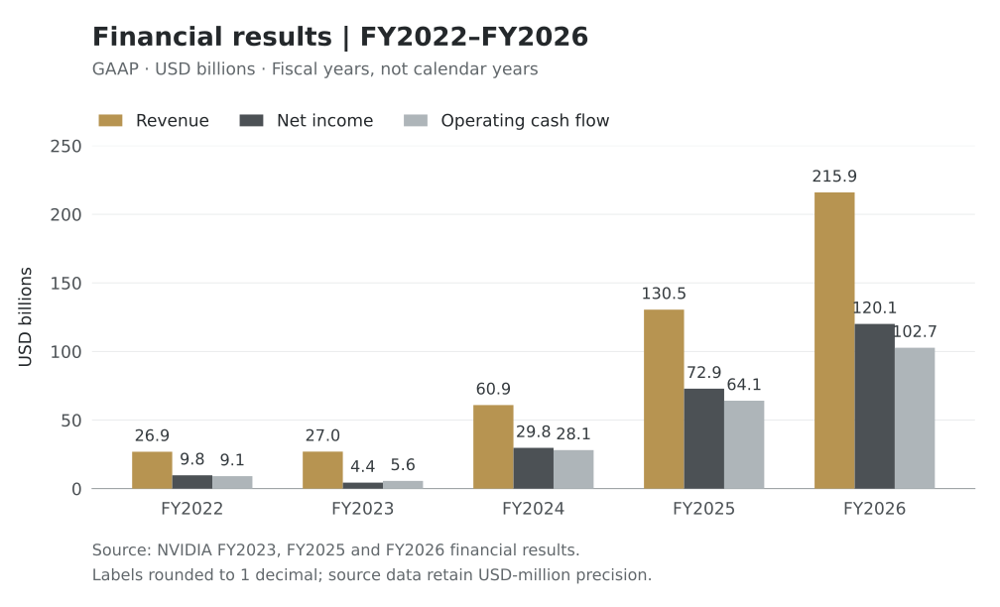

<section class="nvidia-facts" aria-label="Company facts">
  
Founded<strong>5 April 1993</strong>

  
Nasdaq ticker<strong>NVDA</strong>

  
FY2026 revenue<strong>$215.938bn</strong>

  
Latest quarter in this report<strong>Q2 FY2027</strong>

</section>

Cover: NVIDIA Voyager headquarters. <a href="#evidence-43">Official NVIDIA photograph</a>; the logo is part of the original image.

Information cutoff 3 October 2026

This report is based on company announcements, filings with the US Securities and Exchange Commission (SEC), product documentation and research papers. Retrospective company accounts and financial disclosures are identified through the references.

Unless otherwise stated, financial amounts in the English edition are in USD billions; earnings per share are in US dollars. NVIDIA’s fiscal year differs from the calendar year: fiscal 2026 ended on 25 January 2026. The latest disclosed quarter is the second quarter of fiscal 2027, which ended on 26 July 2026.<a href="#evidence-24" aria-label="Source 24">[24]</a><a href="#evidence-25" aria-label="Source 25">[25]</a>

## 1 Company founding and development

<figure class="nvidia-timeline" aria-labelledby="nvidia-timeline-title">
  <figcaption id="nvidia-timeline-title">Selected milestones</figcaption>
  
A selection of documented events; the company history in the article provides additional context.

  <ol class="nvidia-timeline__list">
    <li class="nvidia-timeline__item">
      <time class="nvidia-timeline__date" datetime="1993-04-05">April 5, 1993</time>
      
NVIDIA was founded by Jensen Huang, Chris Malachowsky, and Curtis Priem to develop 3D graphics for gaming and multimedia.

      <a class="nvidia-timeline__source" href="https://www.nvidia.com/en-us/about-nvidia/corporate-timeline/">Source: NVIDIA company history</a>
    </li>
    <li class="nvidia-timeline__item">
      <time class="nvidia-timeline__date" datetime="1995">1995</time>
      
NVIDIA introduced its first product, NV1, which was used in Diamond Edge 3D products.

      <a class="nvidia-timeline__source" href="https://www.nvidia.com/es-es/about-nvidia/corporate-timeline/">Source: NVIDIA early company history</a>
    </li>
    <li class="nvidia-timeline__item">
      <time class="nvidia-timeline__date" datetime="1999">1999</time>
      
NVIDIA completed its initial public offering on January 22, and GeForce 256 was released on October 11.

      
        <a class="nvidia-timeline__source" href="https://investor.nvidia.com/investor-resources/faqs/default.aspx">Source: NVIDIA investor FAQ</a>
        <a class="nvidia-timeline__source" href="https://blogs.nvidia.com/blog/first-gpu-gaming-ai/">Source: GeForce 256 release retrospective</a>
      
    </li>
    <li class="nvidia-timeline__item">
      <time class="nvidia-timeline__date" datetime="2006">2006</time>
      
NVIDIA unveiled CUDA, providing a programming architecture for GPU parallel computing beyond graphics rendering.

      <a class="nvidia-timeline__source" href="https://www.nvidia.com/en-us/about-nvidia/corporate-timeline/">Source: NVIDIA company history</a>
    </li>
    <li class="nvidia-timeline__item">
      <time class="nvidia-timeline__date" datetime="2012">2012</time>
      
The AlexNet paper by Alex Krizhevsky, Ilya Sutskever, and Geoffrey Hinton described model training on two NVIDIA GTX 580 GPUs with 3 GB of memory each.

      <a class="nvidia-timeline__source" href="https://proceedings.neurips.cc/paper/2012/file/c399862d3b9d6b76c8436e924a68c45b-Paper.pdf">Source: original AlexNet paper, pages 2 and 7</a>
    </li>
    <li class="nvidia-timeline__item">
      <time class="nvidia-timeline__date" datetime="2016-04-05">April 5, 2016</time>
      
NVIDIA announced DGX-1, an integrated deep-learning system with eight Tesla P100 GPUs and NVLink interconnects.

      <a class="nvidia-timeline__source" href="https://nvidianews.nvidia.com/news/nvidia-launches-world-s-first-deep-learning-supercomputer-6622436">Source: DGX-1 announcement</a>
    </li>
    <li class="nvidia-timeline__item">
      <time class="nvidia-timeline__date" datetime="2020-04-27">April 27, 2020</time>
      
NVIDIA completed its acquisition of Mellanox, with an announced transaction value of US$7 billion.

      <a class="nvidia-timeline__source" href="https://nvidianews.nvidia.com/news/nvidia-completes-acquisition-of-mellanox-creating-major-force-driving-next-gen-data-centers">Source: acquisition completion announcement</a>
    </li>
    <li class="nvidia-timeline__item">
      <time class="nvidia-timeline__date" datetime="2024-03-18">March 18, 2024</time>
      
NVIDIA announced the Blackwell platform, including the GB200 Grace Blackwell Superchip and the GB200 NVL72 rack-scale system.

      <a class="nvidia-timeline__source" href="https://nvidianews.nvidia.com/news/nvidia-blackwell-platform-arrives-to-power-a-new-era-of-computing">Source: Blackwell platform announcement</a>
    </li>
  </ol>
</figure>

### 1 1993 The three founders establish NVIDIA

NVIDIA was founded on 5 April 1993 by Jensen Huang, Chris Malachowsky and Curtis Priem. Its initial development work focused on three dimensional graphics and multimedia processing for personal computers.

The founders’ professional backgrounds included semiconductors and computer graphics. Huang had worked at AMD and LSI Logic. Malachowsky had held engineering and technical leadership positions at Hewlett-Packard and Sun Microsystems. Priem had designed graphics hardware at Sun Microsystems, including work on its GX graphics products, and subsequently served as NVIDIA’s chief technology officer.<a href="#evidence-1" aria-label="Source 1">[1]</a><a href="#evidence-2" aria-label="Source 2">[2]</a><a href="#evidence-3" aria-label="Source 3">[3]</a><a href="#evidence-4" aria-label="Source 4">[4]</a>

In an official retrospective published in 2023, NVIDIA described meetings at a Denny’s restaurant in Silicon Valley where the founders discussed the company’s concept, including enabling more realistic three dimensional graphics on PCs. Huang returned to the restaurant in September 2023 for the unveiling of a commemorative plaque. The restaurant account comes from the company’s retrospective narrative.<a href="#evidence-5" aria-label="Source 5">[5]</a>

### 2 1994 to 1995 Manufacturing cooperation and the first product NV1

In 1994, NVIDIA established a partnership with SGS-Thomson. Diamond Multimedia subsequently used NVIDIA chips in its graphics cards.

NVIDIA introduced its first product, NV1, in 1995. Products incorporating the chip included Diamond Edge 3D. NV1 supported two dimensional and three dimensional graphics and used quadratic texture mapping. NVIDIA also participated in bringing Sega games to the PC platform during this period.<a href="#evidence-6" aria-label="Source 6">[6]</a>

### 3 1996 NV1 sales end and NV2 development is discontinued

NVIDIA’s IPO prospectus reported that NV1 sales declined as Microsoft Direct3D and SGI OpenGL gained adoption. The company stopped selling NV1 in the first quarter of 1996.

NVIDIA subsequently discontinued development of NV2 for a game console project and shifted development work to RIVA 128. This period included product discontinuations and changes in development direction.<a href="#evidence-4" aria-label="Source 4">[4]</a>

### 4 1997 to 1998 The RIVA product family enters the market

RIVA 128 entered commercial sales in 1997. According to NVIDIA’s corporate timeline, shipments exceeded one million units in the first four months. In 1998, the company introduced RIVA 128ZX and RIVA TNT and established a long term manufacturing partnership with TSMC.<a href="#evidence-6" aria-label="Source 6">[6]</a>

The early prospectus reported net revenues of USD 1.182 million, USD 3.912 million and USD 29.071 million for 1995, 1996 and 1997, respectively. These figures use the annual periods reported at that time and are presented separately from the more recent fiscal year data below.<a href="#evidence-4" aria-label="Source 4">[4]</a>

### 5 1999 The IPO and GeForce 256 launch

NVIDIA listed on Nasdaq on 22 January 1999 under the ticker NVDA. Its initial public offering price was USD 12 per share. This was the original issue price, without adjustment for subsequent stock splits.<a href="#evidence-7" aria-label="Source 7">[7]</a>

On 11 October that year, NVIDIA introduced GeForce 256. The product integrated graphics transformation and lighting calculations into hardware. NVIDIA used the term GPU in its product marketing.<a href="#evidence-8" aria-label="Source 8">[8]</a>

### 6 2001 Supplying chips for a game console

In 2001, NVIDIA supplied the graphics processor and media communications processor for Microsoft’s original Xbox. Its products had therefore entered gaming devices beyond personal computers.<a href="#evidence-9" aria-label="Source 9">[9]</a>

### 7 2006 CUDA is announced

NVIDIA announced CUDA in 2006. CUDA provides a programming environment and tools that allow developers to use GPUs for computing tasks beyond graphics rendering.

This product approach includes both hardware and software: GPUs perform computation, while compilers, runtimes and software libraries support program development and execution.<a href="#evidence-1" aria-label="Source 1">[1]</a><a href="#evidence-10" aria-label="Source 10">[10]</a>

### 8 2012 The AlexNet paper documents training on NVIDIA GPUs

In 2012, Alex Krizhevsky, Ilya Sutskever and Geoffrey Hinton published the image classification research paper commonly known as the AlexNet paper.

The paper states that the researchers trained the model on two NVIDIA GTX 580 GPUs, each with 3GB of memory, over approximately five to six days. This is a GPU use case explicitly documented in a research paper. The model’s authors and the chip supplier were separate parties.<a href="#evidence-11" aria-label="Source 11">[11]</a>

### 9 2016 DGX 1 is introduced as an integrated system

On 5 April 2016, NVIDIA introduced DGX-1, integrating GPUs, interconnects, software and development tools into a deep learning computing system.

The original DGX-1 contained eight Tesla P100 GPUs connected through NVLink. NVIDIA supplied an integrated system through this product, rather than only an individual processor.<a href="#evidence-12" aria-label="Source 12">[12]</a><a href="#evidence-13" aria-label="Source 13">[13]</a>

### 10 2018 The Turing architecture and RTX products are introduced

In August 2018, NVIDIA introduced the Turing architecture and Quadro RTX professional products, followed by GeForce RTX products for gaming.

Turing included RT cores for ray tracing and Tensor cores for related matrix computations. The corresponding hardware capabilities were incorporated into professional graphics and consumer gaming products.<a href="#evidence-14" aria-label="Source 14">[14]</a><a href="#evidence-15" aria-label="Source 15">[15]</a>

### 11 2020 The Mellanox acquisition is completed

On 27 April 2020, NVIDIA announced the completion of its acquisition of Mellanox. The announcement described a transaction value of USD 7 billion.

Mellanox’s business included InfiniBand and Ethernet networking products. Following completion, these networking products became part of NVIDIA’s data center product portfolio.<a href="#evidence-16" aria-label="Source 16">[16]</a>

### 12 2022 The Arm acquisition agreement is terminated

In February 2022, NVIDIA and SoftBank announced the termination of the Arm acquisition agreement, citing regulatory challenges. The transaction did not close, and Arm did not become an NVIDIA subsidiary through this transaction.

NVIDIA recorded a USD 1.353 billion acquisition termination charge in its fiscal 2023 financial statements.<a href="#evidence-17" aria-label="Source 17">[17]</a><a href="#evidence-18" aria-label="Source 18">[18]</a>

### 13 2024 The Blackwell platform is announced

On 18 March 2024, NVIDIA announced the Blackwell platform. Related products included the B200 GPU, the GB200 superchip and the GB200 NVL72 system.

GB200 combines two Blackwell GPUs with one Grace CPU. GB200 NVL72 further organizes these computing components into a rack system.<a href="#evidence-19" aria-label="Source 19">[19]</a>

### 14 2026 Vera Rubin production progress is disclosed

On 31 May 2026, NVIDIA announced that the Vera Rubin platform was ramping into full production. This records the production status disclosed by the company; anticipated deployment volumes and revenue in the announcement are not presented as completed operating results.<a href="#evidence-20" aria-label="Source 20">[20]</a>

## 2 Components of the product portfolio



NVIDIA’s products include processors, computing systems, networking equipment and software. Their functions and delivery formats differ.

| Product category | Examples | Uses |
|---|---|---|
| Consumer graphics | GeForce | Game rendering and graphics computation on PCs |
| Professional graphics | NVIDIA RTX professional products | Workstation graphics, design and visualization |
| Data center computing | Data center GPUs, Grace CPUs and DGX | AI and other computing workloads |
| Networking | Spectrum, ConnectX and BlueField | Data transfer, network connectivity and related infrastructure processing |
| Automotive computing | DRIVE | In vehicle computing and autonomous driving system development |
| Embedded computing | Jetson | Computing in robots and other devices |

These categories describe product uses and do not correspond directly to the accounting segments in the financial statements.<a href="#evidence-21" aria-label="Source 21">[21]</a>

### The distinction between training and inference

AI model training involves using data to adjust model parameters. Inference uses a trained model to process inputs and generate results.

NVIDIA’s TensorRT documentation describes a workflow from training models in frameworks such as PyTorch and TensorFlow to optimizing and deploying them for inference. The same GPU product portfolio can therefore participate in different stages of model development, while training and inference remain different computing tasks.<a href="#evidence-22" aria-label="Source 22">[22]</a>

### The distinction between chips and servers and rack systems

<figure class="nvidia-architecture" aria-labelledby="nvidia-architecture-title">
  <figcaption id="nvidia-architecture-title">From computing components to a rack system</figcaption>
  
Example: the NVIDIA GB200 NVL72 single-rack reference configuration. The levels below describe composition, rather than a sequence of computing tasks.

  <ol class="nvidia-architecture__levels">
    <li class="nvidia-architecture__level" data-level="components">
      <h3 class="nvidia-architecture__heading">1. Computing components</h3>
      
Grace CPU and Blackwell GPU

      
The CPU and GPU are separate computing processors used in this configuration.

    </li>
    <li class="nvidia-architecture__level" data-level="superchip">
      <h3 class="nvidia-architecture__heading">2. GB200 Grace Blackwell Superchip</h3>
      
1 Grace CPU + 2 Blackwell GPUs

      
NVLink-C2C connects the CPU and GPUs; the Superchip combines multiple processors.

    </li>
    <li class="nvidia-architecture__level" data-level="compute-tray">
      <h3 class="nvidia-architecture__heading">3. GB200 compute tray</h3>
      
2 GB200 Superchips = 2 Grace CPUs + 4 Blackwell GPUs

      
A liquid-cooled compute node based on the MGX reference design.

    </li>
    <li class="nvidia-architecture__level" data-level="rack">
      <h3 class="nvidia-architecture__heading">4. GB200 NVL72 rack system</h3>
      
18 compute trays + 9 NVLink switch trays

      
Total: 36 Grace CPUs and 72 Blackwell GPUs. NVLink connects the GPUs within this liquid-cooled rack.

    </li>
  </ol>
  
InfiniBand or Ethernet provides network connectivity beyond the rack; this is separate from the rack's NVLink GPU interconnect.

  
Counts apply to this single-rack reference configuration, rather than to every NVIDIA server or rack product.

  

    Sources:
    <a href="https://developer.nvidia.com/blog/nvidia-gb200-nvl72-delivers-trillion-parameter-llm-training-and-real-time-inference/">NVIDIA GB200 NVL72 technical description</a>;
    <a href="https://www.nvidia.com/en-us/data-center/gb200-nvl72/">GB200 NVL72 product specifications</a>;
    <a href="https://nvidianews.nvidia.com/news/nvidia-blackwell-platform-arrives-to-power-a-new-era-of-computing">Blackwell platform announcement</a>.
  

</figure>

A chip is a computing component. A server assembles processors, memory and other components into a device. A rack system further integrates computing devices, connections, power delivery and cooling.

For example, the official GB200 NVL72 documentation specifies 72 Blackwell GPUs and 36 Grace CPUs, liquid cooling and GPU connections through NVLink. Purchasing or deploying this system involves a different product scope from purchasing an individual GPU.<a href="#evidence-23" aria-label="Source 23">[23]</a>

### Components of the networking portfolio

NVIDIA’s Ethernet portfolio includes Spectrum switches, ConnectX network adapters, BlueField data processing units, LinkX connectivity products and associated software.

These products handle connectivity, data transfer and related tasks. Computing interconnects between GPUs, network connections between servers and access to external data perform functions at different levels of a system.<a href="#evidence-26" aria-label="Source 26">[26]</a>

## 3 Software and development platforms

### CUDA Program development and execution

CUDA includes compilation, runtime, debugging, performance analysis and software library components. Developers can use these tools to write and run GPU computing programs.

The CUDA platform and an individual graphics card are different product concepts: CUDA is a software and programming system, while the graphics card is hardware that executes programs.<a href="#evidence-10" aria-label="Source 10">[10]</a>

### TensorRT Model inference optimization

TensorRT is a software development toolkit for optimizing and executing deep learning inference. It addresses deployment and execution of models that have already been trained.<a href="#evidence-27" aria-label="Source 27">[27]</a>

### NVIDIA AI Enterprise Enterprise licensing and support

NVIDIA AI Enterprise provides enterprise AI software and support services. Licensing options include subscriptions, usage based billing through cloud marketplaces and perpetual licenses with a specified support term.

The company’s software business consequently includes charging and service arrangements that differ from one time hardware sales.<a href="#evidence-28" aria-label="Source 28">[28]</a>

### Omniverse Three dimensional data and simulation tools

Omniverse provides software components for three dimensional scenes, simulation and related application development. Its technology is built on OpenUSD, an open framework developed by Pixar for describing three dimensional scenes and exchanging and organizing three dimensional data across tools.<a href="#evidence-29" aria-label="Source 29">[29]</a>

### DRIVE and Isaac and Jetson

DRIVE provides automotive computing and development tools covering sensor data, model training, simulation and in vehicle computing.

Isaac provides robotics development tools. Isaac Sim supports simulation, while Isaac ROS provides robotics software components. Jetson is an embedded computing hardware platform with software tools such as JetPack. These platforms address automotive development, robotics software development and device based computing, respectively.<a href="#evidence-30" aria-label="Source 30">[30]</a><a href="#evidence-31" aria-label="Source 31">[31]</a><a href="#evidence-32" aria-label="Source 32">[32]</a>

## 4 Revenue sources and business classifications



NVIDIA discloses its business through both accounting segments and market platforms. Their boundaries differ, and amounts cannot be added across the two classifications.

### Market platform revenue in fiscal 2026

| Market platform | Revenue USD bn |
|---|---:|
| Data Center | 193.737 |
| Gaming | 16.042 |
| Professional Visualization | 3.191 |
| Automotive | 2.349 |
| OEM and Other | 0.619 |
| Total | 215.938 |

Data Center revenue in this presentation includes computing and networking businesses.<a href="#evidence-33" aria-label="Source 33">[33]</a>

### Market platform revenue in the second quarter of fiscal 2027

| Market platform | Revenue USD bn |
|---|---:|
| Data Center Hyperscale | 48.710 |
| Data Center AI Clouds, Industrial & Enterprise | 40.313 |
| Data Center subtotal | 89.023 |
| Edge Computing | 7.198 |
| Total | 96.221 |

Hyperscale is the hyperscale customer category. ACIE refers to AI Clouds, Industrial & Enterprise. The Data Center subtotal already includes the first two rows.

NVIDIA changed its presentation of market platform revenue in fiscal 2027 and recast comparative data. During the second quarter, it also reclassified one customer from ACIE to Hyperscale following a change in the customer’s business model. Categories such as Gaming in the earlier table therefore cannot be treated as having the same statistical scope as Edge Computing in the newer table.

The company’s reportable accounting segments remain Compute & Networking and Graphics, presented separately from the market platform classifications above.<a href="#evidence-34" aria-label="Source 34">[34]</a>

## 5 Customers and sales channels and revenue recognition

NVIDIA distinguishes between direct and indirect customers.

Direct customers purchase from NVIDIA and include distributors, equipment manufacturers, cloud service providers, AI model developers and system integrators. Indirect customers purchase or use the products through direct customers and may include enterprises, cloud service providers and public sector organizations.

In the first half of fiscal 2027, three direct customers accounted for 16%, 15% and 13% of total revenue, respectively. The filing did not name them in this disclosure, so these percentages cannot be assigned to specific companies without additional evidence.<a href="#evidence-35" aria-label="Source 35">[35]</a>

Geographic revenue is classified by the location of the customer’s headquarters. This describes the customer’s location and does not directly identify the eventual installation or use location of the equipment.

Product revenue is generally recognized when control transfers. Support and service revenue is recognized according to the service arrangements. Revenue recognition and cash collection can occur on different dates; sales revenue, accounts receivable and cash flow are therefore different financial items.<a href="#evidence-33" aria-label="Source 33">[33]</a>

## 6 Manufacturing arrangements and supply chain

NVIDIA uses external manufacturing partners. Product design, wafer fabrication, memory supply, packaging and testing, and system assembly involve different participants.

Partners identified in its annual report include the following:

| Stage | Partners identified in the annual report |
|---|---|
| Wafer fabrication | TSMC and Samsung |
| Memory supply | SK hynix, Micron and Samsung |
| Assembly and testing and related manufacturing services | Hon Hai, Wistron, Fabrinet and others |

The annual report also discusses advanced packaging technologies such as CoWoS. This list describes disclosed relationships and does not mean that every product is manufactured by the same group of suppliers.<a href="#evidence-33" aria-label="Source 33">[33]</a>

## 7 Operating data for the last five fiscal years

<figure class="nvidia-financial-figure">

<figcaption>GAAP annual results, USD billions. Fiscal years, not calendar years. FY2026 ended on 25 January 2026. Sources: <a href="#evidence-18">FY2023</a>, <a href="#evidence-36">FY2025</a> and <a href="#evidence-24">FY2026 results</a>. On small screens, scroll the chart horizontally. Select it to open at full size; the exact figures appear in the table below.</figcaption>
</figure>

Amounts below follow the company’s disclosed US generally accepted accounting principles (GAAP) figures.

| Fiscal year | Revenue USD bn | Gross margin | Operating income USD bn | Net income USD bn | Operating cash flow USD bn |
|---|---:|---:|---:|---:|---:|
| 2022 | 26.914 | 64.9% | 10.041 | 9.752 | 9.108 |
| 2023 | 26.974 | 56.9% | 4.224 | 4.368 | 5.641 |
| 2024 | 60.922 | 72.7% | 32.972 | 29.760 | 28.090 |
| 2025 | 130.497 | 75.0% | 81.453 | 72.880 | 64.089 |
| 2026 | 215.938 | 71.1% | 130.387 | 120.067 | 102.718 |

The data come from the fiscal 2023, fiscal 2025 and fiscal 2026 financial announcements.<a href="#evidence-18" aria-label="Source 18">[18]</a><a href="#evidence-36" aria-label="Source 36">[36]</a><a href="#evidence-24" aria-label="Source 24">[24]</a>

These items use different calculations:

- Revenue: sales and service revenue recognized during the reporting period.
- Gross margin: revenue less cost of revenue, expressed as a percentage of revenue.
- Operating income: gross profit less operating expenses such as research and development, sales and administration.
- Net income: income after other income and expenses and income tax.
- Operating cash flow: net cash generated by operating activities, including working capital movements and related adjustments.

Fiscal 2023 operating income includes the Arm acquisition termination charge described earlier. Fiscal 2026 net income also includes income outside operating income; the two measures are not interchangeable.

## 8 Results for the latest disclosed quarter

NVIDIA announced its second quarter fiscal 2027 results on 26 August 2026. The reporting period ended on 26 July 2026.

| Metric | Q2 fiscal 2027 | Prior year quarter |
|---|---:|---:|
| Revenue USD bn | 96.221 | 46.743 |
| GAAP gross margin | 75.0% | 72.4% |
| Operating expenses USD bn | 8.408 | 5.413 |
| Operating income USD bn | 63.734 | 28.440 |
| Net income USD bn | 59.688 | 26.422 |
| Diluted earnings per share USD | 2.46 | 1.08 |

The company reported revenue growth of 106% year over year and 18% from the preceding quarter.<a href="#evidence-25" aria-label="Source 25">[25]</a>

### Differences between GAAP and adjusted figures

For the same quarter, NVIDIA reported GAAP diluted earnings per share of USD 2.46 and non-GAAP earnings per share of USD 2.22.

Non-GAAP figures adjust company designated items, including the exclusion of gains from equity securities. Net gains from equity securities were USD 7.771 billion in the quarter, so adjusted earnings per share can be lower than the GAAP figure.

Beginning in the first quarter of fiscal 2027, NVIDIA’s non-GAAP measures no longer exclude stock based compensation expense. The historical comparative figures presented were updated accordingly. Non-GAAP figures published in different years therefore need to be distinguished according to the adjustment definitions in the relevant announcements.<a href="#evidence-34" aria-label="Source 34">[34]</a>

## 9 Cash flow and receivables and the balance sheet

### Profit and cash flow in the first half of fiscal 2027

| Metric | Amount USD bn |
|---|---:|
| Net income | 118.010 |
| Operating cash flow | 74.421 |
| Company defined free cash flow | 69.895 |

NVIDIA defines free cash flow as operating cash flow less purchases related to property and equipment and intangible assets, and principal payments on those assets.<a href="#evidence-25" aria-label="Source 25">[25]</a>

The quarterly report states that net gains from equity securities were primarily driven by unrealized gains. Recognizing such gains in income does not mean the company received an equivalent amount of cash from selling the investments.<a href="#evidence-35" aria-label="Source 35">[35]</a>

### Selected balance sheet items as of 26 July 2026

| Item | Amount USD bn |
|---|---:|
| Cash and cash equivalents | 22.443 |
| Marketable debt securities | 34.143 |
| Marketable equity securities | 42.783 |
| Accounts receivable net | 63.059 |
| Inventories | 31.575 |
| Total assets | 320.272 |
| Total liabilities | 91.288 |
| Shareholders’ equity | 228.984 |

Cash, debt securities and equity securities are presented separately in the financial statements. Marketable equity securities are investment assets.<a href="#evidence-25" aria-label="Source 25">[25]</a>

The CFO commentary reported days sales outstanding of 60 days in the second quarter, compared with 45 days in the preceding quarter. The company attributed the change to extended payment terms on large, multi-quarter agreements with certain investment-grade customers.

During the same quarter, NVIDIA issued USD 25 billion of senior unsecured notes for general corporate purposes.<a href="#evidence-34" aria-label="Source 34">[34]</a>

## 10 Research spending and employees and management

### Research and development expenses

| Fiscal year | R and D expenses USD bn |
|---|---:|
| 2023 | 7.339 |
| 2024 | 8.675 |
| 2025 | 12.914 |
| 2026 | 18.497 |

These amounts are presented in the respective annual financial statements as operating expenses.<a href="#evidence-18" aria-label="Source 18">[18]</a><a href="#evidence-36" aria-label="Source 36">[36]</a><a href="#evidence-24" aria-label="Source 24">[24]</a>

At the end of fiscal 2026, NVIDIA had approximately 42,000 employees across 38 countries, including approximately 31,000 working in research and development.<a href="#evidence-33" aria-label="Source 33">[33]</a>

### Management and the founder’s ownership

Management identified in the 2026 proxy statement included President and Chief Executive Officer Jensen Huang, Chief Financial Officer Colette Kress, Ajay Puri with responsibility for worldwide field operations, and Debora Shoquist with responsibility for operations.

As of 23 March 2026, the proxy statement reported Huang’s beneficial ownership at 870,604,104 shares, or 3.58%. This measure includes shares associated with relevant trusts, entities and a foundation; it should not all be treated as shares held directly in his personal name.

Executive equity compensation includes performance stock units (PSUs) and restricted stock units (RSUs), which have different vesting conditions and assessment arrangements.<a href="#evidence-37" aria-label="Source 37">[37]</a>

## 11 Disclosed contractual commitments and guarantees

### Selected contractual commitments as of 26 July 2026

| Category | Disclosed amount USD bn |
|---|---:|
| Supply and capacity | 279 |
| Cloud service agreements | 29 |
| Data center leases not commenced | 25 |
| Equity investments | 25 |
| Capital expenditures | 8 |
| Total of the above items | 366 |

These figures are future contractual commitments disclosed in the financial statements and cover different periods. Certain arrangements are conditional. They are distinct from cash already paid and expenses already recognized during the reporting period.<a href="#evidence-35" aria-label="Source 35">[35]</a>

### SB Energy related guarantees signed in August 2026

NVIDIA subsequently disclosed guarantees signed in August 2026 in connection with SB Energy, providing credit support for the PORTS campus project in Ohio and involving leases for an OpenAI affiliate.

The guarantees are capped at USD 105 billion in total and become effective in phases subject to conditions such as the commencement of the relevant leases. Payment obligations are triggered by specified tenant defaults and are limited to defined portions of lease and power payments.

The amount is a conditional guarantee cap, not cash already paid or a loss already recognized. The signing date was after the quarterly balance sheet date of 26 July.<a href="#evidence-35" aria-label="Source 35">[35]</a>

## 12 Export licensing events that have occurred

On 9 April 2025, the US government informed NVIDIA that exports of H20 products to China and related destinations required a license.

In the first quarter of fiscal 2026, which ended on 27 April 2025, NVIDIA recorded a USD 4.5 billion charge related to H20 excess inventory and purchase obligations. GAAP gross margin for that quarter was 60.5%.

These are events that had occurred and were reflected in the financial statements. Undelivered orders, estimates of future sales and recognized revenue use different reporting bases.<a href="#evidence-38" aria-label="Source 38">[38]</a>

## 13 Related computing products offered by other companies

Other companies offer announced processors and software systems for AI computing:

| Company | Product or platform | Uses disclosed by the company |
|---|---|---|
| AMD | Instinct accelerators and ROCm software | AI training, inference and other computation |
| Google Cloud | TPU | Cloud based machine learning computation |
| AWS | Trainium | AI training and inference |

These products differ in hardware format, software interfaces and delivery arrangements. The table records their existence and uses; it does not establish market shares or quantify an effect on NVIDIA’s revenue.<a href="#evidence-39" aria-label="Source 39">[39]</a><a href="#evidence-40" aria-label="Source 40">[40]</a><a href="#evidence-41" aria-label="Source 41">[41]</a>

## 14 Stock trading data and measurement basis

NVIDIA common stock trades on Nasdaq under the ticker NVDA. The historical price page records a closing price of USD 233.95 per share for the US trading session on 2 October 2026.<a href="#evidence-42" aria-label="Source 42">[42]</a>

The company reported GAAP diluted earnings per share of USD 4.90 for fiscal 2026, USD 1.84 for the first half of fiscal 2026 and USD 4.85 for the first half of fiscal 2027. Combining these disclosed rounded figures gives approximate trailing twelve month earnings per share of:

4.90 − 1.84 + 4.85 = USD 7.91.

Dividing that closing price by these earnings per share gives approximately 29.6 times. This calculation uses historical GAAP earnings, including investment gains in the corresponding periods. It is an approximate historical price to earnings ratio calculated from disclosed data.<a href="#evidence-24" aria-label="Source 24">[24]</a><a href="#evidence-34" aria-label="Source 34">[34]</a>

### Measurement conventions used in this report

Historical events are presented by event date, financial results by company fiscal period, balance sheet amounts by reporting date and stock prices by US trading session. Accounting segments, market platforms, customer headquarters and final product uses each have their own definitions. Future revenue guidance, anticipated deployment volumes and investment return forecasts are not included as realized results.

## Sources and image credit

<ol class="nvidia-references">
<li id="evidence-1"><a href="https://www.nvidia.com/en-us/about-nvidia/corporate-timeline/">Corporate timeline</a>. <a class="nvidia-source-return" href="#cite-1-1" aria-label="Return to source 1 in the article">Return to citation</a></li>
<li id="evidence-2"><a href="https://nvidianews.nvidia.com/bios/jensen-huang">Jensen Huang biography</a>. <a class="nvidia-source-return" href="#cite-2-1" aria-label="Return to source 2 in the article">Return to citation</a></li>
<li id="evidence-3"><a href="https://nvidianews.nvidia.com/bios/chris-a-malachowsky">Chris Malachowsky biography</a>. <a class="nvidia-source-return" href="#cite-3-1" aria-label="Return to source 3 in the article">Return to citation</a></li>
<li id="evidence-4"><a href="https://d18rn0p25nwr6d.cloudfront.net/CIK-0001045810/327515c2-03c2-4795-8946-5968098fa73a.pdf">IPO prospectus</a>. <a class="nvidia-source-return" href="#cite-4-1" aria-label="Return to source 4 in the article">Return to citation</a></li>
<li id="evidence-5"><a href="https://blogs.nvidia.com/blog/nvidia-dennys-trillion/">Retrospective account of the Denny’s founding story</a>. <a class="nvidia-source-return" href="#cite-5-1" aria-label="Return to source 5 in the article">Return to citation</a></li>
<li id="evidence-6"><a href="https://www.nvidia.com/es-es/about-nvidia/corporate-timeline/">Early product and manufacturing partnership timeline</a>. <a class="nvidia-source-return" href="#cite-6-1" aria-label="Return to source 6 in the article">Return to citation</a></li>
<li id="evidence-7"><a href="https://investor.nvidia.com/investor-resources/faqs/default.aspx">Investor relations FAQs</a>. <a class="nvidia-source-return" href="#cite-7-1" aria-label="Return to source 7 in the article">Return to citation</a></li>
<li id="evidence-8"><a href="https://blogs.nvidia.com/blog/first-gpu-gaming-ai/">GeForce 256 launch retrospective</a>. <a class="nvidia-source-return" href="#cite-8-1" aria-label="Return to source 8 in the article">Return to citation</a></li>
<li id="evidence-9"><a href="https://www.nvidia.com/content/timeline/time_01.html">Corporate timeline for 2001</a>. <a class="nvidia-source-return" href="#cite-9-1" aria-label="Return to source 9 in the article">Return to citation</a></li>
<li id="evidence-10"><a href="https://developer.nvidia.com/cuda?lang=en">CUDA development platform</a>. <a class="nvidia-source-return" href="#cite-10-1" aria-label="Return to source 10 in the article">Return to citation</a></li>
<li id="evidence-11"><a href="https://proceedings.neurips.cc/paper/2012/file/c399862d3b9d6b76c8436e924a68c45b-Paper.pdf">Original AlexNet research paper</a>. <a class="nvidia-source-return" href="#cite-11-1" aria-label="Return to source 11 in the article">Return to citation</a></li>
<li id="evidence-12"><a href="https://nvidianews.nvidia.com/news/nvidia-launches-world-s-first-deep-learning-supercomputer-6622436">DGX 1 launch announcement</a>. <a class="nvidia-source-return" href="#cite-12-1" aria-label="Return to source 12 in the article">Return to citation</a></li>
<li id="evidence-13"><a href="https://developer.nvidia.com/blog/inside-pascal/">DGX 1 and Pascal hardware description</a>. <a class="nvidia-source-return" href="#cite-13-1" aria-label="Return to source 13 in the article">Return to citation</a></li>
<li id="evidence-14"><a href="https://nvidianews.nvidia.com/news/nvidia-reinvents-computer-graphics-with-turing-architecture">Turing architecture announcement</a>. <a class="nvidia-source-return" href="#cite-14-1" aria-label="Return to source 14 in the article">Return to citation</a></li>
<li id="evidence-15"><a href="https://nvidianews.nvidia.com/news/10-years-in-the-making-nvidia-brings-real-time-ray-tracing-to-gamers-with-geforce-rtx">GeForce RTX announcement</a>. <a class="nvidia-source-return" href="#cite-15-1" aria-label="Return to source 15 in the article">Return to citation</a></li>
<li id="evidence-16"><a href="https://nvidianews.nvidia.com/news/nvidia-completes-acquisition-of-mellanox-creating-major-force-driving-next-gen-data-centers">Mellanox acquisition completion announcement</a>. <a class="nvidia-source-return" href="#cite-16-1" aria-label="Return to source 16 in the article">Return to citation</a></li>
<li id="evidence-17"><a href="https://nvidianews.nvidia.com/news/nvidia-and-softbank-group-announce-termination-of-nvidias-acquisition-of-arm-limited">Arm transaction termination announcement</a>. <a class="nvidia-source-return" href="#cite-17-1" aria-label="Return to source 17 in the article">Return to citation</a></li>
<li id="evidence-18"><a href="https://investor.nvidia.com/news/press-release-details/2023/NVIDIA-Announces-Financial-Results-for-Fourth-Quarter-and-Fiscal-2023/">Fiscal 2023 financial results announcement</a>. <a class="nvidia-source-return" href="#cite-18-1" aria-label="Return to source 18 in the article">Return to citation</a></li>
<li id="evidence-19"><a href="https://nvidianews.nvidia.com/news/nvidia-blackwell-platform-arrives-to-power-a-new-era-of-computing">Blackwell platform announcement</a>. <a class="nvidia-source-return" href="#cite-19-1" aria-label="Return to source 19 in the article">Return to citation</a></li>
<li id="evidence-20"><a href="https://nvidianews.nvidia.com/news/vera-rubin-full-production-agentic-ai-factory">Vera Rubin production progress announcement</a>. <a class="nvidia-source-return" href="#cite-20-1" aria-label="Return to source 20 in the article">Return to citation</a></li>
<li id="evidence-21"><a href="https://www.nvidia.com/en-us/products/">NVIDIA product catalog</a>. <a class="nvidia-source-return" href="#cite-21-1" aria-label="Return to source 21 in the article">Return to citation</a></li>
<li id="evidence-22"><a href="https://docs.nvidia.com/deeplearning/tensorrt/latest/getting-started/quick-start-guide.html">TensorRT workflow documentation</a>. <a class="nvidia-source-return" href="#cite-22-1" aria-label="Return to source 22 in the article">Return to citation</a></li>
<li id="evidence-23"><a href="https://www.nvidia.com/en-us/data-center/gb200-nvl72/">GB200 NVL72 product documentation</a>. <a class="nvidia-source-return" href="#cite-23-1" aria-label="Return to source 23 in the article">Return to citation</a></li>
<li id="evidence-24"><a href="https://investor.nvidia.com/news/press-release-details/2026/NVIDIA-Announces-Financial-Results-for-Fourth-Quarter-and-Fiscal-2026/">Fiscal 2026 financial results announcement</a>. <a class="nvidia-source-return" href="#cite-24-1" aria-label="Return to source 24 in the article">Return to citation</a></li>
<li id="evidence-25"><a href="https://investor.nvidia.com/news/press-release-details/2026/NVIDIA-Announces-Financial-Results-for-Second-Quarter-Fiscal-2027/">Second quarter fiscal 2027 financial results announcement</a>. <a class="nvidia-source-return" href="#cite-25-1" aria-label="Return to source 25 in the article">Return to citation</a></li>
<li id="evidence-26"><a href="https://www.nvidia.com/en-us/networking/products/ethernet/">Ethernet product portfolio</a>. <a class="nvidia-source-return" href="#cite-26-1" aria-label="Return to source 26 in the article">Return to citation</a></li>
<li id="evidence-27"><a href="https://docs.nvidia.com/deeplearning/tensorrt/latest/">TensorRT documentation</a>. <a class="nvidia-source-return" href="#cite-27-1" aria-label="Return to source 27 in the article">Return to citation</a></li>
<li id="evidence-28"><a href="https://docs.nvidia.com/ai-enterprise/planning-resource/licensing-guide/latest/licensing.html">AI Enterprise licensing guide</a>. <a class="nvidia-source-return" href="#cite-28-1" aria-label="Return to source 28 in the article">Return to citation</a></li>
<li id="evidence-29"><a href="https://docs.nvidia.com/omniverse/index.html">Omniverse documentation</a>. <a class="nvidia-source-return" href="#cite-29-1" aria-label="Return to source 29 in the article">Return to citation</a></li>
<li id="evidence-30"><a href="https://developer.nvidia.com/DRIVE">DRIVE platform</a>. <a class="nvidia-source-return" href="#cite-30-1" aria-label="Return to source 30 in the article">Return to citation</a></li>
<li id="evidence-31"><a href="https://developer.nvidia.com/isaac">Isaac platform</a>. <a class="nvidia-source-return" href="#cite-31-1" aria-label="Return to source 31 in the article">Return to citation</a></li>
<li id="evidence-32"><a href="https://developer.nvidia.com/embedded/jetson-modules">Jetson modules</a>. <a class="nvidia-source-return" href="#cite-32-1" aria-label="Return to source 32 in the article">Return to citation</a></li>
<li id="evidence-33"><a href="https://www.sec.gov/Archives/edgar/data/1045810/000104581026000021/nvda-20260125.htm">Fiscal 2026 annual report Form 10 K</a>. <a class="nvidia-source-return" href="#cite-33-1" aria-label="Return to source 33 in the article">Return to citation</a></li>
<li id="evidence-34"><a href="https://www.sec.gov/Archives/edgar/data/1045810/000104581026000073/q2fy27cfocommentary.htm">Second quarter fiscal 2027 CFO commentary</a>. <a class="nvidia-source-return" href="#cite-34-1" aria-label="Return to source 34 in the article">Return to citation</a></li>
<li id="evidence-35"><a href="https://www.sec.gov/Archives/edgar/data/1045810/000104581026000075/nvda-20260726.htm">Second quarter fiscal 2027 quarterly report Form 10 Q</a>. <a class="nvidia-source-return" href="#cite-35-1" aria-label="Return to source 35 in the article">Return to citation</a></li>
<li id="evidence-36"><a href="https://investor.nvidia.com/news/press-release-details/2025/NVIDIA-Announces-Financial-Results-for-Fourth-Quarter-and-Fiscal-2025/default.aspx">Fiscal 2025 financial results announcement</a>. <a class="nvidia-source-return" href="#cite-36-1" aria-label="Return to source 36 in the article">Return to citation</a></li>
<li id="evidence-37"><a href="https://www.sec.gov/Archives/edgar/data/1045810/000104581026000036/nvda-20260512.htm">2026 proxy statement</a>. <a class="nvidia-source-return" href="#cite-37-1" aria-label="Return to source 37 in the article">Return to citation</a></li>
<li id="evidence-38"><a href="https://investor.nvidia.com/news/press-release-details/2025/NVIDIA-Announces-Financial-Results-for-First-Quarter-Fiscal-2026/">First quarter fiscal 2026 financial results announcement</a>. <a class="nvidia-source-return" href="#cite-38-1" aria-label="Return to source 38 in the article">Return to citation</a></li>
<li id="evidence-39"><a href="https://www.amd.com/en/products/accelerators/instinct/mi350.html">AMD Instinct products</a>. <a class="nvidia-source-return" href="#cite-39-1" aria-label="Return to source 39 in the article">Return to citation</a></li>
<li id="evidence-40"><a href="https://cloud.google.com/tpu">Google Cloud TPU</a>. <a class="nvidia-source-return" href="#cite-40-1" aria-label="Return to source 40 in the article">Return to citation</a></li>
<li id="evidence-41"><a href="https://aws.amazon.com/ai/machine-learning/trainium/">AWS Trainium</a>. <a class="nvidia-source-return" href="#cite-41-1" aria-label="Return to source 41 in the article">Return to citation</a></li>
<li id="evidence-42"><a href="https://stockanalysis.com/stocks/nvda/history/">NVIDIA historical stock prices</a>. <a class="nvidia-source-return" href="#cite-42-1" aria-label="Return to source 42 in the article">Return to citation</a></li>
<li id="evidence-43"><a href="https://nvidianews.nvidia.com/file/voyager-exterior-sign">NVIDIA Voyager headquarters photograph</a>.</li>
<li id="evidence-44"><a href="https://developer.nvidia.com/blog/nvidia-gb200-nvl72-delivers-trillion-parameter-llm-training-and-real-time-inference/">GB200 NVL72 architecture and reference configuration</a>.</li>
</ol>

Source review for this website edition: 5 October 2026. The report’s information cutoff remains 3 October 2026. The Vera Rubin announcement date has been corrected to 31 May 2026, and the AlexNet paper link now points to the original NeurIPS publication.
