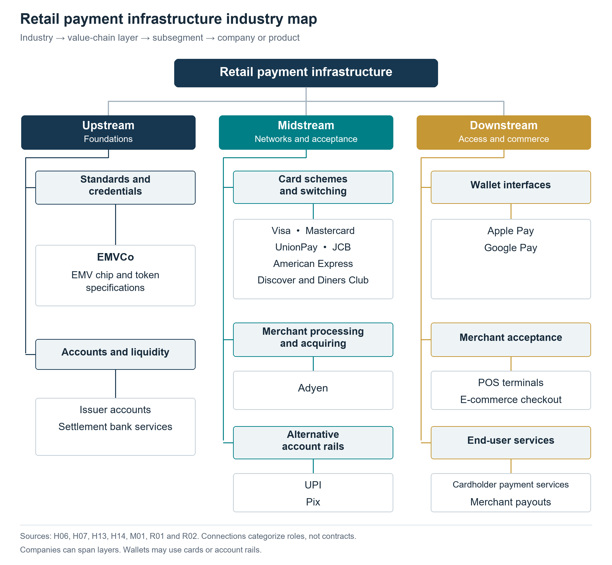
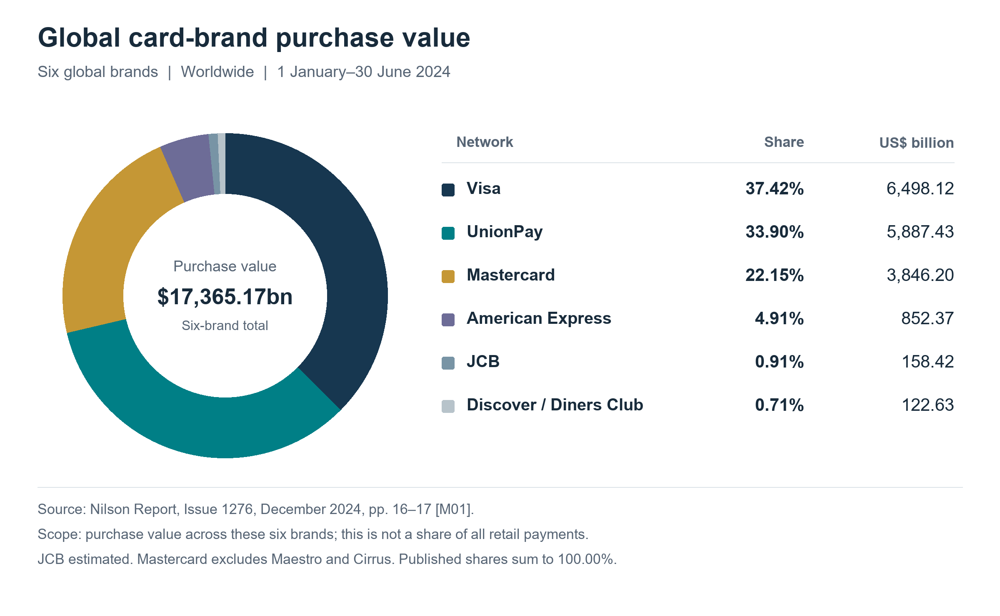

<strong>Article preview · Version 1.0 · Information cutoff: 8 October 2026</strong>

Global industry report centered on Visa and Mastercard. Information cutoff 8 October 2026. Version 1.0. The report examines how payment networks coordinate commerce, how the industry developed, where revenue is earned and what can change the competitive position of card and account-payment systems.

Reading the evidence: the share chart is a historical January to June 2024 snapshot of six global card brands, not the whole payment industry. The recent scale observation is calendar 2025, and the principal company comparison is April to June 2026. Statistics retain their original definitions. Analysis and conditional judgments are identified in the text; source records explain what each item can and cannot establish.

## Part 1: Industry Story

### When an approval message stops moving

On 1 June 2018, Visa Europe suffered a partial disruption to its card authorization system. Visa later told the UK Parliament that 5.2 million of 51.2 million transaction attempts submitted during the incident failed to process correctly. Retrying reduced the failure measure by approximately half. These were attempts, not a count of affected people or permanently lost purchases. Visa attributed the incident to a partial hardware failure that interfered with failover, rather than a cyberattack. <a class="evidence-cite" href="#source-H01" aria-label="Source H01">[H01]</a>

The Bank of England subsequently required Visa Europe to implement the recommendations of an independent review and appointed PwC to assess progress. The Bank explicitly distinguished this supervisory action from enforcement and a finding of regulatory breach. The incident nevertheless exposed how an infrastructure failure can interrupt ordinary commerce even when the buyer has money and the merchant wants to sell. <a class="evidence-cite" href="#source-H02" aria-label="Source H02">[H02]</a>

The visible payment experience is only the entrance to a longer process. Authorization asks whether a transaction may proceed. Clearing exchanges and reconciles the information needed to establish obligations. Settlement transfers funds to discharge those obligations. Legal finality defines when a transfer is irrevocable and unconditional. A fast approval at the checkout does not establish that every institution has already received final funds. <a class="evidence-cite" href="#source-H13" aria-label="Source H13">[H13]</a>

This report examines the business built around that coordination. Its central assessment is that Visa and Mastercard derive durable value from acceptance, operating rules and connections between institutions. Their prospects depend on whether the benefits remain worth the cost to banks, merchants and users as alternative account-payment systems improve. Faster technology matters, but pricing, fraud responsibility, liquidity and the ability to resolve a failed payment matter just as much. That is an analytical framework, not a forecast that one payment method must replace another.

## Part 2: Industry History

### From a local card to a shared rulebook

Visa traces its origins to BankAmericard in 1958; Mastercard&#x27;s predecessor, the Interbank Card Association, formed in 1966. <a class="evidence-cite" href="#source-H03" aria-label="Source H03">[H03]</a><a class="evidence-cite" href="#source-H04" aria-label="Source H04">[H04]</a> The useful historical distinction is between issuing a card and making that card acceptable outside the issuer&#x27;s immediate relationships. Our interpretation is that the network&#x27;s decisive contribution was coordination: many institutions could offer their own customer products while agreeing how to recognize a payment, exchange information and allocate responsibilities.

This arrangement separated two kinds of scale. A bank could deepen its relationship with a particular customer; the shared system could extend where that customer paid. The analytical implication is a reinforcing incentive: wider acceptance makes an issuer&#x27;s card more useful, while more usable cards make acceptance more attractive. Building these relationships together is harder than building a payment interface alone.

### Electronic coordination creates a network

The Federal Reserve&#x27;s historical account describes early interbank card settlement as paper based and bilateral, with telephone authorization. It also records the US decision to leave point of sale infrastructure development to the private sector following a 1977 commission recommendation. <a class="evidence-cite" href="#source-H05" aria-label="Source H05">[H05]</a> These facts place today&#x27;s networks in an institutional history: their role developed through choices about who would organize communication, rather than appearing simply because a faster computer became available.

Our assessment is that electronic processing increased the value of a common rulebook. A faster message has limited commercial value if the receiving institution interprets it differently or the parties disagree about responsibility. As transactions became easier to exchange, consistent procedures, exception handling and institutional participation became complementary assets. Technology and governance therefore need to be read together in the industry&#x27;s development.

### Standards make expansion repeatable

EMVCo was established in 1999 to manage interoperable secure payment specifications and testing. <a class="evidence-cite" href="#source-H06" aria-label="Source H06">[H06]</a> A useful way to interpret this layer is as a reduction in repeated integration work. If each issuer, terminal and acceptance market required a wholly separate technical arrangement, expansion would demand many more bespoke connections. Common specifications make compatibility more repeatable, while leaving commercial competition and network rules as separate questions.

### Ownership changes the objective

Mastercard completed its IPO in 2006; Visa followed on 19 March 2008. <a class="evidence-cite" href="#source-H03" aria-label="Source H03">[H03]</a><a class="evidence-cite" href="#source-H04" aria-label="Source H04">[H04]</a> Our analytical reading is that a stock market listing adds a capital allocation question to the coordination problem: which investments strengthen acceptance and reliability while also producing returns for shareholders? A network must preserve participants&#x27; willingness to use its system even as it seeks to earn more from the services surrounding each payment.

### The next contest moves below the interface

The EU adopted its instant payments regulation in February 2024, requiring covered providers to offer instant euro transfers after transition periods. <a class="evidence-cite" href="#source-H15" aria-label="Source H15">[H15]</a> This marks a different competitive proposition: an alternative can change the account transfer route beneath the customer&#x27;s familiar banking interface. The historical question is consequently expanding from which card a consumer carries to which institutions, rules and settlement arrangements serve the transaction.

Our conclusion from this history is conditional. Cards retain advantages where a shared acceptance and service framework solves several problems together. Account based alternatives become more compelling where they can reproduce the necessary commercial protections with less friction. Neither a new interface nor a faster transfer alone settles that competition; the relevant unit is the complete payment service.

## Part 3: Market Landscape

### What belongs inside this industry

The scope is global retail payment infrastructure, with card schemes and clearing networks at its center. Account-to-account payments are included as competing or complementary systems. Securities exchanges, central counterparties and securities depositories are outside the measured market. There is no meaningful single revenue total obtained by adding the sales of banks, networks, processors and wallets: the same purchase generates several interdependent fees.

Three different denominators therefore appear below. The industry chart measures purchase value on six global card brands. The recent industry total measures purchase transaction counts. The company comparison measures consolidated net revenue and GAAP profit. None can substitute for the others. An interface share, such as the proportion of checkouts using a wallet, would introduce yet another denominator and must not be added to card-brand shares.

### The value chain and who gets paid

Upstream, institutions provide accounts, liquidity and the technical standards that let a payment credential work across different devices and providers. EMVCo maintains specifications; it is not itself a merchant acquirer or a settlement network. EMV payment tokenisation substitutes a constrained token for the primary account number, allowing existing card infrastructure to support digital use cases. A payment token in this sense is distinct from a blockchain asset. <a class="evidence-cite" href="#source-H06" aria-label="Source H06">[H06]</a><a class="evidence-cite" href="#source-R02" aria-label="Source R02">[R02]</a>

Midstream, the card scheme sets participation and transaction rules while its processing network helps institutions exchange messages. Acquirers and processors connect merchants, perform operational work and arrange payment acceptance. Adyen is an example of a company providing both processing and acquiring. Its documentation makes an instructive distinction: funds received by Adyen in a settled payment have not necessarily been paid out to the merchant. Provider receipt and merchant payout are different events. <a class="evidence-cite" href="#source-R01" aria-label="Source R01">[R01]</a>

Downstream, wallets, checkout software and terminals make these services usable in commerce. A card held in Apple Pay or Google Pay may still rely on the underlying card network; the wallet is not automatically an independent clearing rail. UPI and Pix illustrate a different category: account-payment arrangements whose adoption depends on participant access, governance and useful payment scenarios. The diagram classifies roles, not market shares or verified supply contracts. <a class="evidence-cite" href="#source-H07" aria-label="Source H07">[H07]</a><a class="evidence-cite" href="#source-H14" aria-label="Source H14">[H14]</a>

**Figure 1 Retail payment infrastructure value chain**



Static figure and editable files

<a href="industry_map.png" download>Download PNG</a> · <a href="industry_map.svg" download>Download editable SVG</a> · <a href="industry_map.csv" download>Download source data (CSV)</a>

Figure 1 follows the same sequence as the text: foundations, networks and acceptance, then access and commerce. A company can occupy several positions, and an institution providing a payment interface may rely on another institution for settlement. Names are representative rather than exhaustive. Sources: <a class="evidence-cite" href="#source-H06" aria-label="Source H06">[H06]</a><a class="evidence-cite" href="#source-H07" aria-label="Source H07">[H07]</a><a class="evidence-cite" href="#source-H13" aria-label="Source H13">[H13]</a><a class="evidence-cite" href="#source-H14" aria-label="Source H14">[H14]</a><a class="evidence-cite" href="#source-M01" aria-label="Source M01">[M01]</a><a class="evidence-cite" href="#source-R01" aria-label="Source R01">[R01]</a><a class="evidence-cite" href="#source-R02" aria-label="Source R02">[R02]</a>.

<table><caption>Roles and commercial relationships</caption><thead><tr><th scope="col">Stage</th><th scope="col">Product and customer</th><th scope="col">Economic role</th></tr></thead><tbody><tr><th scope="row">Upstream</th><td>Accounts, funding, liquidity and standards for participating institutions</td><td>Account and funding terms; technical interoperability is not a claim on merchant fees</td></tr><tr><th scope="row">Midstream networks</th><td>Scheme rules, routing, clearing and settlement coordination for issuers and acquirers</td><td>Network and processing charges, net of customer incentives</td></tr><tr><th scope="row">Midstream acceptance</th><td>Processing and acquiring for merchants, illustrated by Adyen</td><td>Acceptance and service charges; pass-through costs must be distinguished from retained revenue</td></tr><tr><th scope="row">Downstream</th><td>Wallet interfaces, POS and online checkout, merchant payouts</td><td>Distribution, software and end-user services; the funding route determines the underlying network</td></tr></tbody></table>

In a four-party card arrangement, the consumer deals with an issuer and the merchant with an acquirer, while the network coordinates their interaction. Interchange generally flows from the acquirer to the issuer. Scheme and processing fees are separate, and the merchant service charge contains several components. Treating the entire merchant charge as Visa or Mastercard revenue misidentifies both the recipient and the economics. <a class="evidence-cite" href="#source-H07" aria-label="Source H07">[H07]</a>

Our interpretation is that a new network faces a coordination problem before it faces a computing problem. Issuers need merchants willing to accept the credential; merchants need enough potential buyers; both need reliable operation and agreed procedures when a transaction goes wrong. Discounting one side can attract participants, but the discount has to be funded. Scale is valuable only if the network can retain useful participation after incentives and operating costs.

### Market scale and a comparable share snapshot

Nilson Report counts 828.10 billion goods-and-services purchase transactions across the six global card brands in calendar 2025, up 7.1% year on year. This measures branded card purchases, not all electronic payments or the revenues earned from them. The publicly readable release does not provide a complete usable set of brand shares. <a class="evidence-cite" href="#source-M02" aria-label="Source M02">[M02]</a>

The complete share chart therefore uses a separately dated historical observation: worldwide purchase value in January to June 2024. Six brands accounted for USD17,365.17 billion in that defined dataset. Visa represented 37.42%, UnionPay 33.90%, Mastercard 22.15%, American Express 4.91%, JCB 0.91%, and Discover/Diners Club 0.71%. The published shares total 100.00%; JCB is estimated and Mastercard excludes Maestro and Cirrus. <a class="evidence-cite" href="#source-M01" aria-label="Source M01">[M01]</a>

**Figure 2 Purchase value shares of six global card brands**



Static figure and editable files

<a href="market_share_h1_2024.png" download>Download PNG</a> · <a href="market_share_h1_2024.svg" download>Download editable SVG</a> · <a href="market_share_h1_2024.csv" download>Download source data (CSV)</a>

Figure 2 excludes cash withdrawals and is not a share of all retail payments, all card schemes, payment-processing revenue or financial infrastructure. The percentages are used as published without normalization. Visa and Mastercard together account for 59.57% of this defined purchase value, calculated as 37.42% + 22.15%. That supports their importance within this dataset; it does not establish a universal global payments duopoly. Source: Nilson Report, Issue 1276, published 19 December 2024, pp. 16–17. <a class="evidence-cite" href="#source-M01" aria-label="Source M01">[M01]</a>

Regional analysis changes the competitive question. A globally aggregated card chart combines markets with different institutions and payment habits. In the United States, routing and network contracting feature in the DOJ debit case. In Europe, interchange regulation and instant-transfer rules constrain different layers of the service. India and Brazil illustrate how account-payment systems can develop around domestic institutions. These observations should be compared as institutional settings, not combined into a fabricated worldwide payment-method share. <a class="evidence-cite" href="#source-H09" aria-label="Source H09">[H09]</a><a class="evidence-cite" href="#source-H12" aria-label="Source H12">[H12]</a><a class="evidence-cite" href="#source-H14" aria-label="Source H14">[H14]</a><a class="evidence-cite" href="#source-H15" aria-label="Source H15">[H15]</a>

### Visa and Mastercard on the same calendar quarter

The strongest recent company comparison is April to June 2026. Visa calls it fiscal third quarter 2026; Mastercard calls it second quarter 2026. Both cover the same three months. The following table uses consolidated GAAP results and US dollars, without combining adjusted and reported profits. <a class="evidence-cite" href="#source-M05" aria-label="Source M05">[M05]</a><a class="evidence-cite" href="#source-M06" aria-label="Source M06">[M06]</a>

<table><caption>Quarter ended 30 June 2026</caption><thead><tr><th scope="col">Metric</th><th scope="col">Visa</th><th scope="col">Mastercard</th></tr></thead><tbody><tr><th scope="row">Net revenue USD bn</th><td>11.633</td><td>9.277</td></tr><tr><th scope="row">Reported revenue growth YoY</th><td>14%</td><td>14%</td></tr><tr><th scope="row">GAAP operating income USD bn</th><td>6.877</td><td>5.587</td></tr><tr><th scope="row">GAAP net income USD bn</th><td>5.628</td><td>4.388</td></tr><tr><th scope="row">GAAP operating margin</th><td>59.1% calculated</td><td>60.2% reported</td></tr></tbody></table>

Operating margin is operating income divided by net revenue. Visa: 6.877 / 11.633 = 59.1% after rounding; Mastercard: 5.587 / 9.277 = 60.2%. These are company-wide accounting outcomes, not merchant tariffs. Visa revenue growth was 13% in constant dollars and Mastercard growth 12% on its currency-neutral measure. The identical 14% reported growth therefore does not imply identical underlying activity. <a class="evidence-cite" href="#source-M05" aria-label="Source M05">[M05]</a><a class="evidence-cite" href="#source-M06" aria-label="Source M06">[M06]</a>

The annual accounts show scale but need a period warning. Visa fiscal 2025 runs from October 2024 to September 2025; Mastercard 2025 runs from January to December 2025. Their annual results describe different twelve-month windows and cannot establish a calendar-year race between the two. <a class="evidence-cite" href="#source-M03" aria-label="Source M03">[M03]</a><a class="evidence-cite" href="#source-M04" aria-label="Source M04">[M04]</a>

<table><caption>Annual scale with different fiscal periods</caption><thead><tr><th scope="col">USD bn except margin</th><th scope="col">Visa FY2025</th><th scope="col">Mastercard 2025</th></tr></thead><tbody><tr><th scope="row">Period end</th><td>2025-09-30</td><td>2025-12-31</td></tr><tr><th scope="row">Net revenue</th><td>40.000</td><td>32.791</td></tr><tr><th scope="row">GAAP operating income</th><td>23.994</td><td>18.897</td></tr><tr><th scope="row">GAAP net income</th><td>20.058</td><td>14.968</td></tr><tr><th scope="row">GAAP operating margin</th><td>60.0% calculated</td><td>57.6% reported</td></tr></tbody></table>

### Profitability incentives and the next transaction

Our interpretation of the financial results is that shared infrastructure can serve substantial additional demand without replicating the whole organization for each transaction. That helps explain why scale can support high margins. It does not eliminate operating expenditure, litigation exposure or the need to compete for institutional customers. Profitability needs to be assessed after those costs and after the discounts used to win or retain business.

Visa deducted USD15.751 billion of client incentives in fiscal 2025. <a class="evidence-cite" href="#source-M03" aria-label="Source M03">[M03]</a> This illustrates why customer economics matter when assessing the model. Discounts to win or retain participation reduce recognized revenue; their level should be examined alongside growth. An analyst should avoid adding incentives back to net revenue as though the company retained both amounts, and should not confuse these incentives with interchange.

Mastercard’s 2025 services and solutions net revenue was USD13.315 billion, calculated as 40.6% of consolidated net revenue. <a class="evidence-cite" href="#source-M04" aria-label="Source M04">[M04]</a> Our assessment is that this widens the commercial question beyond the fee on a card transaction. Services can deepen a customer relationship, but a revenue classification by itself does not establish an independent profit engine. The additional questions are what customers buy, how much delivery costs and whether the service remains useful if the transaction route changes.

Mastercard disclosed USD2.0 billion of remaining service performance obligations expected through 2030; activity-dependent network obligations receive a disclosure exemption. <a class="evidence-cite" href="#source-M04" aria-label="Source M04">[M04]</a> That is a defined service commitment measure, not total company backlog. Our analytical preference is to assess network demand through transactions, purchase value, incentives and revenue conversion. Unlike an equipment order awaiting shipment, an agreement to serve future payments does not by itself establish how much activity customers will generate.

Cross-border services require a further distinction. Changes in transaction count, ticket size, currency movements, geographic mix and pricing can affect revenue differently. Visa’s processed-transactions metric counts transactions processed by Visa; Mastercard switched transactions likewise measure its processing. Mastercard gross dollar volume includes cash as well as purchases. <a class="evidence-cite" href="#source-M03" aria-label="Source M03">[M03]</a><a class="evidence-cite" href="#source-M04" aria-label="Source M04">[M04]</a><a class="evidence-cite" href="#source-M05" aria-label="Source M05">[M05]</a><a class="evidence-cite" href="#source-M06" aria-label="Source M06">[M06]</a> Dividing net revenue by an incompatible volume denominator would create a misleading apparent fee rate.

The resulting assessment is conditional. Networks with broad acceptance and useful institutional services can remain valuable as interfaces evolve. If competing rails match merchant integration, customer recourse and trusted operation at a lower total cost, incumbent pricing and participation can come under pressure. Evaluating that possibility requires a comparable use case, rather than a claim that every wallet, bank transfer or stablecoin transaction is a lost card payment.

## Part 4: Industry Challenges

### The price of acceptance

The central pricing tension is that participants value broad acceptance but may have limited practical substitutes for particular transactions. The PSR&#x27;s UK review identified ineffective competitive constraints and opaque fee information. <a class="evidence-cite" href="#source-H07" aria-label="Source H07">[H07]</a> Our assessment is that a merchant&#x27;s ability to change its acquirer does not, by itself, establish that it can avoid the network underlying its customers&#x27; preferred cards. Competition at one layer need not discipline every other layer equally.

The UK&#x27;s July 2026 final directions require improved information and pricing governance. Relevant pricing decisions must comply from end November 2026; substantive information requirements apply from end July 2027, both after this report&#x27;s cutoff. <a class="evidence-cite" href="#source-H08" aria-label="Source H08">[H08]</a> These measures target accountability and intelligibility. Their analytical limit is that understanding a bill better does not automatically create an alternative supplier; their effect should be judged by subsequent outcomes rather than announced intent.

The US DOJ&#x27;s 2024 Visa suit concerns alleged exclusionary conduct; the June 2025 denial of Visa&#x27;s dismissal motion was not a liability verdict. <a class="evidence-cite" href="#source-H09" aria-label="Source H09">[H09]</a><a class="evidence-cite" href="#source-H10" aria-label="Source H10">[H10]</a> The policy challenge is to distinguish contracts that support efficient participation from arrangements that obstruct viable competition without treating every volume incentive as equivalent.

### Resilience must survive a partial failure

The supervisory response to Visa Europe&#x27;s outage establishes operational continuity as a matter of financial confidence. <a class="evidence-cite" href="#source-H02" aria-label="Source H02">[H02]</a> Our assessment is that resilience spending should be judged by recovery under realistic failure conditions, not just nominal spare capacity. A second site is useful only if traffic can reach it, state remains consistent and staff can isolate the failing component.

A practical response is to test partial degradation, dependencies and merchant recovery together. Independent recovery paths can reduce common points of failure, but additional connections also introduce complexity and reconciliation work. The commercial objective should be fewer uncompleted purchases and faster restoration, with clear communication when normal service cannot be maintained.

### Authentication does not settle who bears the loss

The EBA and ECB find that strong authentication helps against card fraud while criminals increasingly manipulate legitimate payers. <a class="evidence-cite" href="#source-H11" aria-label="Source H11">[H11]</a> Our interpretation is that proving who approved a payment and establishing whether that payment was induced by deception are different tasks. Improving the first can leave the second unresolved.

Providers therefore need to evaluate warning design, beneficiary checks, dispute handling and the allocation of losses together. Excessive intervention can reject legitimate purchases or train users to ignore warnings; insufficient intervention can make a fast payment an efficient channel for a scam. A useful comparison asks which party can prevent a loss, which party actually bears it and whether those incentives align. No single fraud rate answers all three questions.

### Account payments must win the whole transaction

BIS research links fast payment adoption with design and participation choices, rather than speed alone. <a class="evidence-cite" href="#source-H14" aria-label="Source H14">[H14]</a> Our assessment is that an account payment alternative must be evaluated at the merchant&#x27;s full cost and the customer&#x27;s full experience. A lower transfer charge may be less persuasive if integration, exceptions or dispute administration become more expensive.

Merchant acceptance, recurring payment journeys and cross border usability are therefore appropriate tests of competitive progress, not assumed achievements. Shared implementation standards and clear recourse can help, but these require coordination and funding. Lower fees also leave someone responsible for operating the system. The unresolved business question is how those costs are recovered while keeping participation attractive to banks, service providers, merchants and users.

### Faster settlement changes the risk budget

Immediate customer access and final settlement between institutions are distinct; fast payment systems can use different inter-provider settlement models. <a class="evidence-cite" href="#source-H14" aria-label="Source H14">[H14]</a> The international infrastructure principles emphasize defined finality and control of settlement-asset credit and liquidity risk. <a class="evidence-cite" href="#source-R04" aria-label="Source R04">[R04]</a> Our assessment is that speed compresses the time available to arrange funding or investigate an exception, making operating and liquidity arrangements more important.

Visa&#x27;s December 2025 US announcement introduced USDC settlement for selected institutions. <a class="evidence-cite" href="#source-R03" aria-label="Source R03">[R03]</a> This is evidence that a network can adapt its settlement arrangements. The analytical test is what changes in funding availability, redemption exposure, operational dependencies and legal rights. Moving an obligation onto a blockchain does not, by itself, answer those questions or remove the need for trusted institutions.

### Measure outcomes rather than announcements

Our proposed monitoring framework follows the transaction rather than a technology label. Track merchant acceptance and completed purchases, total acceptance cost, losses and their allocation, recovery from disruptions, and access to settlement liquidity. Compare like periods and markets, separating card credentials, network processing and account transfers. Announced coverage is not observed usage, lower stated fees are not necessarily lower total costs, and higher transaction counts need not represent more profitable business. These distinctions make change measurable without assuming in advance which architecture will prevail. A convincing assessment would also ask whether new revenue comes from solving an additional customer problem, from greater underlying commerce or from repricing existing activity. Those paths can produce similar headline growth while implying different durability, customer acceptance and regulatory exposure. The same discipline applies to incumbent networks and their challengers.

## Appendix: Supporting Evidence

This appendix is independent of Parts 1 to 4. Source IDs match the claims and figures. Originals remain with the publishers; the links below provide access.

### [H01] Letter from Visa regarding service disruption, 15 June 2018 {#source-H01}

Publisher and type: Visa Europe (Charlotte Hogg); published by the UK Parliament Treasury Committee; Primary source — company incident account submitted to Parliament

Publication: 2018-06-15. Event or statistical period: 2018-06-01 14:35 BST to 2018-06-02 00:45 BST.

Location: Printed pp. 1–5; hardware sequence p. 2; transaction attempts p. 4. Read: 2026-10-08.

Scope: Visa's European processing systems during the incident; transaction attempts, not unique people.

Supports: Visa reported 5.2 million unsuccessful processing attempts out of 51.2 million submissions, approximately 10%; accounting for retries roughly halved the failure measure. It described a partial switch failure that disrupted failover and stated the incident was not cyber-related.

Limits: Contemporaneous company account, not the final independent root-cause review; failures are not necessarily lost purchases. Retain the source's rounded 10%.

Original: [Letter from Visa regarding service disruption, 15 June 2018](https://www.parliament.uk/globalassets/documents/commons-committees/treasury/correspondence/2017-19/visa-response-150618.pdf)

### [H02] Bank of England announces supervisory action over Visa Europe’s June 2018 partial outage incident {#source-H02}

Publisher and type: Bank of England; Primary source — supervisory announcement

Publication: 2019-03-08. Event or statistical period: 2018-06-01 outage; 2019 supervisory direction.

Location: News release, paragraphs 1–8. Read: 2026-10-08.

Scope: Visa Europe's card authorization system; UK supervision of the European incident.

Supports: Following an independent review, the Bank directed Visa Europe to implement the recommendations and required PwC to assess progress. It identified widespread disruption and possible damage to confidence in the financial system.

Limits: The Bank expressly said this was not enforcement action and did not imply a regulatory breach; it was not a fine.

Original: [Bank of England announces supervisory action over Visa Europe’s June 2018 partial outage incident](https://www.bankofengland.co.uk/news/2019/March/boe-announces-supervisory-action-over-visa-europes-june-2018-partial-outage-incident)

### [H03] Visa Inc. Facts & Figures, November 2015 {#source-H03}

Publisher and type: Visa; Primary source — corporate historical fact sheet

Publication: 2015-11. Event or statistical period: 1958; 1976; 2007; 2008-03-19.

Location: P. 1, Our History and Key Facts. Read: 2026-10-08.

Scope: Visa's origin, brand formation, restructuring and initial public offering.

Supports: BankAmericard launched in 1958; the Visa brand formed in 1976 and Visa Inc. was created through restructuring in 2007. The fact sheet dates Visa's IPO to 2008-03-19.

Limits: Historical source only; its 2015 financial, leadership and scale information is not current evidence. It does not establish a world-first claim.

Original: [Visa Inc. Facts & Figures, November 2015](https://usa.visa.com/dam/VCOM/download/corporate/media/visa-inc-factsheet.pdf)

### [H04] Brand History {#source-H04}

Publisher and type: Mastercard; Primary source — corporate historical account

Publication: Not displayed; accessed 2026-10-08. Event or statistical period: 1966; 1967 formal charter; 1979; 2002; 2006.

Location: Building a Global Brand; Brand Mark Evolution. Read: 2026-10-08.

Scope: Mastercard's association origins, rule setting, brand and ownership changes.

Supports: The Interbank Card Association originated in 1966, with committees establishing authorization, clearing and settlement rules; Master Charge became MasterCard in 1979. The Europay merger and conversion to a private share corporation occurred in 2002, followed by an IPO in 2006.

Limits: Publication date is undisclosed; distinguish 1966 origins from the page's 1967 formal charter. Undated marketing statistics are excluded.

Original: [Brand History](https://www.mastercard.com/brandcenter/us/en/brand-history.html)

### [H05] Electronic Point-of-Sale Payments {#source-H05}

Publisher and type: Federal Reserve History; Institutional historical synthesis — based on earlier records

Publication: 2024-09-25. Event or statistical period: 1950s–2010; 1966 licensing; 1970 reorganization; 1977 commission recommendation.

Location: Development of bank-issued credit cards; Early 1970s proposals; development of private networks. Read: 2026-10-08.

Scope: US bank-card development and the Federal Reserve's infrastructure choices.

Supports: Expansion beyond individual banks created interbank-settlement needs, initially served through paper records and telephone authorization. The Fed considered point-of-sale switching but left its development to private actors following the 1977 commission recommendation.

Limits: Institutional synthesis, not contemporaneous primary evidence for every event; it does not establish a global chronology or privatization of all payment infrastructure.

Original: [Electronic Point-of-Sale Payments](https://www.federalreservehistory.org/essays/electronic-point-of-sale-payments)

### [H06] Overview of EMVCo {#source-H06}

Publisher and type: EMVCo; Primary source — standards body's self-description

Publication: Not displayed; accessed 2026-10-08. Event or statistical period: 1999 formation; organizational description accessed 2026-10-08.

Location: FAQs: Who is EMVCo?; How does EMVCo operate?; specifications mandate question. Read: 2026-10-08.

Scope: Global payment interoperability specifications and testing governance.

Supports: EMVCo formed in 1999 to manage interoperable secure-payment specifications and testing. Its six owners are American Express, Discover, JCB, Mastercard, UnionPay and Visa; EMVCo states that it does not mandate use of its specifications.

Limits: Undated page; access date is not publication date. Standard setting does not make EMVCo a settlement network, regulator or guarantee against all fraud.

Original: [Overview of EMVCo](https://www.emvco.com/about-us/overview-of-emvco/)

### [H07] MR22/1.10 Market review of card scheme and processing fees: final report {#source-H07}

Publisher and type: Payment Systems Regulator; Primary source — regulatory market review

Publication: 2025-03-06. Event or statistical period: 2017–2023 fee analysis; detailed incremental-cost baselines: Mastercard 2017, Visa 2018.

Location: P. 6; pp. 18–20, paras. 3.4–3.7; pp. 100–101, paras. 6.68–6.69. Read: 2026-10-08.

Scope: UK acquiring-side core scheme and processing fees; real growth; monetary amounts in GBP.

Supports: PSR found core fees relative to transaction value rose at least 25% in real terms over 2017–2023, implying at least GBP 170 million additional annual cost. It distinguishes issuer interchange, network charges and acquirer revenue, and describes card-linked wallets as interfaces.

Limits: UK findings, not global prices or adjudicated damages; reliable UK cost data were insufficient. Redactions remain unknown; reproduced UK Finance/BRC estimates retain their third-party status.

Original: [MR22/1.10 Market review of card scheme and processing fees: final report](https://www.psr.org.uk/media/sogjjvl4/mr22-110-card-sp-fees-mr-final-report-publication-redacted-mar-2025-updated.pdf)

### [H08] PS26/1: Market review of card scheme and processing fees: Final decision — Information, transparency and complexity remedy; pricing governance remedy {#source-H08}

Publisher and type: Payment Systems Regulator; Primary source — final regulatory policy decision

Publication: 2026-07-30. Event or statistical period: Final directions 2026-07-30; pricing governance from end-November 2026; substantive information requirements from end-July 2027.

Location: Policy statement webpage, opening paragraphs and implementation dates. Read: 2026-10-08.

Scope: UK Mastercard and Visa scheme/processing fee transparency and pricing governance.

Supports: Two final directions require clearer fee/reconciliation information and better evidence for pricing decisions. Relevant pricing decisions must comply from end-November 2026, and substantive information requirements apply from end-July 2027.

Limits: These compliance dates remain future at the 2026-10-08 cutoff. This is not a price cap or evidence of realized fee reductions; financial reporting was a separate measure.

Original: [PS26/1: Market review of card scheme and processing fees: Final decision — Information, transparency and complexity remedy; pricing governance remedy](https://www.psr.org.uk/publications/policy-statements/ps261-market-review-of-card-scheme-and-processing-fees-final-decision-information-transparency-and-complexity-remedy-pricing-governance-remedy/)

### [H09] Justice Department Sues Visa for Monopolizing Debit Markets {#source-H09}

Publisher and type: US Department of Justice; Primary source — plaintiff's announcement of allegations

Publication: 2024-09-24; updated 2025-02-06. Event or statistical period: Civil antitrust complaint filed 2024-09-24.

Location: Press release, opening paragraphs and conduct allegations. Read: 2026-10-08.

Scope: Alleged conduct in US debit-network markets.

Supports: DOJ filed a civil antitrust suit alleging that Visa used exclusionary contracts and agreements with potential competitors to protect its debit-network position.

Limits: Allegations are not liability findings. Litigation market-share claims are excluded from the industry chart, and this announcement does not establish subsequent case status.

Original: [Justice Department Sues Visa for Monopolizing Debit Markets](https://www.justice.gov/archives/opa/pr/justice-department-sues-visa-monopolizing-debit-markets)

### [H10] Memorandum Opinion and Order, United States v. Visa Inc., 24-cv-7214 (JGK), Document 89 {#source-H10}

Publisher and type: US District Court, Southern District of New York; Judge John G. Koeltl; hosted by DOJ; Primary source — court order at the pleadings stage

Publication: 2025-06-23. Event or statistical period: Motion-to-dismiss decision filed 2025-06-23.

Location: Pp. 1–3 and 58. Read: 2026-10-08.

Scope: Procedural ruling on Visa's motion to dismiss the US antitrust complaint.

Supports: The court denied Visa's motion to dismiss and explained that complaint facts were accepted as true for that motion. Visa disputed market definition, the pricing allegations and the interpretation of its agreements.

Limits: Not a trial judgment or finding of liability; the order does not prove that no later procedural developments occurred.

Original: [Memorandum Opinion and Order, United States v. Visa Inc., 24-cv-7214 (JGK), Document 89](https://www.justice.gov/atr/media/1407066/dl?inline=)

### [H11] Joint EBA-ECB report on payment fraud: strong authentication remains effective but fraudsters are adapting {#source-H11}

Publisher and type: European Banking Authority and European Central Bank; Primary source — joint regulatory statistical release

Publication: 2025-12-15. Event or statistical period: Semiannual 2022–2024 data; headline figures for 2024.

Location: Headline bullets and paragraphs 1–7. Read: 2026-10-08.

Scope: EEA payment fraud; card-loss subset covers EU/EEA-issued cards; EUR.

Supports: Reported payment fraud reached EUR 4.2 billion in 2024; card losses for EU/EEA-issued cards were EUR 1.329 billion. Strong authentication generally reduced card fraud, while exploitation of exemptions and manipulation of legitimate payers remained concerns.

Limits: EUR 4.2 billion is not card-only fraud or a global figure. Transfer fraud is not exclusively instant-payment fraud; network operators do not necessarily bear all reported losses.

Original: [Joint EBA-ECB report on payment fraud: strong authentication remains effective but fraudsters are adapting](https://www.ecb.europa.eu/press/pr/date/2025/html/ecb.pr251215~e133d9d683.en.html)

### [H12] Fees for card-based payments — Summary of Regulation (EU) 2015/751 {#source-H12}

Publisher and type: Publications Office of the European Union / EUR-Lex; Official legislative summary

Publication: Initial summary 2015; last update 2018-08-30. Event or statistical period: Regulation dated 2015-04-29; Official Journal publication 2015-05-19.

Location: Key points; Main document. Read: 2026-10-08.

Scope: Covered consumer card interchange in the EU, subject to exemptions and national options.

Supports: Covered consumer debit interchange is capped at 0.2% and consumer credit interchange at 0.3%, with exemptions including qualifying commercial cards. These limits concern interchange rather than total merchant charges or network revenue.

Limits: The official summary was read; the full-law link redirected during this session. Do not infer the cap commencement date or universal coverage of international/commercial transactions.

Original: [Fees for card-based payments — Summary of Regulation (EU) 2015/751](https://eur-lex.europa.eu/EN/legal-content/summary/fees-for-card-based-payments.html?fromSummary=24)

### [H13] Innovations in payments {#source-H13}

Publisher and type: Morten Bech and Jenny Hancock; BIS Quarterly Review; Institutional research — payment-systems conceptual primer

Publication: 2020-03. Event or statistical period: Conceptual framework published March 2020.

Location: Payments: a primer; PDF edition begins at printed p. 21. Read: 2026-10-08.

Scope: Global payment terminology and settlement design.

Supports: Clearing exchanges and reconciles instructions; settlement transfers funds to discharge obligations, with finality identifying an irrevocable and unconditional transfer. Net settlement economizes on liquidity while leaving exposure until settlement; real-time gross settlement needs more funding.

Limits: Use the conceptual definitions, not outdated statistics or service-launch forecasts. It does not imply all retail payments settle directly at a central bank.

Original: [Innovations in payments](https://www.bis.org/publications/innovations-payments)

### [H14] Fast payments: design and adoption {#source-H14}

Publisher and type: BIS Quarterly Review; Institutional research — cross-country analysis; authors' views

Publication: 2024-03. Event or statistical period: Research sample: 2001-04 to 2023-12; 13 jurisdictions.

Location: Key takeaways; Infrastructure; Cross-country analysis. Read: 2026-10-08.

Scope: Fast-payment system design and adoption across 13 jurisdictions.

Supports: Adoption was associated with public ownership, nonbank participation, more use cases and cross-border connections. Immediate availability to users can coexist with either real-time or deferred inter-provider settlement.

Limits: Association is not universal causal proof; authors' views are not necessarily BIS/CPMI policy. Selected-jurisdiction data do not constitute global payment-market shares.

Original: [Fast payments: design and adoption](https://www.bis.org/publications/qr-202403/fast-payments-design-and-adoption)

### [H15] Council adopts regulation on instant payments {#source-H15}

Publisher and type: Council of the European Union; Primary source — legislative adoption announcement

Publication: 2024-02-26; last reviewed 2025-01-20. Event or statistical period: Council adoption 2024-02-26; phased transition periods.

Location: Press release, paragraphs 1–7. Read: 2026-10-08.

Scope: Euro instant credit transfers within the regulation's EU/EEA scope.

Supports: Covered providers must offer instant euro transfers after transition periods, with ten-second availability around the clock and charges no higher than corresponding ordinary transfers. Beneficiary verification and access provisions accompany the speed requirement.

Limits: The adoption release does not prove universal compliance by 2026-10-08 or supply every implementation deadline. It does not make all instant payments free or replicate card protections automatically.

Original: [Council adopts regulation on instant payments](https://www.consilium.europa.eu/en/press/press-releases/2024/02/26/council-adopts-regulation-on-instant-payments/)

### [M01] Global Brand Cards Worldwide — Midyear 2024, Nilson Report Issue 1276 {#source-M01}

Publisher and type: Nilson Report / HSN Consultants; Original industry research; third-party measurement; JCB estimated

Publication: 2024-12-19. Event or statistical period: 2024-01-01 to 2024-06-30; read 2026-10-08.

Location: pp. 16–17, Global Brand General Purpose Cards table and adjacent text. Read: 2026-10-08.

Scope: Worldwide purchases on six global card brands; consumer, small-business and commercial credit, debit and prepaid cards; USD value excludes cash advances/withdrawals.

Supports: H 1 2024 purchase value $17,365.17 bn: Visa 37.42%, UnionPay 33.90%, Mastercard 22.15%, Amex 4.91%, JCB 0.91%, Discover/Diners 0.71%. Shares sum 100.00%; Visa+Mastercard 59.57%. Purchase transactions 363.93 bn. Publisher PDF text and rendered pp 16–17 verified.

Limits: Historical six-brand universe, not all payments or all infrastructure. Mastercard excludes Maestro/Cirrus. JCB estimated. Source shares used unchanged; no normalization. Newer complete six-brand data not accessible. Source PDF retained for inspection only; distribute link, not original.

Original: [Global Brand Cards Worldwide — Midyear 2024, Nilson Report Issue 1276](https://nilsonreport.com/wp-content/uploads/NilsonReport_Issue_1276_0L24.pdf)

### [M02] Global Network Card Results Worldwide — 2025, Issue 1310 {#source-M02}

Publisher and type: Nilson Report / HSN Consultants; Original industry research, publicly readable excerpt

Publication: 2026-06-30. Event or statistical period: Calendar 2025; read 2026-10-08.

Location: Public opening paragraph; publication date on nilsonreport.com/newsletters/1310/. Read: 2026-10-08.

Scope: Worldwide goods/services purchase transactions on Visa, UnionPay, Mastercard, Amex, JCB and Discover/Diners; consumer/small-business/commercial; debit includes prepaid.

Supports: 2025 transactions 828.10 bn, up 7.1% year on year. Newer scale observation can accompany separately dated H 1 2024 share chart.

Limits: Full brand breakdown subscription-only; public chart numerals blurred. No exact 2025 brand shares used, and no splice with H 1 2024 chart.

Original: [Global Network Card Results Worldwide — 2025, Issue 1310](https://nilsonreport.com/articles/global-network-card-results-worldwide-2025/)

### [M03] Visa Reports Fiscal Fourth Quarter and Full-Year 2025 Results {#source-M03}

Publisher and type: Visa; SEC Exhibit 99.1; Company primary financial disclosure

Publication: 2025-10-28. Event or statistical period: Fiscal year 2024-10-01 to 2025-09-30; read 2026-10-08.

Location: Full-year highlights p3; financial summary p6; consolidated operations p8. Read: 2026-10-08.

Scope: Visa worldwide consolidated fiscal results, USD; GAAP unless stated.

Supports: Revenue $40.000 bn (+11%); operating income $23.994 bn; net income $20.058 bn. Calculated operating margin 23.994/40.000=60.0% rounded. Client incentives $15.751 bn deducted from gross revenue categories. Processed transactions 257.5 bn.

Limits: Fiscal year ends September, not Mastercard's December. Processing count is not all Visa-branded purchase count. Company revenue is not payment value or industry market share. GAAP includes litigation/severance effects.

Original: [Visa Reports Fiscal Fourth Quarter and Full-Year 2025 Results](https://www.sec.gov/Archives/edgar/data/1403161/000140316125000077/q42025earningsrelease.htm)

### [M04] Mastercard Incorporated 2025 Form 10-K {#source-M04}

Publisher and type: Mastercard; U.S. SEC; Company annual report / primary financial disclosure

Publication: 2026-02-11. Event or statistical period: 2025-01-01 to 2025-12-31; read 2026-10-08.

Location: pp6–7,49–56,68; Note3 Revenue pp82–83. Read: 2026-10-08.

Scope: Worldwide consolidated calendar-year GAAP financial results and defined operating drivers.

Supports: Supports the annual financial table, services revenue, gross-dollar-volume definition and remaining service obligations. Calculations and units appear once in the calculation record.

Limits: Fiscal dates differ from Visa. Cash is included in GDV. Services revenue is not standalone profit; service obligations are not total company backlog.

Original: [Mastercard Incorporated 2025 Form 10-K](https://www.sec.gov/Archives/edgar/data/1141391/000114139126000013/ma-20251231.htm)

### [M05] Visa Reports Fiscal Third Quarter 2026 Results {#source-M05}

Publisher and type: Visa; SEC Exhibit 99.1; Company primary financial disclosure

Publication: 2026-07-28. Event or statistical period: 2026-04-01 to 2026-06-30; read 2026-10-08.

Location: Financial highlights p2, financial summary p5, consolidated operations p7. Read: 2026-10-08.

Scope: Worldwide consolidated GAAP quarterly results; Visa FY 2026 Q 3.

Supports: Revenue $11.633 bn (+14%; constant-dollar+13%); operating income $6.877 bn; net income $5.628 bn. Calculated margin 6.877/11.633=59.1%. Processed transactions 71.7 bn (+10%). Payments growth 10% constant dollar; client incentives $4.680 bn (+18%).

Limits: Quarter matches M 06 despite fiscal name. Service revenue uses prior-quarter payments volume. Brand volume versus processed count differ. Visa ex-Europe cross-border growth should not be compared with Mastercard total without scope caveat.

Original: [Visa Reports Fiscal Third Quarter 2026 Results](https://www.sec.gov/Archives/edgar/data/1403161/000140316126000103/q32026earningsrelease.htm)

### [M06] Mastercard Incorporated Reports Second Quarter 2026 Financial Results {#source-M06}

Publisher and type: Mastercard; SEC Exhibit 99.1; Company primary financial disclosure

Publication: 2026-07-30. Event or statistical period: 2026-04-01 to 2026-06-30; read 2026-10-08.

Location: Quarterly operating results p1, business drivers p2, consolidated operations p7. Read: 2026-10-08.

Scope: Worldwide consolidated GAAP calendar Q 2 2026 results.

Supports: Revenue $9.277 bn (+14%; currency-neutral+12%); operating income $5.587 bn; margin 60.2%; net income $4.388 bn. Purchase value+10% local currency; switched transactions+9%. Services revenue+20%; network revenue+10%; network rebates/incentives+22% reported.

Limits: Use this calendar quarter to match M 05. Consolidated company revenue is not a market-share denominator. Local/currency-neutral definitions and processing measures remain company-specific; no 2026 annual extrapolation.

Original: [Mastercard Incorporated Reports Second Quarter 2026 Financial Results](https://www.sec.gov/Archives/edgar/data/1141391/000114139126000081/ma06302026-exx991xearnings.htm)

### [R01] Payments lifecycle and Global acquiring {#source-R01}

Publisher and type: Adyen; First-party product documentation

Publication: Undated live documentation; accessed 2026-10-08. Event or statistical period: Product description observed 2026-10-08.

Location: Authorization statuses; Capture and settlement statuses; Global acquiring overview. Read: 2026-10-08.

Scope: Adyen services; illustrative of card payment operations, not a universal rulebook.

Supports: Authorization reserves funds. A settled status at Adyen does not necessarily mean the merchant has been paid. Adyen provides processing and acquiring.

Limits: No publication date is displayed. No provider performance, market share or universal payout schedule is inferred.

Original: [Payments lifecycle and Global acquiring](https://docs.adyen.com/account/payments-lifecycle/)

Additional product page: [Adyen global acquiring](https://www.adyen.com/global-acquiring)

### [R02] EMV Payment Tokenisation {#source-R02}

Publisher and type: EMVCo; Primary standards-body documentation

Publication: Undated overview; listed framework v2.4 publication 2026-07-09. Event or statistical period: Technology description read 2026-10-08.

Location: What is EMV Payment Tokenisation; Specifications; FAQs. Read: 2026-10-08.

Scope: EMV payment tokens in card payments worldwide.

Supports: A payment token substitutes for the primary account number and can be restricted to a merchant, device or use case while using existing payment infrastructure.

Limits: Not a blockchain token or settlement asset. This explanation is not a measured guarantee of fraud prevention. The complete v 2.4 specification was not audited.

Original: [EMV Payment Tokenisation](https://www.emvco.com/emv-technologies/payment-tokenisation/)

### [R03] Visa Launches Stablecoin Settlement in the United States {#source-R03}

Publisher and type: Visa; First-party announcement

Publication: 2025-12-16. Event or statistical period: US launch 2025-12-16; run-rate observation 2025-11-30.

Location: Opening paragraphs; Expanding a proven foundation; FAQ; footnote 1. Read: 2026-10-08.

Scope: Selected US institutions settling Visa obligations in USDC; run rate relates to Visa stablecoin settlement activity.

Supports: Cross River Bank and Lead Bank began USDC settlement over Solana. Visa reported a monthly-volume annualized run rate above USD 3.5 bn, not realized full-year volume.

Limits: Broader 2026 availability was a plan in this release. It does not prove all Visa transactions settle onchain or that bank and issuer risks disappear.

Original: [Visa Launches Stablecoin Settlement in the United States](https://corporate.visa.com/en/sites/visa-perspectives/newsroom/visa-launches-stablecoin-settlement-in-the-united-states.html)

### [R04] Principles for Financial Market Infrastructures {#source-R04}

Publisher and type: CPSS and IOSCO; BIS overview; Primary international standards

Publication: 2012-04 principles; live overview accessed 2026-10-08. Event or statistical period: International risk-management principles.

Location: Principles 8 and 9. Read: 2026-10-08.

Scope: Relevant financial market infrastructures; general analytical benchmark, not a claim of identical legal applicability to every provider.

Supports: Rules should define settlement finality. Settlement in commercial bank money requires control of credit and liquidity risk; central bank money is preferred where practical and available.

Limits: A successful authorization or blockchain confirmation alone is not a legal determination of finality. No provider compliance certification is asserted.

Original: [Principles for Financial Market Infrastructures](https://www.bis.org/committees/cpmi/pfmi/overview)

## Calculations and image records

Figure 2 uses Nilson directly published purchase-value shares: 37.42 + 33.90 + 22.15 + 4.91 + 0.91 + 0.71 = 100.00%. No re-scaling or residual Other category is used. The values in USD billions total 17,365.17. Visa plus Mastercard = 37.42 + 22.15 = 59.57%. The denominator excludes payment methods outside these six brands.

Quarterly GAAP operating margins: Visa 6.877 / 11.633 × 100 = 59.1%; Mastercard 5.587 / 9.277 × 100 = 60.2%, rounded to one decimal. Annual margins: Visa 23.994 / 40.000 = 60.0%; Mastercard 18.897 / 32.791 = 57.6%. Annual periods differ. Mastercard services share 13.315 / 32.791 = 40.6%. Calculations do not imply causal attribution or a merchant fee rate.

Both figures are original editorial diagrams based on the cited evidence. Diagram links classify roles and are not evidence of contracts. The cover is an AI-generated conceptual illustration, not a photograph or evidence of a real facility. No documentary photographs are reproduced. The source PDFs and publisher charts are linked rather than redistributed.

All cited sources were read on 8 October 2026. Dated material used was published by the cutoff. Undated live documentation is explicitly marked as observed on the access date. The newer complete brand-share dataset was not publicly readable, so no 2025 or 2026 shares are inferred. Dated litigation events are reported without claiming a final outcome by the cutoff.

### Report files

[Download the complete English text](report_en.txt) · [Download the supporting evidence](supporting_evidence_en.txt)

The cover is an original AI-generated conceptual illustration. It is not a documentary image of a company facility. The figures and their downloadable SVG/CSV files are original DEX editorial assets. Publisher originals are linked rather than redistributed.
