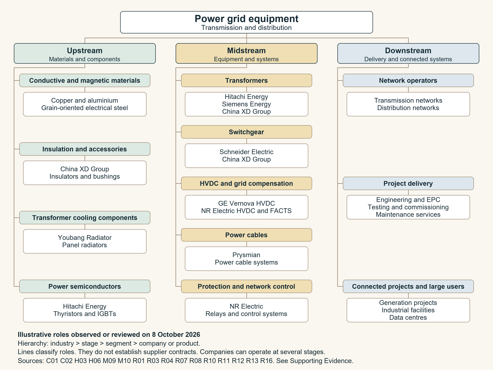
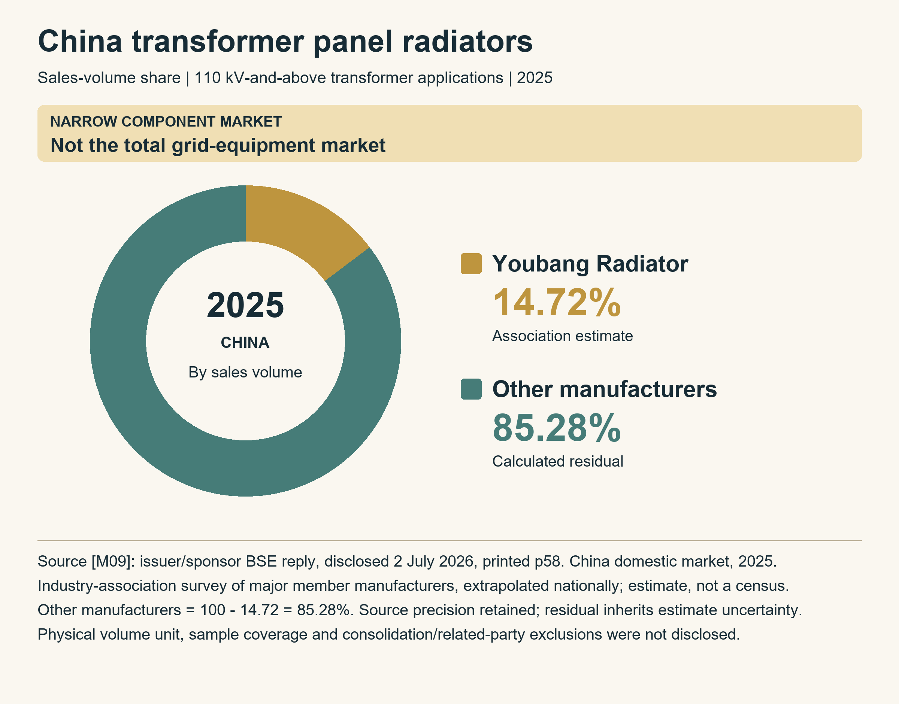

Industry report · Version 1.0 · Evidence cutoff 8 October 2026

Global perspective with comparison of China the United States and Europe

The industry&#x27;s central task is to convert spending and orders into functioning network capacity. This report explains the technologies, supplier roles and regional demand behind that task, then examines the constraints on delivery.

The core scope is electricity transmission and distribution equipment. Project services and network investment are discussed as adjacent activities and demand context. Company examples are illustrative. The mandatory share figure uses the user-approved China panel-radiator component market in 2025; it is explicitly not a global or whole-industry share. Bracketed IDs connect claims and figures to the separate Supporting Evidence appendix.

<a href="report_en.txt" download>Download the complete English report and Supporting Evidence (UTF-8 text)</a>

## Part 1: Industry Story {#part-1}

### A transformer factory reveals the industry's time problem {#part-1-section-1}

On 15 September 2026, Hitachi Energy announced a USD 528 million transformer factory in Gallman, Mississippi. Construction was expected to begin later in 2026, but production was scheduled for 2029. The company planned to keep manufacturing at its existing Crystal Springs facility until the move. A factory announced during an electricity investment boom therefore offered a response measured in years. This was a disclosed investment plan, not a completed plant. <a class="evidence-cite" href="#evidence-R01" aria-label="Evidence R01">[R01]</a>

The event illustrates a practical question: how quickly can spending become equipment that actually carries electricity? A transformer changes voltage; breakers isolate faults; cables and overhead conductors move power; protection and control equipment coordinate operation. Generation, network equipment and the customer&#x27;s connection must work together. A purchased transformer cannot create a permitted transmission corridor, and a new line cannot operate safely without the right protection and substations. These relationships explain why the industry has to be studied as a system. <a class="evidence-cite" href="#evidence-R10" aria-label="Evidence R10">[R10]</a><a class="evidence-cite" href="#evidence-R12" aria-label="Evidence R12">[R12]</a><a class="evidence-cite" href="#evidence-R14" aria-label="Evidence R14">[R14]</a>

Our interpretation is that the current opportunity depends on delivering usable network capacity. Strong demand can improve a supplier&#x27;s order book, but financial outcomes also depend on product qualification, manufacturing throughput, contract terms and execution. The following report connects the history of transmission technology to today&#x27;s value chain, regional demand and constraints. It separates measured results from company forecasts and from our analysis.

## Part 2: Industry History {#part-2}

### From voltage conversion to networks 1886 to 1891 {#part-2-section-1}

Modern grid equipment grew out of a practical problem: power was useful at low voltage, while distance rewarded transmission at higher voltage. IEEE&#x27;s historical record identifies William Stanley&#x27;s Great Barrington demonstration on 20 March 1886 as an early practical transformer-based AC distribution system. Transformers made it possible to change voltage at different points, turning generation, transmission and local delivery into connected stages. Here, the milestone refers to practical AC lighting distribution; it is not a claim that Stanley invented electricity or every transformer principle. <a class="evidence-cite" href="#evidence-H01" aria-label="Evidence H01">[H01]</a>

In 1891, the Lauffen–Frankfurt exhibition demonstrated three-phase high-voltage transmission over about 175 km. The combination of AC machines, transformers and a functioning long-distance line helped establish the feasibility of supplying an industrial centre from remote generation. The important legacy was the system architecture: equipment had to work together across voltage levels. Our historical interpretation is that today&#x27;s transformer, switchgear and protection businesses remain shaped by this requirement for compatibility and dependable operation. <a class="evidence-cite" href="#evidence-H02" aria-label="Evidence H02">[H02]</a>

### Interconnected systems needed institutions as well as wires {#part-2-section-2}

Europe&#x27;s cross-border electricity system developed through operational cooperation. From 1951, UCPTE coordinated synchronous operation among interconnected companies; its successor UCTE strengthened technical coordination as electricity markets developed. Operational responsibilities transferred to ENTSO-E on 1 July 2009. This describes the evolution of Continental Europe&#x27;s synchronous cooperation, rather than one owner operating every European grid. <a class="evidence-cite" href="#evidence-H03" aria-label="Evidence H03">[H03]</a>

The commercial implication, in our assessment, is that a larger network increases the value of interoperability and shared operating rules. An interconnector cannot be judged only by its cable or conductor: the systems on both sides need compatible planning, protection and controls. Europe&#x27;s history therefore helps explain why engineering integration and coordination remain important alongside equipment manufacturing. <a class="evidence-cite" href="#evidence-H03" aria-label="Evidence H03">[H03]</a>

### HVDC created a second transmission path {#part-2-section-3}

AC became the familiar network foundation, while high-voltage direct current developed for selected transmission duties. Hitachi Energy records Gotland 1, commissioned in Sweden in 1954 at 20 MW and 100 kV, as the first commercial HVDC link. The original mercury-arc converter technology was supplemented by thyristor valves in 1970. This is a commercial-system milestone under the manufacturer&#x27;s historical definition. <a class="evidence-cite" href="#evidence-H04" aria-label="Evidence H04">[H04]</a>

Power electronics subsequently changed what converters could do. The 3 MW, ±10 kV Hällsjön–Grängesberg HVDC Light trial began in March 1997. Its voltage-source converter technology could control voltage and reactive power and connect to weak networks. The industry acquired another source of value: control of how power enters a network, as well as movement of power across distance. That is our interpretation of the technical shift, not a claim that every HVDC design serves the same application. <a class="evidence-cite" href="#evidence-H05" aria-label="Evidence H05">[H05]</a>

### China combined institutional scale with very high voltage {#part-2-section-4}

China&#x27;s 2002 State Council reform plan separated generation and network assets and set up the State Grid and China Southern Power Grid structures. State Grid received responsibilities for cross-regional transmission and coordination, while regional companies operated and planned their networks. The policy established an institutional basis for coordinated large-scale grid development; subsequent reforms have continued to alter electricity-market arrangements. <a class="evidence-cite" href="#evidence-H06" aria-label="Evidence H06">[H06]</a>

An important technical milestone followed in 2009, when the Jindongnan–Nanyang–Jingmen 1,000 kV AC demonstration entered operation. The historical record documents development of transformers, switching equipment and insulation for that voltage class. A participating supplier, Sediver, separately records its 2008 selection to supply insulators for the project. Those two dates concern different stages; supplier selection is not commissioning. <a class="evidence-cite" href="#evidence-H07" aria-label="Evidence H07">[H07]</a><a class="evidence-cite" href="#evidence-H12" aria-label="Evidence H12">[H12]</a>

ABB announced commercial commissioning of the ±800 kV Xiangjiaba–Shanghai UHVDC link in July 2010. The later Changji–Guquan project reached ±1,100 kV and a 12,000 MW rating, with commissioning recorded in 2019. These examples show successive increases in transmission scale. They should not be read as proof that the highest possible voltage is always the cheapest solution: project economics still depend on distance, capacity, network conditions and integration. That final judgement is our analysis. <a class="evidence-cite" href="#evidence-H08" aria-label="Evidence H08">[H08]</a><a class="evidence-cite" href="#evidence-H09" aria-label="Evidence H09">[H09]</a>

### The distribution grid became an active system {#part-2-section-5}

The change since the 2000 s has extended to local networks. A DOE-sponsored April 2024 framework describes digital grid modernization, wider operational use of distributed energy resources, and eventual coordination of those resources for network services. Adoption is uneven; its stages describe a framework rather than a universal timetable. Measurement, communications and control increasingly matter to how a distribution system uses its physical assets. <a class="evidence-cite" href="#evidence-H10" aria-label="Evidence H10">[H10]</a>

China&#x27;s December 2025 grid-development policy similarly calls for coordinated main grids, distribution grids and smart microgrids, including a transition toward active bidirectional distribution. Its 2030 and 2035 objectives are forward-looking policy goals. Our interpretation is that the equipment industry&#x27;s task has expanded from delivering rated capacity to delivering capacity that remains observable, controllable and usable under changing operating conditions. Replacement of established equipment and investment in new controls can therefore occur together. <a class="evidence-cite" href="#evidence-H11" aria-label="Evidence H11">[H11]</a>

## Part 3: Market Landscape {#part-3}

### Define the market before counting it {#part-3-section-1}

The core equipment boundary includes power and distribution transformers, switching and substations, overhead conductors and power cables, HVDC converters, compensation equipment, protection, measurement and network control. Engineering, installation and maintenance are adjacent delivery activities. Electricity generation equipment, fuel, retail electricity sales and telecommunications cables are outside the core equipment boundary. The examples below describe product roles rather than an exhaustive ranking. <a class="evidence-cite" href="#evidence-R10" aria-label="Evidence R10">[R10]</a><a class="evidence-cite" href="#evidence-R11" aria-label="Evidence R11">[R11]</a><a class="evidence-cite" href="#evidence-R12" aria-label="Evidence R12">[R12]</a><a class="evidence-cite" href="#evidence-R13" aria-label="Evidence R13">[R13]</a>

Three economic measures answer different questions. Network capital expenditure measures the buyer&#x27;s infrastructure investment, including more than factory equipment. Equipment revenue measures recognized sales within a supplier&#x27;s reporting boundary. Orders and backlog measure commercial commitments with future delivery. None is an interchangeable denominator for the others. Our interpretation is that order strength becomes more valuable when the buyer&#x27;s project is funded, permitted and technically ready to proceed.

### Upstream materials and specialized components {#part-3-section-2}

Upstream production turns conductive, magnetic and insulating materials into components that equipment makers can qualify. The transformer chain includes cores, bushings, insulation and cooling; the cable chain includes conductors, insulation and accessories; converter systems require power semiconductors and cooling. China XD&#x27;s catalog identifies insulators and bushings alongside complete equipment. Hitachi Energy lists thyristors and IGBTs for power applications, including transmission and distribution. These are documented examples of different roles within a diversified supplier. <a class="evidence-cite" href="#evidence-R10" aria-label="Evidence R10">[R10]</a><a class="evidence-cite" href="#evidence-R16" aria-label="Evidence R16">[R16]</a><a class="evidence-cite" href="#evidence-C01" aria-label="Evidence C01">[C01]</a><a class="evidence-cite" href="#evidence-C02" aria-label="Evidence C02">[C02]</a>

Cooling illustrates another upstream role. Youbang Radiator (Changshu) Co., Ltd. reports research, manufacturing and sales of transformer radiators and components. Its disclosed customer groups do not establish an order amount or a current purchasing commitment. The share example below concerns this component market alone. <a class="evidence-cite" href="#evidence-M10" aria-label="Evidence M10">[M10]</a>

Analytically, raw-material tonnage and qualified component availability are separate issues. A maker can have sufficient metal while lacking a tested bushing, an approved valve component or a suitable manufacturing slot. Substitution therefore has to be assessed against the design and qualification requirements. The diagram&#x27;s upstream leaves include products where a reliable named-company attribution was unnecessary.

### Midstream equipment has several competitive structures {#part-3-section-3}

Transformers are a family of markets. Distribution units and large transmission transformers solve different voltage, capacity and installation needs. DOE describes large power transformers as commonly customized and not readily interchangeable. That supports a distinction between repeatable manufacturing and project-specific engineering, rather than a single commodity market. Hitachi Energy and Siemens Energy supply grid equipment internationally; China XD Group provides AC and DC transformer products. <a class="evidence-cite" href="#evidence-R01" aria-label="Evidence R01">[R01]</a><a class="evidence-cite" href="#evidence-R03" aria-label="Evidence R03">[R03]</a><a class="evidence-cite" href="#evidence-R10" aria-label="Evidence R10">[R10]</a><a class="evidence-cite" href="#evidence-R14" aria-label="Evidence R14">[R14]</a>

Switchgear combines interruption, isolation, measurement and control. Schneider Electric is an example in medium voltage; China XD Group lists high-voltage switches and integrated equipment. Protection relays and network automation are a related but distinct layer: NR Electric lists protection, digital substations, control systems and HVDC equipment. NR Electric is identified here as the documented supplier; its catalog is not used as the financial reporting boundary of the listed NARI Technology. <a class="evidence-cite" href="#evidence-R10" aria-label="Evidence R10">[R10]</a><a class="evidence-cite" href="#evidence-R11" aria-label="Evidence R11">[R11]</a><a class="evidence-cite" href="#evidence-R12" aria-label="Evidence R12">[R12]</a>

For transmission links, converter technology and cable systems should also be separated. GE Vernova&#x27;s Electrification disclosure identifies AC substation and HVDC solutions, while Prysmian documents power-cable installation and maintenance. A cable supplier can manufacture and install the cable without supplying the entire converter station. Similarly, owning control technology does not establish ownership of the network. These distinctions matter when evaluating who captures value and which risk sits inside a contract. <a class="evidence-cite" href="#evidence-R04" aria-label="Evidence R04">[R04]</a><a class="evidence-cite" href="#evidence-R13" aria-label="Evidence R13">[R13]</a>

Our interpretation is that competition changes with engineering complexity and execution responsibility. Catalog equipment benefits from manufacturing scale and distribution. Large transformers and HVDC systems rely more heavily on design, qualification and project coordination. Cable systems also require installation capability. A broad company can participate in multiple layers, but a position in one product family does not prove leadership across all equipment categories.

### Downstream operators and delivery partners {#part-3-section-4}

Downstream buyers include network operators, generation developers and large electricity users. The delivery chain adds planning, engineering, installation, testing, commissioning and lifetime maintenance. NR Electric&#x27;s catalog provides examples of EPC, system studies and maintenance; Prysmian includes installation services. Such services can accompany equipment, but the business role is different from operating the regulated network. <a class="evidence-cite" href="#evidence-R11" aria-label="Evidence R11">[R11]</a><a class="evidence-cite" href="#evidence-R13" aria-label="Evidence R13">[R13]</a>

In the United States, EIA explains that regulated investor-owned utilities recover allowed costs and a regulator-approved return through rates. Other structures, including cooperatives and municipal utilities, can differ. Manufacturers instead earn revenue from equipment and service contracts. Our interpretation is that the operator&#x27;s willingness and ability to invest connects physical demand with supplier orders: an urgent engineering need may still face financing and cost-recovery decisions. <a class="evidence-cite" href="#evidence-R08" aria-label="Evidence R08">[R08]</a>



Figure 1 Industry map of power grid equipment and delivery roles

View the static figure and editable files

<figure class="research-photo"><figcaption>Figure 1 Industry map of power grid equipment and delivery roles</figcaption></figure>

<a href="industry_map.png">Full-size PNG</a> · <a href="industry_map.svg">Editable SVG</a> · <a href="industry_map.csv" download>Data CSV</a> · <a href="industry_map.json" download>Figure data and methods</a>

### The scale of demand and regional differences {#part-3-section-5}

IEA&#x27;s Electricity 2026 report uses a current annual grid-investment baseline of USD 400 billion and estimates that investment must rise by approximately 50% by 2030 to meet demand. Simple arithmetic gives about USD 600 billion annually at the stated requirement. This is network investment rather than the revenue of equipment factories; it should not be compared with supplier revenue to compute market share. <a class="evidence-cite" href="#evidence-R02" aria-label="Evidence R02">[R02]</a>

China&#x27;s NEA reported approximately 1200 GW of solar and 640 GW of wind capacity at end 2025, with year-on-year growth of 35.4% and 22.9%. Separately, accessible First Financial reporting hosted by NEA attributes to a China Electricity Council (CEC) presentation a forecast exceeding CNY 5 trillion of grid fixed-asset investment during 2026–2030. The generation statistics are primary government data; the investment figure is a reported forecast whose underlying complete CEC report was not read. Neither establishes guaranteed equipment orders. <a class="evidence-cite" href="#evidence-R05" aria-label="Evidence R05">[R05]</a><a class="evidence-cite" href="#evidence-R15" aria-label="Evidence R15">[R15]</a>

For the United States, EIA&#x27;s historical major-utility sample shows USD 50.9 billion of distribution capital investment in 2023, up USD 6.5 billion from 2022, in 2023 dollars. The observation demonstrates the significance of local networks, but does not claim to be a 2026 market total. Our regional interpretation is that replacement, resilience and new-load connections should be analyzed alongside bulk transmission, rather than treating grid spending as exclusively new long-distance lines. <a class="evidence-cite" href="#evidence-R07" aria-label="Evidence R07">[R07]</a>

For the European Union, the Commission estimates EUR 584 billion of electricity-grid investment needs this decade and states that 40% of distribution grids are over 40 years old. These are cumulative demand and aging indicators. Europe also includes non-EU systems, so the EU estimate is not relabeled as an all-Europe total. Cross-border planning and aging distribution networks create different equipment and delivery requirements from China&#x27;s long-distance resource corridors. That comparison is an analytical interpretation, not a claim that either region has a single uniform market. <a class="evidence-cite" href="#evidence-R06" aria-label="Evidence R06">[R06]</a>

### Equipment portfolio estimates and cable project awards {#part-3-section-6}

A corporate estimate provides an equipment-oriented perspective, with a different boundary from grid capital expenditure. Hitachi Energy&#x27;s October 2025 strategy presentation estimated its portfolio market at USD 233 billion in 2024 and USD 251 billion in 2025, rising to USD 350 billion in 2030 and USD 450 billion in 2035. It described approximate growth rates of 7% for 2024–2030 and 5% for 2030–2035. These are management estimates for a served portfolio, with detailed geography and inclusions not supplied on the market-size slide. They are not an independently measured total for all grid equipment. <a class="evidence-cite" href="#evidence-M08" aria-label="Evidence M08">[M08]</a>

Power-cable awards show why annual growth can be misleading. NKT estimated about EUR 4 billion of awards in its addressable high-voltage market during 2025 and retained an annual-average forecast above EUR 10 billion for 2024–2030. Its H1 2026 presentation estimated about EUR 10 billion of transmission-cable awards during that half year and reported its own Transmission backlog at EUR 13 billion at 30 June 2026. NKT changed its business-line boundaries from January 2026, so the two periods are not assumed to have identical scope. Awards are commitments, while cable delivery and revenue can follow over several years. <a class="evidence-cite" href="#evidence-M04" aria-label="Evidence M04">[M04]</a><a class="evidence-cite" href="#evidence-M05" aria-label="Evidence M05">[M05]</a>

Our interpretation is that these figures are useful lenses rather than quantities to add together. Buyer investment, a company-defined served market and project-award value can each reveal pressure in the system. They do not share a denominator. The corporate forecasts also retain execution and timing risk; the report does not turn them into guaranteed industry growth.

### Order growth and profitability {#part-3-section-7}

The quarter from April to June 2026 allows a timely comparison of two supplier segments, with currencies and definitions retained. Siemens Energy Grid Technologies reported EUR 5.367 billion in orders and EUR 3.624 billion in revenue, with a 19.9% profit margin before special items; backlog was approximately EUR 51 billion. Comparable revenue growth was 28.6%. GE Vernova Electrification reported USD 6.347 billion in orders and USD 3.637 billion in revenue, with an 18.4% segment EBITDA margin. GE&#x27;s revenue grew 68% as reported and 29% organically, with Prolec GE included in the reported result. <a class="evidence-cite" href="#evidence-R03" aria-label="Evidence R03">[R03]</a><a class="evidence-cite" href="#evidence-R04" aria-label="Evidence R04">[R04]</a>

The resulting book-to-bill ratios are approximately 1.48 for Siemens GT and 1.75 for GE Electrification, using each segment&#x27;s orders divided by revenue. These values suggest that orders exceeded quarterly revenue, not that either supplier held those shares of the world market. The profit measures also differ: EBITDA and Siemens&#x27; profit before special items are not interchangeable. Comparing the two headline margins as a league table would hide accounting and portfolio differences. <a class="evidence-cite" href="#evidence-R03" aria-label="Evidence R03">[R03]</a><a class="evidence-cite" href="#evidence-R04" aria-label="Evidence R04">[R04]</a>

Cable economics offer another useful within-company comparison. At year-end 2025, Prysmian reported a EUR 17 billion Transmission backlog. Its Q4 adjusted EBITDA margins at standard metal prices were 20.9% in Transmission and 12.1% in Power Grid; the company said metal premiums temporarily affected the overhead-line business. Those are supplier-specific, adjusted figures rather than universal margins for high-voltage and distribution cables. <a class="evidence-cite" href="#evidence-R09" aria-label="Evidence R09">[R09]</a>

Our interpretation is that a large backlog provides visibility but also creates a delivery obligation. The questions are whether the supplier can expand output without quality failures, obtain suitable price and inflation protection, and complete the buyer&#x27;s project milestones. Pricing that improves margins during scarcity may weaken as capacity arrives. This is a conditional mechanism, not a forecast of a particular company&#x27;s future margin.

<table><caption>Table 1 Supplier segment results with original reporting definitions</caption><thead><tr><th scope="col">Metric</th><th scope="col">Siemens Energy GT</th><th scope="col">GE Vernova Electrification</th></tr></thead><tbody><tr><th scope="row">Period</th><td>April–June 2026</td><td>April–June 2026</td></tr><tr><th scope="row">Orders</th><td>EUR 5.367bn</td><td>USD 6.347bn</td></tr><tr><th scope="row">Revenue</th><td>EUR 3.624bn</td><td>USD 3.637bn</td></tr><tr><th scope="row">Book-to-bill</th><td>1.48</td><td>1.75</td></tr><tr><th scope="row">Margin</th><td>19.9% before special items</td><td>18.4% segment EBITDA</td></tr><tr><th scope="row">Revenue growth</th><td>28.6% comparable</td><td>68% reported; 29% organic</td></tr></tbody></table>

Sources <a class="evidence-cite" href="#evidence-R03" aria-label="Evidence R03">[R03]</a><a class="evidence-cite" href="#evidence-R04" aria-label="Evidence R04">[R04]</a>. Currencies, segment scope and profit definitions differ; this is not a market-share or profit ranking. Book-to-bill is orders divided by revenue, rounded to two decimal places.

### A disclosed share in one upstream component market {#part-3-section-8}

A reliable share is possible only with a precise market definition. Youbang&#x27;s BSE inquiry response reproduces an association estimate that its share of China&#x27;s domestic sales-volume market for panel radiators used on transformers rated 110 kV and above was 14.72% in 2025. The association surveyed major radiator-producing members and extrapolated the domestic market. The underlying physical volume unit, complete sample coverage and group-sales elimination details are not disclosed. <a class="evidence-cite" href="#evidence-M09" aria-label="Evidence M09">[M09]</a>

Figure 2 keeps that published figure and calculates other manufacturers as 85.28%. The residual includes all suppliers outside the reported issuer category; no competitor share is invented. This is a narrow cooling-component example, not a share of all transformers or grid equipment. It demonstrates the discipline required before comparing a market percentage with a company&#x27;s financial results.



Figure 2 China transformer panel-radiator sales-volume share in 2025

Source <a class="evidence-cite" href="#evidence-M09" aria-label="Evidence M09">[M09]</a>, printed page 58. Association survey extrapolation reproduced in the issuer/sponsor filing; estimate rather than census. Other = 100.00 − 14.72 = 85.28%.

View the static figure and editable files

<figure class="research-photo"><figcaption>Figure 2 China transformer panel-radiator sales-volume share in 2025</figcaption></figure>

Source <a class="evidence-cite" href="#evidence-M09" aria-label="Evidence M09">[M09]</a>, printed page 58. Association survey extrapolation reproduced in the issuer/sponsor filing; estimate rather than census. Other = 100.00 − 14.72 = 85.28%.

<a href="market_share.png">Full-size PNG</a> · <a href="market_share.svg">Editable SVG</a> · <a href="market_share.csv" download>Data CSV</a> · <a href="market_share.json" download>Figure data and methods</a>

### What a useful monitoring framework measures {#part-3-section-9}

A useful analytical framework follows conversion rather than headlines alone: planned network investment to funded projects; project awards to equipment orders; orders to qualified production and shipment; shipment to commissioning and cash collection. Along that chain, watch book-to-bill, organic revenue growth, backlog delivery dates, the accounting definition of margin and working-capital effects. These are questions for further diligence, not unverified measurements of the industry.

Geography and product specialization also have to remain visible. A China procurement result, a European cable framework agreement and a North American transformer order can all indicate demand, but they do not create a single comparable market-share table. The share figure must retain its own measured market, period and denominator, and must not be generalized to all transmission and distribution equipment.

## Part 4: Industry Challenges {#part-4}

### Supply capacity is constrained by specifications, skills and materials {#part-4-section-1}

A July 2024 DOE report describes U.S. large power transformers as customized equipment and records producer interviews reporting lead times up to, and exceeding, 36 months. This is a dated U.S. observation, not a current worldwide average. Voltage, impedance, insulation, testing and delivery requirements make a large transformer difficult to substitute casually. In our assessment, adding nominal factory capacity will not automatically create equivalent deliverable capacity if engineering, skilled labour or qualified inputs remain constrained. <a class="evidence-cite" href="#evidence-C01" aria-label="Evidence C01">[C01]</a>

The distribution segment has its own bottleneck. DOE&#x27;s February 2024 account reports U.S. lead times rising from 3–6 months in 2019 to 12–30 months in 2023, with electrical steel, copper, aluminium and workforce shortages contributing. DOE also identifies extensive specification variation and has pursued more common designs through an industry working group. <a class="evidence-cite" href="#evidence-C02" aria-label="Evidence C02">[C02]</a><a class="evidence-cite" href="#evidence-C03" aria-label="Evidence C03">[C03]</a>

Our assessment is that credible multiyear purchasing commitments, fewer unnecessary variants, training and qualified alternative inputs can ease the constraint together. The limits are material: changing a design may require new validation, and standardization cannot ignore local protection, loading or environmental conditions. For buyers, a quoted production slot should be evaluated alongside approval, transport and installation readiness; otherwise, an apparently secured unit may still arrive too late for the project. This is an analytical implication of the documented supply constraints. <a class="evidence-cite" href="#evidence-C01" aria-label="Evidence C01">[C01]</a><a class="evidence-cite" href="#evidence-C03" aria-label="Evidence C03">[C03]</a>

### Connection queues are proposed projects, not committed demand {#part-4-section-2}

LBNL&#x27;s June 2026 edition of Queued Up records 1,312 GW of generation and approximately 749 GW of storage actively seeking U.S. interconnection at end-2025. Its data cover about 98% of installed U.S. generating capacity. For regions with available data, projects built in 2025 had a median request-to-commercial-operation duration above five years. Many requests are eventually withdrawn, so queue volume cannot be converted directly into future equipment sales. <a class="evidence-cite" href="#evidence-C04" aria-label="Evidence C04">[C04]</a>

FERC&#x27;s Order 2023 reforms introduced cluster studies, readiness requirements and study deadlines to improve processing. These address procedural congestion. Our analysis is that faster studies can reveal a network upgrade earlier, but cannot manufacture the transformer, secure a route or finance the upgrade by themselves. A smaller queue can also reflect withdrawals rather than faster construction. <a class="evidence-cite" href="#evidence-C05" aria-label="Evidence C05">[C05]</a><a class="evidence-cite" href="#evidence-C04" aria-label="Evidence C04">[C04]</a>

China&#x27;s distribution policy emphasizes connection capability and coordination of generation, load and storage. This points to a related physical problem without establishing an equivalent national queue dataset. Our assessment is that transparent hosting-capacity information, credible project milestones and coordinated reinforcement reduce wasted development work. Flexible connections can help where operating constraints are explicit, but they transfer some dispatch or curtailment risk to the connected customer and require terms that customer can finance. <a class="evidence-cite" href="#evidence-C06" aria-label="Evidence C06">[C06]</a>

### Permitting and cost allocation determine whether plans become assets {#part-4-section-3}

A transmission project joins locations and jurisdictions; benefits may spread beyond the place bearing construction disruption. The U.S. CITAP programme coordinates eligible federal reviews on a two-year schedule, with the clock beginning after preapplication. State siting participation is voluntary, and the schedule is not a promise to finish an entire line in two years. That scope matters when interpreting policy announcements as equipment demand. <a class="evidence-cite" href="#evidence-C07" aria-label="Evidence C07">[C07]</a>

Funding creates a second coordination problem. FERC&#x27;s regional planning framework, including Orders 1920, 1920-A and 1920-B, provides for long-term scenarios of at least 20 years and a stronger role for states in cost allocation. In Europe, the Commission&#x27;s June 2025 anticipatory-investment guidance proposes assigning future utilization risk in advance and considering separate approval stages for design/permitting and construction. These are responses to uncertainty about who pays before all future users arrive. <a class="evidence-cite" href="#evidence-C08" aria-label="Evidence C08">[C08]</a><a class="evidence-cite" href="#evidence-C09" aria-label="Evidence C09">[C09]</a>

Our assessment is that earlier community engagement, coordinated applications and transparent benefit allocation can make projects more credible. Yet accelerating investment trades one risk for another: waiting for every customer delays access, while building ahead of uncertain demand can burden consumers with underused assets. Scenario-based planning and staged commitments help manage this trade-off; they do not remove forecasting error, local opposition or the need for a financeable cost-recovery arrangement. Equipment suppliers therefore need to distinguish a network plan, a funded project and an executable purchase order. <a class="evidence-cite" href="#evidence-C07" aria-label="Evidence C07">[C07]</a><a class="evidence-cite" href="#evidence-C08" aria-label="Evidence C08">[C08]</a><a class="evidence-cite" href="#evidence-C09" aria-label="Evidence C09">[C09]</a>

### Usable capacity requires voltage control and verified dynamic performance {#part-4-section-4}

Reliability involves more than adequate megawatts. NERC&#x27;s 2025 overview records four 2024 disturbance events above 500 MW involving coordinated inverter-based-resource performance. Separately, ENTSO-E&#x27;s March 2026 official conclusions on the April 2025 Iberian blackout identify interacting oscillations, voltage and reactive-power control gaps, regulatory-practice differences and generator disconnections. The investigation supports a multiple-factor explanation; it does not justify assigning sole blame to renewable generation. <a class="evidence-cite" href="#evidence-C10" aria-label="Evidence C10">[C10]</a><a class="evidence-cite" href="#evidence-C11" aria-label="Evidence C11">[C11]</a>

Grid-forming controls are one response. DOE&#x27;s technical roadmap explanation describes their ability to support independent restart, alongside work needed on controls, modelling and standards. China&#x27;s November 2024 safety policy calls for reasonable network strength, safety margins and observable, measurable, adjustable and controllable distributed resources. These measures connect equipment capability with operating responsibility. <a class="evidence-cite" href="#evidence-C12" aria-label="Evidence C12">[C12]</a><a class="evidence-cite" href="#evidence-C16" aria-label="Evidence C16">[C16]</a>

Our assessment is that buyers should assess control behaviour, validated models and protection coordination with the same seriousness as thermal ratings. Grid-forming functionality is not a universal software fix: the complete system still needs suitable hardware, operating conditions and verification. Different controls can interact in ways that a single-device test misses. Integrating dependable voltage support, disturbance recording and commissioning tests creates value, but adds engineering effort and makes clear responsibility between manufacturers, plant owners and grid operators essential. <a class="evidence-cite" href="#evidence-C10" aria-label="Evidence C10">[C10]</a><a class="evidence-cite" href="#evidence-C11" aria-label="Evidence C11">[C11]</a><a class="evidence-cite" href="#evidence-C12" aria-label="Evidence C12">[C12]</a>

### The European fluorinated gas transition changes the product roadmap {#part-4-section-5}

Regulation (EU) 2024/573 restricts putting specified fluorinated-gas switchgear into operation in stages: medium-voltage distribution equipment up to 24 kV from 1 January 2026; above 24 through 52 kV from 2030; high-voltage equipment from 52 through 145 kV and up to 50 kA, using gases with GWP at least 1, from 2028; and equipment above 145 kV or above 50 kA, using gases with GWP at least 1, from 2032. Conditional derogations cover procurement availability, orders placed before 11 March 2024 and certain incompatible extensions, among other cases. This is not an immediate requirement to remove all installed SF6 equipment. <a class="evidence-cite" href="#evidence-C13" aria-label="Evidence C13">[C13]</a>

Our assessment is that this creates both a development opportunity and a transition burden. Utilities need qualified equipment for each duty, while suppliers need to align product design, validation, delivery and service capability with the applicable date. A technically attractive alternative that cannot be approved or delivered for the required application does not solve the project constraint. Regional compliance differences may require parallel product portfolios and complicate production planning. <a class="evidence-cite" href="#evidence-C13" aria-label="Evidence C13">[C13]</a>

For buyers, the practical approach is to specify the duty and commissioning date early, verify the relevant provision and any claimed exception, and assess whole-life service needs. For suppliers, success requires reliable operating evidence and customer qualification as well as a lower-emission design. Those are this report&#x27;s commercial conclusions, rather than a forecast that every legacy product disappears on one date. <a class="evidence-cite" href="#evidence-C13" aria-label="Evidence C13">[C13]</a>

### Digital operation extends the security obligation through the equipment life {#part-4-section-6}

Joint international OT guidance published in October 2024 places physical safety at the centre of security decisions and stresses network segregation, supply-chain security and people. January 2026 guidance on secure OT connectivity adds a specific problem: long-lived legacy equipment, vendor connections and remote access can enlarge exposure, while segmentation is only an interim response to obsolete products. These are operational guidelines, not quantified evidence of attacks on any company discussed here. <a class="evidence-cite" href="#evidence-C14" aria-label="Evidence C14">[C14]</a><a class="evidence-cite" href="#evidence-C15" aria-label="Evidence C15">[C15]</a>

Our assessment is that suppliers increasingly need to support controlled access, vulnerability handling and an achievable replacement path over the equipment&#x27;s operating life. Owners need to know which third parties can change a control system, record that access and retain workable recovery arrangements. The difficulty is that a grid cannot suspend a critical function whenever a software update appears. Security maintenance must therefore fit testing and operating schedules, with accountability agreed before purchase. <a class="evidence-cite" href="#evidence-C14" aria-label="Evidence C14">[C14]</a><a class="evidence-cite" href="#evidence-C15" aria-label="Evidence C15">[C15]</a>

Taken together, the six constraints favour a broader assessment of competitive strength: the capacity to qualify, deliver, connect and support equipment under real network conditions. This is our synthesis of the evidence, not a ranking or a prediction of guaranteed supplier profits. Physical manufacturing, project governance and system engineering must advance together for grid investment to become reliable service. <a class="evidence-cite" href="#evidence-C01" aria-label="Evidence C01">[C01]</a><a class="evidence-cite" href="#evidence-C04" aria-label="Evidence C04">[C04]</a><a class="evidence-cite" href="#evidence-C07" aria-label="Evidence C07">[C07]</a><a class="evidence-cite" href="#evidence-C11" aria-label="Evidence C11">[C11]</a><a class="evidence-cite" href="#evidence-C13" aria-label="Evidence C13">[C13]</a><a class="evidence-cite" href="#evidence-C15" aria-label="Evidence C15">[C15]</a>

## Appendix: Supporting Evidence {#supporting-evidence}

Records are grouped by the claims they support. Each identifies provenance, dates, scope, location, supported statements and limitations. Company estimates and secondary reporting remain labeled as such. Read dates are 8 October 2026; all cited materials were public by the cutoff. Undated live pages describe what was observed on that date, without an invented publication date.

Source originals and screenshots are linked rather than redistributed because a reproduction license was not verified. No documentary body photographs are included; no optional image with a verified redistribution license was selected. The industry map, share chart and conceptual cover are report-created assets.

### Story and equipment functions

<section class="research-evidence" id="evidence-R01" aria-labelledby="evidence-title-R01">
<h3 id="evidence-title-R01">[R01] Hitachi deepens commitment to U.S. manufacturing with $528 million Mississippi transformer factory</h3>

Publisher and material type: Hitachi Energy; First-party company announcement.

<a href="https://www.hitachienergy.com/in/en/news-and-events/press-releases/2026/09/hitachi-deepens-commitment-to-u-s-manufacturing-with-528-million-mississippi-transformer-factory" target="_blank" rel="noopener">Read the original source</a>

Dates, scope, support and limits

Publication: 2026-09-15. Event: 2026-09-15 announcement; construction expected late 2026; production scheduled 2029. Statistical period: Investment announcement, not realized expenditure. Read: 8 October 2026.

Scope and location: Gallman, Mississippi, United States; USD. Locator: Opening announcement and paragraph beginning The new factory in Gallman.

Supports: A planned USD 528 m transformer plant; production expected in 2029; existing Crystal Springs production is to move after completion.

Limits: Corporate plans are not verified commissioning or expenditure. Capacity doubling refers to this local operation, not the global industry. Employment statements differ within the release, so exact job counts are excluded.

</section>

<section class="research-evidence" id="evidence-R10" aria-labelledby="evidence-title-R10">
<h3 id="evidence-title-R10">[R10] Main products</h3>

Publisher and material type: China XD Group; First-party product documentation.

<a href="https://en.xd.com.cn/Core_business/Equipment_manufacture/Main_products.htm" target="_blank" rel="noopener">Read the original source</a>

Dates, scope, support and limits

Publication: Undated live product catalog. Event: Product roles observed 2026-10-08. Statistical period: Catalog as read. Read: 8 October 2026.

Scope and location: China XD Group catalog; examples of roles, not audited company sales. Locator: Transformer Products, High-voltage switch products, Power electronics, Power automation products, Insulators and sleeves.

Supports: Catalog identifies power/converter transformers, high-voltage switches, converter valves, protection/control, insulators/bushings and cables.

Limits: Group catalog does not attribute every product to listed China XD Electric or verify any contract, share or product superiority. Product roles can span stages.

</section>

<section class="research-evidence" id="evidence-R12" aria-labelledby="evidence-title-R12">
<h3 id="evidence-title-R12">[R12] Switchgear Medium voltage explained</h3>

Publisher and material type: Schneider Electric; First-party technical and product documentation.

<a href="https://www.se.com/ww/en/knowledge-center/switchgear/" target="_blank" rel="noopener">Read the original source</a>

Dates, scope, support and limits

Publication: Undated live product explanation. Event: Product roles observed 2026-10-08. Statistical period: Documentation as read. Read: 8 October 2026.

Scope and location: Medium voltage switching, measurement and protection; voltage definitions vary by region. Locator: Protection, Control, Circuit breaker, Protective relay, Instrument transformers, AirSeT sections.

Supports: Relays detect faults and command breakers; switchgear routes, isolates and controls circuits; Schneider supplies SF6-free medium voltage products.

Limits: Vendor explanations do not establish legal applicability, quantified market share or universal voltage-class boundaries. Regulation is separately sourced from the original law.

</section>

<section class="research-evidence" id="evidence-R14" aria-labelledby="evidence-title-R14">
<h3 id="evidence-title-R14">[R14] Transformer Resilience and Advanced Components TRAC Program</h3>

Publisher and material type: US Department of Energy Office of Electricity; Primary government technical program documentation.

<a href="https://www.energy.gov/oe/transformer-resilience-and-advanced-components-trac-program" target="_blank" rel="noopener">Read the original source</a>

Dates, scope, support and limits

Publication: Undated live program page; cites 2023 appropriations context. Event: Technical overview observed 2026-10-08. Statistical period: Program description as read. Read: 8 October 2026.

Scope and location: Large transformers, HVDC and advanced grid components. Locator: Advanced Transformers and High Voltage Direct Current sections.

Supports: Large power transformers are often custom-made, expensive and not readily interchangeable. DOE supports HVDC converter cost reduction and advanced transformers.

Limits: Legacy typical lead-time description is not a 2026 market-wide measured lead time. Technical R&amp;D objectives are not commercially delivered results.

</section>

### Origins and industry history

<section class="research-evidence" id="evidence-H01" aria-labelledby="evidence-title-H01">
<h3 id="evidence-title-H01">[H01] Milestones Alternating Current Electrification 1886</h3>

Title: Milestones Alternating Current Electrification 1886. Publisher: IEEE History Center / ETHW. Material: institutional historical record.

<a href="https://ethw.org/Milestones:Alternating_Current_Electrification,_1886" target="_blank" rel="noopener">Read the original source</a>

Dates, scope, support and limits

Publication is undated; the plaque was dedicated on 2 October 2004. Event: 20 March 1886. Historical period: 1886. Read: 8 October 2026.

Coverage: Great Barrington, Massachusetts, U.S.; transformer-based AC distribution. Locator: milestone citation and historical explanation. No market-size unit applies.

Supports: Supports Stanley&#x27;s public demonstration of practical AC illumination using transformers to change distribution voltage. This identifies a system milestone and the voltage-conversion architecture.

Limitations: This is a retrospective institutional history, not a contemporaneous journal. IEEE&#x27;s practical-system definition does not establish a universal first for AC, transformers or electricity. The report avoids that broader inference.

</section>

<section class="research-evidence" id="evidence-H02" aria-labelledby="evidence-title-H02">
<h3 id="evidence-title-H02">[H02] Milestones Long Distance Electric Power Transmission Using Three Phase Alternating Current 1891</h3>

Title: Milestones Long Distance Electric Power Transmission Using Three Phase Alternating Current 1891. Publisher: IEEE History Center / ETHW. Material: institutional historical record.

<a href="https://ethw.org/Milestones:Long_Distance_Electric_Power_Transmission_Using_Three-Phase_Alternating_Current,_1891" target="_blank" rel="noopener">Read the original source</a>

Dates, scope, support and limits

Publication is undated; dedication: 9 June 2025. Event and historical period: 1891. Read: 8 October 2026.

Coverage: Lauffen–Frankfurt, Germany; high-voltage three-phase AC demonstration. Locator: milestone citation and justification. Relevant units: kilometres and kilovolts.

Supports: Supports the 1891 exhibition&#x27;s approximately 175 km transmission demonstration and its influence on AC adoption. The report uses it to explain interoperable system architecture.

Limitations: This is an institutional retrospective. Different passages give 24 and 25 August, so the manuscript uses the year only. The scoped demonstration does not prove the first electricity transmission of any type.

</section>

<section class="research-evidence" id="evidence-H03" aria-labelledby="evidence-title-H03">
<h3 id="evidence-title-H03">[H03] Former Associations UCPTE and UCTE</h3>

Title: Former Associations UCPTE and UCTE. Publisher: ENTSO-E. Material: primary institutional historical record.

<a href="https://www.entsoe.eu/news-events/former-associations/" target="_blank" rel="noopener">Read the original source</a>

Dates, scope, support and limits

Publication is undated; archived milestones: 1951, 1999 and 1 July 2009. Historical period: 1951–2009. Read: 8 October 2026.

Coverage: Continental European synchronous-grid cooperation. Locator: UCTE section of Former Associations. This is institutional history, without a market-size denominator.

Supports: Supports UCPTE&#x27;s coordination from 1951, UCTE&#x27;s 1999 transition toward transmission-operator cooperation, and transfer of operational functions to ENTSO-E in July 2009.

Limitations: Continental Europe is one synchronous area; the record does not imply that every European grid is synchronous with it or has one owner. Commercial implications concerning interoperability are the report&#x27;s interpretation, not measured market data.

</section>

<section class="research-evidence" id="evidence-H04" aria-labelledby="evidence-title-H04">
<h3 id="evidence-title-H04">[H04] The Gotland HVDC link</h3>

Title: The Gotland HVDC link. Publisher: Hitachi Energy. Material: primary manufacturer historical record.

<a href="https://www.hitachienergy.com/se/sv/news-and-events/customer-stories/the-gotland-hvdc-link" target="_blank" rel="noopener">Read the original source</a>

Dates, scope, support and limits

Publication is undated; historical events: 1954 and 1970. Period: 1954–1970. Read: 8 October 2026.

Coverage: Gotland, Sweden; commercial HVDC. Locator: opening historical account. Relevant units: MW and kV.

Supports: Supports the 1954 Gotland 1 link&#x27;s 20 MW and 100 kV ratings and the addition of thyristor valves to mercury-arc technology in 1970.

Limitations: This is the manufacturer&#x27;s historical account. Its first-commercial-HVDC description has a defined commercial-system scope; it does not establish the origin of every DC transmission concept. Later system upgrades are not substituted for the original link&#x27;s ratings.

</section>

<section class="research-evidence" id="evidence-H05" aria-labelledby="evidence-title-H05">
<h3 id="evidence-title-H05">[H05] Hällsjön The First HVDC Light Transmission</h3>

Title: Hällsjön The First HVDC Light Transmission. Publisher: Hitachi Energy. Material: primary manufacturer historical record.

<a href="https://www.hitachienergy.com/us/en/news-and-events/customer-stories/hallsjon-the-first-hvdc-light-transmission" target="_blank" rel="noopener">Read the original source</a>

Dates, scope, support and limits

Publication is undated; trial operation began in March 1997. Historical period: 1997. Read: 8 October 2026.

Coverage: Hällsjön–Grängesberg, Sweden; voltage-source converter test link. Locator: historical account and main-data table. Units: MW and kV.

Supports: Supports the 3 MW, ±10 kV HVDC Light trial and the described voltage/reactive-power control and weak-network connection capability of voltage-source converters.

Limitations: The source describes a branded test-transmission milestone, not the invention of every VSC concept in 1997. The report&#x27;s interpretation of greater value in network control is not an independently measured revenue effect or market share.

</section>

<section class="research-evidence" id="evidence-H06" aria-labelledby="evidence-title-H06">
<h3 id="evidence-title-H06">[H06] Electric Power System Reform Plan State Council Document No 5 of 2002</h3>

Title (English translation): Electric Power System Reform Plan State Council Document No 5 of 2002. Publisher: State Council of China; archived by National Energy Administration. Material: primary regulatory policy text.

<a href="https://www.nea.gov.cn/2011-08/17/c_131054253.htm" target="_blank" rel="noopener">Read the original source</a>

Dates, scope, support and limits

Policy published on 10 February 2002; NEA archive: 17 August 2011. Event: the 2002 reform plan. Period: 2002. Read: 8 October 2026.

Coverage: China&#x27;s electricity-asset restructuring and regulated networks. Locator: sections 6–13 and 21. No equipment-sales unit applies.

Supports: Supports separation of generation and network assets, establishment of the State Grid and China Southern Power Grid structures, and assigned regional/cross-regional responsibilities.

Limitations: The document establishes the 2002 policy plan, not the complete present-day organizational structure or every later reform. Institutional implications are interpreted from that plan; no supplier market shares, current contract awards or guaranteed investments follow from it.

</section>

<section class="research-evidence" id="evidence-H07" aria-labelledby="evidence-title-H07">
<h3 id="evidence-title-H07">[H07] Ultra High Voltage Establishes Chinese Leadership and Expands China&#x27;s Electricity Highway</h3>

Title (English translation): Ultra High Voltage Establishes Chinese Leadership and Expands China&#x27;s Electricity Highway. Publisher: People&#x27;s Daily reporter Bao Dan; reprinted by National Energy Administration. Material: officially reprinted secondary reporting.

<a href="https://www.nea.gov.cn/2011-12/19/c_131314789.htm" target="_blank" rel="noopener">Read the original source</a>

Dates, scope, support and limits

Published on 19 December 2011. Events: initial operation in January 2009 and extension in December 2011. Period: 2009–2011. Read: 8 October 2026.

Coverage: China&#x27;s Jindongnan–Nanyang–Jingmen AC pilot. Locator: commissioning and equipment passages. Relevant unit: 1,000 kV.

Supports: Supports the 2009 commissioning year, subsequent 2011 extension, and development of transformer, switchgear and insulation capability; a participant&#x27;s insulator record provides cross-checking.

Limitations: This is People&#x27;s Daily reporting hosted by NEA, so government republication does not turn it into primary evidence. The manuscript avoids an exact commissioning day, blanket world-first wording and claims that every component was domestically sourced.

</section>

<section class="research-evidence" id="evidence-H08" aria-labelledby="evidence-title-H08">
<h3 id="evidence-title-H08">[H08] ABB Commissions the World&#x27;s Longest and Most Powerful Transmission Link</h3>

Title: ABB Commissions the World&#x27;s Longest and Most Powerful Transmission Link. Publisher: ABB. Material: primary company commissioning disclosure.

<a href="https://new.abb.com/news/detail/12798/abb-commissions-worlds-longest-and-most-powerful-transmission-link" target="_blank" rel="noopener">Read the original source</a>

Dates, scope, support and limits

Published on 19 July 2010; commercial commissioning announced in July 2010. Period: 2010. Read: 8 October 2026.

Coverage: Xiangjiaba–Shanghai UHVDC, China. Locator: release paragraphs 1–7. Units: kV and MW.

Supports: ABB&#x27;s contemporary disclosure supports commissioning of the ±800 kV link, its stated 7,200 MW rating, and ABB&#x27;s disclosed delivery of converter transformers and other equipment.

Limitations: This is a participant&#x27;s disclosure, not an independent comparison of every transmission project. Current heritage pages use different rounded ratings; the report retains this source&#x27;s definition or omits capacity. Neither a global supplier share nor universal UHVDC cost advantage is inferred.

</section>

<section class="research-evidence" id="evidence-H09" aria-labelledby="evidence-title-H09">
<h3 id="evidence-title-H09">[H09] Changji Guquan UHVDC Link</h3>

Title: Changji Guquan UHVDC Link. Publisher: Hitachi Energy. Material: primary manufacturer project record.

<a href="https://www.hitachienergy.com/jp/ja/news-and-events/customer-stories/changji-guquan-uhvdc-link" target="_blank" rel="noopener">Read the original source</a>

Dates, scope, support and limits

Publication is undated; commissioning year and historical period: 2019. Read: 8 October 2026.

Coverage: Changji–Guquan UHVDC, China. Locator: project description and main-data table. Units: kV and MW.

Supports: Supports 2019 commissioning, a ±1,100 kV DC rating, 12,000 MW capacity, and the manufacturer&#x27;s converter-valve and converter-transformer contribution.

Limitations: The Hitachi page gives approximately 3,000 km, while NR Electric gives 3,400 km. Route definitions were not reconciled, so the manuscript omits length and the precise daily date. It does not infer a market share or guarantee that higher voltage is economically preferable in every application.

</section>

<section class="research-evidence" id="evidence-H10" aria-labelledby="evidence-title-H10">
<h3 id="evidence-title-H10">[H10] Distribution System Evolution</h3>

Title: Distribution System Evolution. Publisher: Paul De Martini; Lisa Schwartz; DOE-sponsored. Material: primary technical framework.

<a href="https://energy.gov/media/323194" target="_blank" rel="noopener">Read the original source</a>

Dates, scope, support and limits

Published in April 2024; no single event date. Period: the April 2024 conceptual framework. Read: 8 October 2026.

Coverage: U.S. distribution grids, DER and electrification. Locator: printed pages 3–6, PDF pages 4–7. No market-size unit is used.

Supports: Supports digital modernization, operational use of distributed resources and coordinated optimization as stages of distribution-system development, with uneven adoption between areas.

Limitations: This is a DOE-sponsored authors&#x27; technical framework, not a mandatory government rule or universal timetable. Illustrative DER percentages are not universal engineering limits and are not used in the report. Commercial implications are analysis rather than quantified forecasts.

</section>

<section class="research-evidence" id="evidence-H11" aria-labelledby="evidence-title-H11">
<h3 id="evidence-title-H11">[H11] Guiding Opinions on Promoting High Quality Development of Power Grids Document No 1710 of 2025</h3>

Title (English translation): Guiding Opinions on Promoting High Quality Development of Power Grids Document No 1710 of 2025. Publisher: National Development and Reform Commission; National Energy Administration. Material: primary policy text.

<a href="https://www.nea.gov.cn/20251231/1be7eddc38c74ec09f528c126c9bdb1c/c.html" target="_blank" rel="noopener">Read the original source</a>

Dates, scope, support and limits

NEA publication: 31 December 2025; signed: 26 December 2025. Policy periods: 2030 and 2035. Read: 8 October 2026.

Coverage: China; main grids, distribution and smart microgrids. Locator: sections 3–7 and 9–17. The report uses qualitative policy requirements, not target-capacity units.

Supports: Supports coordinated multilevel development, active bidirectional distribution, engineering verification of grid-forming technology and safety governance.

Limitations: Future targets are aspirations, not measured 2026 installations. The record does not establish that policy tasks have been completed or guarantee equipment orders. The relationship between digital controls and usable network capacity is the report&#x27;s interpretation of the policy direction.

</section>

<section class="research-evidence" id="evidence-H12" aria-labelledby="evidence-title-H12">
<h3 id="evidence-title-H12">[H12] 2008 1000 kV Jindongnan Nanyang Jingmen China</h3>

Title: 2008 1000 kV Jindongnan Nanyang Jingmen China. Publisher: Sediver. Material: primary participant project record.

<a href="https://www.sediver.com/case_studies/1000-kv-jindongnan-jinmen-china/" target="_blank" rel="noopener">Read the original source</a>

Dates, scope, support and limits

Publication is undated; supplier selected in 2008; operation followed in 2009. Period: 2008 onwards. Read: 8 October 2026.

Coverage: insulators for the Jindongnan–Nanyang–Jingmen AC pilot, China. Locator: What we delivered. Units: kV, kN and insulator count.

Supports: Sediver records developing 550 kN insulators and selection in 2008 to deliver more than 20,000 units for the 1,000 kV demonstration.

Limitations: This is a participant&#x27;s product case. The 2008 heading concerns supplier selection, not commissioning. It provides neither an industry share nor proof of complete equipment localization; marketing claims about superiority are not treated as independent performance evidence.

</section>

### Value chain and regional demand

<section class="research-evidence" id="evidence-R16" aria-labelledby="evidence-title-R16">
<h3 id="evidence-title-R16">[R16] Semiconductors</h3>

Publisher and material type: Hitachi Energy; First-party product documentation.

<a href="https://www.hitachienergy.com/products-and-solutions/semiconductors" target="_blank" rel="noopener">Read the original source</a>

Dates, scope, support and limits

Publication: Undated live product catalog; displayed 2026 catalog. Event: Product roles observed 2026-10-08. Statistical period: Catalog as read. Read: 8 October 2026.

Scope and location: Power semiconductors and transmission/distribution applications; examples only. Locator: Semiconductor portfolio; Applications Transmission and distribution; Our Offerings.

Supports: Catalog lists thyristors, IGBTs, diodes and associated assemblies and identifies transmission/distribution applications.

Limits: Portfolio does not establish a particular chip&#x27;s sales share, customer contract or availability. Products may serve other applications as well as grids.

</section>

<section class="research-evidence" id="evidence-R11" aria-labelledby="evidence-title-R11">
<h3 id="evidence-title-R11">[R11] NR Electric company products and solutions</h3>

Publisher and material type: NR Electric Co. Ltd; First-party product documentation.

<a href="https://www.nrec.com/en/" target="_blank" rel="noopener">Read the original source</a>

Dates, scope, support and limits

Publication: Undated live catalog. Event: Product roles observed 2026-10-08. Statistical period: Catalog as read. Read: 8 October 2026.

Scope and location: NR Electric legal supplier identity; not interchangeable with NARI Technology listed-company identity. Locator: Protection Automation and Control, HVDC and FACTS, Reliable EPC Contractor, Maintenance Services.

Supports: Protection/automation/control, LCC and VSC HVDC valves/control, FACTS, system studies, EPC and maintenance roles.

Limits: Does not substantiate market shares, customer contracts or the financial results of another NARI legal entity. Marketing performance assertions are not used as measured results.

</section>

<section class="research-evidence" id="evidence-R13" aria-labelledby="evidence-title-R13">
<h3 id="evidence-title-R13">[R13] Installation Capabilities and Submarine Solutions</h3>

Publisher and material type: Prysmian; First-party capability documentation.

<a href="https://www.prysmian.com/en/markets/generation-transmission-and-distribution/installation-capabilities-and-submarine-solutions" target="_blank" rel="noopener">Read the original source</a>

Dates, scope, support and limits

Publication: Undated live capability overview. Event: Product and service roles observed 2026-10-08. Statistical period: Catalog as read. Read: 8 October 2026.

Scope and location: Submarine power cables and installation for interconnectors and offshore wind. Locator: Installation Capabilities and Monitoring and Maintenance.

Supports: Supplier describes cable installation, monitoring and maintenance capabilities in submarine power links.

Limits: Capability does not prove any specific award or measured share. Telecom submarine cables are a different market and excluded from the power-cable examples.

</section>

<section class="research-evidence" id="evidence-R08" aria-labelledby="evidence-title-R08">
<h3 id="evidence-title-R08">[R08] Trend toward electric utility rate increases in regulated markets continues in 2024</h3>

Publisher and material type: US Energy Information Administration; Lori Aniti; Government explanation with third-party rate-case data.

<a href="https://www.eia.gov/todayinenergy/detail.php?id=63024" target="_blank" rel="noopener">Read the original source</a>

Dates, scope, support and limits

Publication: 2024-09-09. Event: Historical regulator decisions and business model. Statistical period: 2023 to 2024; explanatory model observed at access. Read: 8 October 2026.

Scope and location: US regulated investor-owned utilities; exceptions for nonprofit utilities. Locator: Paragraphs on rate cases, delivery charges, and nonprofit utilities.

Supports: Delivery charges remain regulated; IOUs seek rate cases when expected allowed costs exceed revenue. Allowed costs and regulator-approved investment returns form the recovery model.

Limits: The report uses the business-model explanation, not S&amp;P&#x27;s rate-case totals as primary measured data. Recovery is not automatic approval of every expenditure. State and utility structures differ.

</section>

<section class="research-evidence" id="evidence-R02" aria-labelledby="evidence-title-R02">
<h3 id="evidence-title-R02">[R02] Grids in Electricity 2026</h3>

Publisher and material type: International Energy Agency; Primary international agency analysis and estimates.

<a href="https://www.iea.org/reports/electricity-2026/grids" target="_blank" rel="noopener">Read the original source</a>

Dates, scope, support and limits

Publication: 2026 report; exact publication day not displayed on the chapter read. Event: Not a single event. Statistical period: Current investment baseline in the 2026 report and modeled requirement through 2030. Read: 8 October 2026.

Scope and location: Worldwide electricity grids; annual investment USD; not equipment sales. Locator: Grid technologies and regulatory reforms unlock grid capacity; notes under hosting capacity estimates.

Supports: Annual grid investment baseline USD 400 bn; approximately 50% increase needed by 2030. Grid-enhancing capacity estimates overlap and are not additive.

Limits: An investment requirement is not contracted demand, equipment revenue or a guaranteed forecast. The chapter does not establish total vendor shares. Baseline is preserved as the report&#x27;s current baseline rather than assigned an unsupported calendar year.

</section>

<section class="research-evidence" id="evidence-R05" aria-labelledby="evidence-title-R05">
<h3 id="evidence-title-R05">[R05] NEA releases China nationwide electricity statistics for 2025</h3>

Publisher and material type: National Energy Administration of China; Primary government statistics.

<a href="https://www.nea.gov.cn/20260129/6874f211acd0417eab7ac10c3061a7c2/c.html" target="_blank" rel="noopener">Read the original source</a>

Dates, scope, support and limits

Publication: 2026-01-29; text says release occurred Jan 28. Event: Year-end 2025. Statistical period: 2025 installed generating capacity. Read: 8 October 2026.

Scope and location: China; source table unit 10000 kW; generation capacity, not T&amp;D equipment sales. Locator: Article and attached nationwide electricity statistics table, actually opened locally as nea_statistics_2025.png.

Supports: Text rounds solar to 1200 GW and wind to 640 GW, up 35.4% and 22.9%. Table gives solar 120173 units of 10000 kW and wind 64001. Full generation 389134 in source units.

Limits: Generation nameplate capacity does not measure generated energy, firm capacity, needed grid capex or equipment vendor shares. No grid investment figure appears in the viewed 2025 table.

</section>

<section class="research-evidence" id="evidence-R15" aria-labelledby="evidence-title-R15">
<h3 id="evidence-title-R15">[R15] Reported forecast of more than CNY 5 trillion in grid investment for the 15 th Five-Year Plan</h3>

Publisher and material type: First Financial, republished by China&#x27;s National Energy Administration; Secondary reporting hosted by a government agency, not converted into primary statistics.

<a href="https://www.nea.gov.cn/20260717/6ba0fac6398740758e0f0de19ef8d27e/c.html" target="_blank" rel="noopener">Read the original source</a>

Dates, scope, support and limits

Publication: 2026-07-17 republication; CEC report launch 2026-07-14. Event: CEC annual report launch 2026-07-14. Statistical period: Forecast for 2026 to 2030. Read: 8 October 2026.

Scope and location: China nationwide grid fixed-asset investment forecast; CNY. Locator: Paragraph reporting CEC planning department director&#x27;s explanation of 15 th Five-Year Plan.

Supports: Report attributes a forecast of more than CNY 5 tn grid fixed-asset investment in 2026-2030 to CEC&#x27;s report presentation.

Limits: The complete original CEC report was not read, so the forecast is explicitly attributed to accessible reporting. It is not approved expenditure, realized capex or equipment sales. No unsupported historical growth comparison is reproduced.

</section>

<section class="research-evidence" id="evidence-R07" aria-labelledby="evidence-title-R07">
<h3 id="evidence-title-R07">[R07] Grid infrastructure investments drive increase in utility spending over last two decades</h3>

Publisher and material type: US Energy Information Administration; Lori Aniti; Government statistical analysis based on regulatory filings.

<a href="https://www.eia.gov/todayinenergy/detail.php?id=63724" target="_blank" rel="noopener">Read the original source</a>

Dates, scope, support and limits

Publication: 2024-11-18. Event: Historical utility expenditure. Statistical period: 2003 to 2023; most recent observation 2023. Read: 8 October 2026.

Scope and location: Major US utilities&#x27; FERC financial reports, accessed by Ventyx Velocity Suite; real 2023 USD. Locator: Transmission and Distribution sections.

Supports: 2023 distribution capital investment USD 50.9 bn, up USD 6.5 bn from 2022. Transmission capital investment increased USD 2.7 bn or 11%. Transmission spending USD 27.7 bn is a spending metric, not silently converted into capex.

Limits: The sample is major reporting utilities, not all US buyers. Historical 2023 figures do not purport to be 2026 market size. Regulatory investment combines equipment, installation and related infrastructure.

</section>

<section class="research-evidence" id="evidence-R06" aria-labelledby="evidence-title-R06">
<h3 id="evidence-title-R06">[R06] European grids</h3>

Publisher and material type: European Commission Directorate General for Energy; Primary government policy overview.

<a href="https://energy.ec.europa.eu/topics/infrastructure/european-grids_en" target="_blank" rel="noopener">Read the original source</a>

Dates, scope, support and limits

Publication: Undated live overview; underlying grid action plan 2023-11-28; package 2025-12-10. Event: Policy milestones 2023 to 2026 described on the page. Statistical period: Investment requirement this decade through 2030. Read: 8 October 2026.

Scope and location: European Union electricity networks; EUR; cumulative decade estimate. Locator: EU Action Plan for Grids and European Grids Package sections.

Supports: EUR 584 bn electricity grid investment need this decade; 40% of distribution grids over 40 years old. December 2025 package described as proposals to revise TEN-E and accelerate permitting.

Limits: EUR 584 bn is not annual spending, signed equipment orders or corporate revenue. An undated overview cannot independently certify legislative passage by cutoff; proposals are described as proposals only. Europe-wide conclusions distinguish EU from UK.

</section>

<section class="research-evidence" id="evidence-M10" aria-labelledby="evidence-title-M10">
<h3 id="evidence-title-M10">[M10] Youbang Radiator (Changshu) Co., Ltd. 2024 Annual Report</h3>

Youbang&#x27;s 2024 annual report, published through CNINFO on 21 April 2025; read 8 October 2026. The event date is unspecified. Locator: cover and Company Profile p 6; Business Overview p 7.

<a href="https://static.cninfo.com.cn/finalpage/2025-04-21/1223183705.PDF" target="_blank" rel="noopener">Read the original source</a>

Dates, scope, support and limits

The legal names are Youbang Radiator (Changshu) Co., Ltd.; NEEQ code 874411. Scope: a China-based supplier researching, manufacturing and selling transformer radiators and components; no market-share unit or denominator.

The report names Hitachi Energy, Siemens Energy, Toshiba, Hyosung, China Electrical Equipment Group, Siyuan Electric and Wujiang Transformers among major customer groups, providing international relationship context.

Named relationships disclose neither order amount, contract duration nor purchasing commitments current in 2026. They cannot establish quantified supplier share or the precise scope of Youbang&#x27;s association-estimated market share.

Only identity, products and customer disclosure are used. A later financial correction exists; this evidence does not use financial numbers. No calculation is required.

</section>

### Market assessments orders and profitability

<section class="research-evidence" id="evidence-M08" aria-labelledby="evidence-title-M08">
<h3 id="evidence-title-M08">[M08] Leading in the Electricity Era: Our Strategic Outlook</h3>

Hitachi Energy strategy presentation by Andreas Schierenbeck, published and presented 30 October 2025; read 8 October 2026. Locator: printed p 19 (PDF index 18); portfolio on p 5, disputed HVDC figures on p 17.

<a href="https://www.hitachi.com/New/cnews/month/2025/10/251030a/Leading_in_the_Electricity_Era_Our_Strategic_Outlook_en.pdf" target="_blank" rel="noopener">Read the original source</a>

Dates, scope, support and limits

Unit: USD billion. Company-defined portfolio market includes transformers, high voltage, grid integration, automation and services. Geographic coverage, precise product inclusion and estimation model are not fully enumerated.

Estimated sizes were USD 233 bn in 2024 and USD 251 bn in 2025, with forecasts of USD 350 bn in 2030 and USD 450 bn in 2035. Source-rounded CAGRs were approximately 7% for 2024–2030 and 5% for 2030–2035.

These are internal portfolio assessments, not independently observed total grid-equipment sales. Dividing company revenue by these figures cannot establish share; retain source-rounded growth rates.

The separate HVDC statement exceeds 50%, while 175/375 GW equals 46.7%; exclude this conflicting share. Original PDF/PNG redistribution rights remain unverified.

</section>

<section class="research-evidence" id="evidence-M04" aria-labelledby="evidence-title-M04">
<h3 id="evidence-title-M04">[M04] NKT A/S Annual Report 2025</h3>

NKT A/S annual-report disclosure, published 25 February 2026; publication and presentation event coincide. Read 8 October 2026. Statistical period: calendar 2025; outlook: 2024–2030. Locator: printed p 34 (PDF index 33), with p 20 investment context.

<a href="https://investors.nkt.com/files/Main/23044/4312550/nkt-annual-report-2025.pdf" target="_blank" rel="noopener">Read the original source</a>

Dates, scope, support and limits

Unit: EUR billion of high-voltage cable project awards in NKT&#x27;s addressable market, mainly European projects; geography is not a standardized global equipment universe.

NKT estimated approximately EUR 4 bn awarded in 2025, largely long-distance DC interconnectors and offshore wind, and forecast average annual awards above EUR 10 bn during 2024–2030.

These are company estimates. Contract timing makes awards uneven; the 2024-to-2025 change does not measure equivalent consumption, revenue, installed capacity or physical demand. Do not calculate a precise decline from rounded ≈4 and &gt;17.

From January 2026, onshore AC moved to Grid Solutions, limiting direct comparisons with the new Transmission market definition.

</section>

<section class="research-evidence" id="evidence-M05" aria-labelledby="evidence-title-M05">
<h3 id="evidence-title-M05">[M05] NKT H1 2026 — Webcast Presentation</h3>

NKT A/S webcast presentation, published and presented 13 August 2026; read 8 October 2026. Locator: slide 8 (PDF index 7), with offerings on slide 7 and Grid Solutions on slide 9.

<a href="https://investors.nkt.com/files/Financial_reports/2026/nkt-h1-2026--webcast.pdf" target="_blank" rel="noopener">Read the original source</a>

Dates, scope, support and limits

Scope: NKT-addressable high-voltage onshore/offshore turnkey transmission cable systems. Unit: EUR billion of awards and backlog. Periods: H1 2026 awards, 30 June 2026 backlog and 2024–2030 outlook.

NKT estimated approximately EUR 10 bn of H1 awards, mainly DC, and reported EUR 13.0 bn Transmission backlog. It retained a market forecast averaging above EUR 10 bn annually during 2024–2030; over 95% of backlog involved European transmission operators.

The market estimate is company-defined; no updated supplier-share percentage was disclosed. Backlog represents future contracted execution, not annual sales or market share.

The January 2026 transfer of onshore AC to Grid Solutions means this Transmission scope is not automatically comparable with the former High-voltage Solutions market.

</section>

<section class="research-evidence" id="evidence-R03" aria-labelledby="evidence-title-R03">
<h3 id="evidence-title-R03">[R03] Earnings Release Q3 FY2026</h3>

Publisher and material type: Siemens Energy; First-party financial results.

<a href="https://assets.siemens-energy.com/dam/30018eed-275d-4e73-811e-b49d004cdc3d/2026-08-05-Earnings_Release_Q3_FY26_EN-pdf_Original%20file.pdf" target="_blank" rel="noopener">Read the original source</a>

Dates, scope, support and limits

Publication: 2026-08-05. Event: Quarter ended 2026-06-30. Statistical period: Q3 FY2026 and Q3 FY2025; April to June. Read: 8 October 2026.

Scope and location: Grid Technologies reporting segment; EUR millions; worldwide company operations. Locator: Printed page 3 Grid Technologies; segment overview page VII; PDF zero-indexed pages 2 and 12.

Supports: GT orders EUR 5367 m, revenue EUR 3624 m, profit before special items EUR 722 m, margin 19.9%, backlog approximately EUR 51 bn; comparable order growth 27.6% and revenue growth 28.6%; book-to-bill 1.48.

Limits: Segment metrics are not global equipment market totals. Siemens margin definition excludes certain items and cannot be ranked directly against GE segment EBITDA. Backlog is not earned revenue or capacity already delivered.

</section>

<section class="research-evidence" id="evidence-R04" aria-labelledby="evidence-title-R04">
<h3 id="evidence-title-R04">[R04] GE Vernova reports second quarter 2026 financial results and raises 2026 financial guidance</h3>

Publisher and material type: GE Vernova; filed with US Securities and Exchange Commission; First-party SEC-filed financial results.

<a href="https://www.sec.gov/Archives/edgar/data/1996810/000199681026000147/gevpressrelease2q26.htm" target="_blank" rel="noopener">Read the original source</a>

Dates, scope, support and limits

Publication: 2026-07-22. Event: Quarter ended 2026-06-30. Statistical period: April to June 2026 and 2025. Read: 8 October 2026.

Scope and location: Electrification reporting segment; USD millions; worldwide company operations. Locator: Electrification table and Second Quarter 2026 Performance; release printed page 4.

Supports: Orders USD 6347 m, revenue USD 3637 m, segment EBITDA USD 671 m and margin 18.4%; reported revenue growth 68%, organic 29%; Prolec GE included in reported results; reported order growth 93%, organic 66%. The release also identifies AC substation and HVDC solutions.

Limits: The segment includes businesses beyond the report&#x27;s strict equipment boundary. Acquisitions affect growth. Organic measures are non-GAAP. This release is not market-share evidence.

</section>

<section class="research-evidence" id="evidence-R09" aria-labelledby="evidence-title-R09">
<h3 id="evidence-title-R09">[R09] Prysmian continues growth and margin expansion in Q4&#x27;25</h3>

Publisher and material type: Prysmian; First-party company financial results.

<a href="https://www.prysmian.com/en/media/press-releases/prysmian-continues-growth-and-margin-expansion-in-q4-25-2025-is-prysmian-s-best-year-yet" target="_blank" rel="noopener">Read the original source</a>

Dates, scope, support and limits

Publication: 2026-02-26. Event: 2025 results approval 2026-02-26. Statistical period: Q4 calendar 2025; backlog at year-end 2025. Read: 8 October 2026.

Scope and location: Prysmian Transmission and Power Grid segments; EUR; margin at standard metal prices. Locator: Opening highlights and Q4 segment margin paragraphs; supporting results PDF.

Supports: Transmission backlog EUR 17 bn. Q4 Transmission adjusted EBITDA margin 20.9%; Power Grid 12.1%, temporarily affected by metal premium surge in overhead transmission line business.

Limits: Supplier adjusted margins at standard metal prices are not general industry profit margins and are not directly comparable with GE or Siemens. Different product mixes and accounting definitions prevent ranking.

</section>

<section class="research-evidence" id="evidence-M09" aria-labelledby="evidence-title-M09">
<h3 id="evidence-title-M09">[M09] Response to the IPO application review inquiry for Youbang Radiator (Changshu) Co., Ltd.</h3>

Issuer/sponsor BSE reply, prepared June 2026, disclosed 2 July 2026; read 8 October 2026. Printed p 58 (PDF index 58); repeated p 19, verification procedure p 63.

<a href="https://www.bse.cn/disclosure/2026/2026-07-02/1782986791_985982.pdf" target="_blank" rel="noopener">Read the original source</a>

Dates, scope, support and limits

Scope: China&#x27;s domestic plate radiators for transformers rated 110 kV and above; calendar 2025; sales-volume share (%). Lower voltages and other transformer cooling systems fall outside this definition. This is not grid-industry share.

The Transformer Branch of the China Electrical Equipment Industry Association reported Youbang at 14.72% (2024: 13.31%), surveying major domestic member suppliers then extrapolating nationally.

The filing verifies disclosure; measurement remains an association estimate, not a census. Raw data, coverage, volume unit, numerator/denominator and extrapolation formula are absent; consolidation and related-party eliminations are unspecified. Banking-review entities do not define share scope.

Other manufacturers=100−14.72=85.28%; total 100%. This residual inherits uncertainty. No competitor shares or market volume are disclosed. Link originals; reproduction rights unverified.

</section>

### Supply connection regulation and system safety

<section class="research-evidence" id="evidence-C01" aria-labelledby="evidence-title-C01">
<h3 id="evidence-title-C01">[C01] Large Power Transformer Resilience Report to Congress</h3>

Title: Large Power Transformer Resilience Report to Congress. Publisher: U.S. Department of Energy. Material: primary government report with interviews.

<a href="https://www.energy.gov/sites/default/files/2024-10/EXEC-2022-001242%20-%20Large%20Power%20Transformer%20Resilience%20Report%20signed%20by%20Secretary%20Granholm%20on%207-10-24.pdf" target="_blank" rel="noopener">Read the original source</a>

Dates, scope, support and limits

Report dated July 2024; posted in October 2024. Interviews: report preparation in 2024. Period: 2024 and historical comparisons. Read: 8 October 2026.

Coverage: U.S. large power transformers, commonly above 60 MVA in this report. Locator: printed pages 12–16, PDF pages 17–21. Units: MVA and months.

Supports: Producer interviews support lead times up to or beyond 36 months; the report explains customization, specialty material and skilled-labour bottlenecks.

Limitations: The figure is a dated U.S. interview observation, not a global 2026 average. The report mixes original interviews with older external estimates; those market estimates are not used. Manufacturing-capacity implications are explicitly the report&#x27;s analysis.

</section>

<section class="research-evidence" id="evidence-C02" aria-labelledby="evidence-title-C02">
<h3 id="evidence-title-C02">[C02] DOE and Industry Team Up to Keep the Lights On for America</h3>

Title: DOE and Industry Team Up to Keep the Lights On for America. Publisher: U.S. Department of Energy. Material: primary government workshop account.

<a href="https://www.energy.gov/oe/articles/doe-and-industry-team-keep-lights-america" target="_blank" rel="noopener">Read the original source</a>

Dates, scope, support and limits

Published on 22 February 2024. Event: March 2023 workshop and 2023 supply conditions. Statistical comparison: 2019–2023. Read: 8 October 2026.

Coverage: U.S. distribution transformers. Locator: supply-stress and workshop passages. Relevant unit: months.

Supports: Supports lead times rising from 3–6 months in 2019 to 12–30 months in 2023, constraints in GOES, aluminium, copper and skilled workforce, and design-standardization efforts.

Limitations: This is a dated government account of the U.S. distribution segment. It cannot substitute for large-transformer or worldwide 2026 delivery data. Proposed supply responses are not evidence that shortages have ended or a new factory already delivers full rated output.

</section>

<section class="research-evidence" id="evidence-C03" aria-labelledby="evidence-title-C03">
<h3 id="evidence-title-C03">[C03] Supply Chain and Market Analysis</h3>

Title: Supply Chain and Market Analysis. Publisher: U.S. Department of Energy Office of Electricity. Material: primary government programme record.

<a href="https://www.energy.gov/oe/supply-chain-and-market-analysis" target="_blank" rel="noopener">Read the original source</a>

Dates, scope, support and limits

The updated page is undated and references a 5 March 2026 webinar. Events: 2023 workshop and that webinar. Period: 2023–March 2026. Read: 8 October 2026.

Coverage: U.S. transformer specification standardization. Locator: Distribution Transformers section. Unit for the disclosed variety figure: configurations.

Supports: DOE identifies more than 80,000 distribution-transformer varieties and utility-specific specifications as contributors to production time; the working group continued in March 2026.

Limitations: Varieties describe configurations, not manufacturers or independently audited stock counts. No 2026 average delivery time is reported here for use in the manuscript. Simplifying designs is a programme response, not verified completion of every utility&#x27;s conversion.

</section>

<section class="research-evidence" id="evidence-C04" aria-labelledby="evidence-title-C04">
<h3 id="evidence-title-C04">[C04] Queued Up 2026 Edition Characteristics of Power Plants Seeking Transmission Interconnection as of the End of 2025</h3>

Title: Queued Up 2026 Edition Characteristics of Power Plants Seeking Transmission Interconnection as of the End of 2025. Publisher: Lawrence Berkeley National Laboratory and GridTracker. Material: primary compiled research dataset and analysis.

<a href="https://emp.lbl.gov/queues" target="_blank" rel="noopener">Read the original source</a>

Dates, scope, support and limits

Report published June 2026; data updated May 2026. Observation: end-2025. Statistical period: through 2025. Read: 8 October 2026.

Coverage: U.S. generation/storage queues, approximately 98% of installed generating capacity. Locator: 2026 highlights. Units: GW and years.

Supports: Supports 1,312 GW of generation and about 749 GW of storage in active queues, and a median request-to-operation duration exceeding five years for projects built in 2025 where data are available.

Limitations: Capacity is proposed, may represent alternatives and is not committed equipment demand. The median concerns the completed-2025 cohort with available data, not every pending project. Generation and storage serve different functions; many applications are withdrawn.

</section>

<section class="research-evidence" id="evidence-C05" aria-labelledby="evidence-title-C05">
<h3 id="evidence-title-C05">[C05] Fact Sheet Improvements to Generator Interconnection Procedures and Agreements</h3>

Title: Fact Sheet Improvements to Generator Interconnection Procedures and Agreements. Publisher: Federal Energy Regulatory Commission. Material: primary regulator fact sheet.

<a href="https://www.ferc.gov/news-events/news/fact-sheet-improvements-generator-interconnection-procedures-and-agreements" target="_blank" rel="noopener">Read the original source</a>

Dates, scope, support and limits

Published and reform adopted on 27 July 2023. Period: Order No. 2023 reforms. Read: 8 October 2026.

Coverage: FERC-jurisdictional U.S. generator interconnection. Locator: cluster studies, deadlines and technological-advancement sections. No market-size unit applies.

Supports: Supports first-ready cluster studies, deposits/site control, study deadlines, and updated treatment of inverter and storage study assumptions.

Limitations: This official fact sheet explains the rule rather than reproducing the full legal text. Provider implementation and subsequent clarifications can vary. The manuscript states neither a precise current compliance deadline nor that procedural reform has eliminated physical congestion, built equipment or guaranteed project completion.

</section>

<section class="research-evidence" id="evidence-C06" aria-labelledby="evidence-title-C06">
<h3 id="evidence-title-C06">[C06] Guiding Opinions on High Quality Development of Distribution Networks under New Circumstances Document No 187 of 2024</h3>

Title (English translation): Guiding Opinions on High Quality Development of Distribution Networks under New Circumstances Document No 187 of 2024. Publisher: National Development and Reform Commission; National Energy Administration. Material: primary policy text.

<a href="https://hbj.nea.gov.cn/xxgk/zcfg/202403/t20240317_259075.html" target="_blank" rel="noopener">Read the original source</a>

Dates, scope, support and limits

Document dated 6 February 2024; NEA regional archive: 17 March 2024. Policy period: through 2030. Read: 8 October 2026.

Coverage: China; active distribution, DER, storage and charging. Locator: transformation goals, supply bottlenecks and connection provisions. No measured queue unit is supplied.

Supports: Supports bidirectional networks, source/load/storage coordination, transformer-overload and voltage-violation assessment, and improved connection service.

Limitations: The document sets policy tasks rather than measured achievements. It provides no comparable national curtailment or queue total used here. Flexible-connection financing and customer-risk implications are the author&#x27;s analysis, not a quantified national outcome or an automatically approved contract structure.

</section>

<section class="research-evidence" id="evidence-C07" aria-labelledby="evidence-title-C07">
<h3 id="evidence-title-C07">[C07] Coordinated Interagency Transmission Authorizations and Permits Program</h3>

Title: Coordinated Interagency Transmission Authorizations and Permits Program. Publisher: U.S. Department of Energy. Material: primary programme explanation.

<a href="https://www.energy.gov/oe/coordinated-interagency-transmission-authorizations-and-permits-program" target="_blank" rel="noopener">Read the original source</a>

Dates, scope, support and limits

Reform announced on 25 April 2024; the programme page is undated. Period: CITAP programme. Read: 8 October 2026.

Coverage: eligible U.S. federal transmission permitting. Locator: schedule/background and FAQs, including state participation and FERC exclusions. Relevant unit: years.

Supports: Supports a coordinated two-year federal-review schedule beginning after preapplication, voluntary state-siting participation, and exclusion of certain FERC Section 216(b) permitting projects.

Limitations: The schedule concerns eligible federal decisions, not all development, construction or compulsory state approval. It is not a guarantee to build a line within two years. Project-specific schedules and coverage need separate verification before using a policy announcement as an order forecast.

</section>

<section class="research-evidence" id="evidence-C08" aria-labelledby="evidence-title-C08">
<h3 id="evidence-title-C08">[C08] Explainer on the Transmission Planning and Cost Allocation Final Rule</h3>

Title: Explainer on the Transmission Planning and Cost Allocation Final Rule. Publisher: Federal Energy Regulatory Commission. Material: primary regulator explanation.

<a href="https://www.ferc.gov/explainer-transmission-planning-and-cost-allocation-final-rule" target="_blank" rel="noopener">Read the original source</a>

Dates, scope, support and limits

The explainer is undated; orders: 13 May 2024, 21 November 2024 and 11 April 2025. Period: Orders 1920/1920-A/1920-B. Read: 8 October 2026.

Coverage: U.S. regional transmission planning and cost allocation. Locator: introduction and Long-Term Scenarios. Unit: years.

Supports: Supports regional scenarios covering at least 20 years and stronger state participation in planning and cost allocation.

Limitations: FERC expressly says the explainer is not the governing legal text. The report does not establish that every compliance filing was approved by the cutoff, exclude subsequent legal changes or treat a planning requirement as an approved purchase order. Financing implications are analytical.

</section>

<section class="research-evidence" id="evidence-C09" aria-labelledby="evidence-title-C09">
<h3 id="evidence-title-C09">[C09] EU Guidance on Ensuring Electricity Grids Are Fit for the Future</h3>

Title: EU Guidance on Ensuring Electricity Grids Are Fit for the Future. Publisher: European Commission Directorate-General for Energy. Material: primary policy guidance announcement.

<a href="https://energy.ec.europa.eu/news/eu-guidance-ensuring-electricity-grids-are-fit-future-2025-06-02_en" target="_blank" rel="noopener">Read the original source</a>

Dates, scope, support and limits

Published on 2 June 2025; event: the guidance announcement that day. Period: anticipatory-investment guidance. Read: 8 October 2026.

Coverage: EU network remuneration and future-utilization risk. Locator: risk allocation, two-step approval and tariff paragraphs. No investment total is used from this source.

Supports: Supports assigning utilization risk before investment, considering separate design/permitting and construction approvals, and tariff incentives for anticipatory network development.

Limitations: This is Commission guidance, not a claim of binding new law or completed assets. The source&#x27;s announced future grid package is not used as evidence of enactment. Consumer-cost and forecasting trade-offs are the report&#x27;s interpretation, not a quantified forecast.

</section>

<section class="research-evidence" id="evidence-C10" aria-labelledby="evidence-title-C10">
<h3 id="evidence-title-C10">[C10] 2025 State of Reliability Overview</h3>

Title: 2025 State of Reliability Overview. Publisher: North American Electric Reliability Corporation. Material: primary reliability event assessment.

<a href="https://www.nerc.com/globalassets/programs/rapa/pa/nerc_sor_2025_overview.pdf" target="_blank" rel="noopener">Read the original source</a>

Dates, scope, support and limits

Report dated June 2025. Events and performance period: 2024. Read: 8 October 2026.

Coverage: North American bulk-power-system inverter-based resources. Locator: printed page 16. Relevant unit: MW.

Supports: Supports four reported 2024 disturbances exceeding 500 MW involving coordinated IBR performance, including cessation of output during faults and sudden resumption.

Limitations: These are historical reported events, not a general device-failure probability. The report does not show that all inverters or renewable plants are unstable, nor that renewables inherently cause blackouts. The manuscript&#x27;s purchasing implications concern verification, not a claim that any named supplier caused those events.

</section>

<section class="research-evidence" id="evidence-C11" aria-labelledby="evidence-title-C11">
<h3 id="evidence-title-C11">[C11] ENTSO E Publishes Expert Panel Final Report on the 28 April 2025 Blackout in Spain and Portugal</h3>

Title: ENTSO E Publishes Expert Panel Final Report on the 28 April 2025 Blackout in Spain and Portugal. Publisher: ENTSO-E. Material: primary expert-panel official conclusions.

<a href="https://www.entsoe.eu/news/2026/03/20/entso-e-publishes-expert-panel-final-report-on-28-april-2025-blackout-in-spain-and-portugal/" target="_blank" rel="noopener">Read the original source</a>

Dates, scope, support and limits

Published on 20 March 2026. Incident: 28 April 2025. Period: final investigation findings issued in March 2026. Read: 8 October 2026.

Coverage: continental Spain and Portugal; voltage/reactive-power behaviour. Locator: official final-report announcement&#x27;s main conclusions. No new numerical outage estimate is used.

Supports: Supports a multiple-factor explanation involving oscillations, voltage/reactive-power gaps, differing regulation practices and generator disconnections, causing voltage increases and cascading disconnections.

Limitations: The official announcement was actually read; the full PDF could not be fetched. Only announced conclusions are used. The record does not support invented fault timings, exclusive blame, or attributing the blackout solely to renewable generation.

</section>

<section class="research-evidence" id="evidence-C12" aria-labelledby="evidence-title-C12">
<h3 id="evidence-title-C12">[C12] Powering On with Grid Forming Inverters</h3>

Title: Powering On with Grid Forming Inverters. Publisher: U.S. Department of Energy. Material: primary technical programme explanation.

<a href="https://www.energy.gov/cmei/systems/articles/powering-grid-forming-inverters" target="_blank" rel="noopener">Read the original source</a>

Dates, scope, support and limits

Published on 4 January 2021. Event: explanation of the 2020 research roadmap. Period: 2020–2021. Read: 8 October 2026.

Coverage: grid-forming inverter controls, U.S. technical programme. Locator: grid-following/forming explanation and research tasks. No market-size unit is used.

Supports: The roadmap describes independent restart capability as a technical response, with further hardware, controls, modelling and standards work identified.

Limitations: This historical roadmap does not establish universal commercial readiness in 2026, direct replacement economics or a guarantee that a software change fixes every system interaction. The report&#x27;s engineering implications require application-specific validation and are presented as analysis.

</section>

<section class="research-evidence" id="evidence-C13" aria-labelledby="evidence-title-C13">
<h3 id="evidence-title-C13">[C13] Regulation EU 2024 573 on Fluorinated Greenhouse Gases</h3>

Title: Regulation EU 2024 573 on Fluorinated Greenhouse Gases. Publisher: European Parliament and Council; EUR-Lex. Material: primary legal text, official Spanish language version.

<a href="https://eur-lex.europa.eu/eli/reg/2024/573/oj?locale=es" target="_blank" rel="noopener">Read the original source</a>

Dates, scope, support and limits

Published 20 February 2024; adopted 7 February 2024. Commissioning restrictions start in 2026/2028/2030/2032; period: Article 13. Read: 8 October 2026.

Coverage: EU primary/secondary MV and specified HV switchgear. Locator: Article 13(7)–(18). Units: kV, kA and GWP.

Supports: Supports MV≤24 kV from 2026; &gt;24–52 kV from 2030; HV 52–145 kV/≤50 kA with GWP≥1 from 2028; &gt;145 kV or &gt;50 kA with GWP≥1 from 2032. Tender availability, pre-11-March-2024 orders, incompatible extensions and other derogations require conditions and records.

Limitations: Official Spanish law was read after English access failed. This is not immediate removal of installed SF6 equipment or an all-SF6 ban. The original text is not an exhaustive later-amendment audit.

</section>

<section class="research-evidence" id="evidence-C14" aria-labelledby="evidence-title-C14">
<h3 id="evidence-title-C14">[C14] Principles of Operational Technology Cyber Security</h3>

Title: Principles of Operational Technology Cyber Security. Publisher: Australian Signals Directorate ACSC; co-sealed U.S., UK, European and other partner agencies. Material: primary joint security guidance.

<a href="https://www.cyber.gov.au/publication/principles-of-operational-technology-cyber-security" target="_blank" rel="noopener">Read the original source</a>

Dates, scope, support and limits

Published on 2 October 2024; event and guidance period: October 2024. Read: 8 October 2026.

Coverage: critical-infrastructure OT internationally, including U.S. and European partners. Locator: six principles and safety/segregation/supply-chain sections. No attack-count or market-size unit applies.

Supports: Supports physical and human safety as central to OT decisions, with network separation, secure supply chains and skilled people among the recommended principles.

Limitations: This is joint operational guidance, not binding law for every jurisdiction. It does not quantify attacks, particular company incidents or grid-market size. The report&#x27;s procurement and operating-life implications are analytical applications of the guidance.

</section>

<section class="research-evidence" id="evidence-C15" aria-labelledby="evidence-title-C15">
<h3 id="evidence-title-C15">[C15] Secure Connectivity Principles for Operational Technology</h3>

Title: Secure Connectivity Principles for Operational Technology. Publisher: UK National Cyber Security Centre with ASD ACSC, CISA, FBI, BSI, NCSC-NL and other partners. Material: primary joint security guidance.

<a href="https://www.cyber.gov.au/publication/secure-connectivity-principles-for-operational-technology" target="_blank" rel="noopener">Read the original source</a>

Dates, scope, support and limits

Published on 15 January 2026; event and guidance period: January 2026. Read: 8 October 2026.

Coverage: international critical-infrastructure OT connectivity. Locator: introduction, obsolete products, network separation and monitoring. No grid-attack statistic is supplied.

Supports: Supports the risks from legacy controls and vendor connectivity, controlled remote access and logging, and segmentation as a temporary mitigation while obsolete assets are replaced.

Limitations: This is operational guidance rather than grid-specific incident or market data. Replacement schedules remain owner-specific. Segmentation cannot permanently resolve unsupported products, and the report does not claim every old device is compromised or every update can be applied without operating validation.

</section>

<section class="research-evidence" id="evidence-C16" aria-labelledby="evidence-title-C16">
<h3 id="evidence-title-C16">[C16] Opinions on Strengthening Electricity Safety Governance to Support High Quality Development of New Power Systems through High Standards of Safety</h3>

Title (English translation): Opinions on Strengthening Electricity Safety Governance to Support High Quality Development of New Power Systems through High Standards of Safety. Publisher: National Energy Administration. Material: primary policy text.

<a href="https://www.nea.gov.cn/2024-11/27/c_1310787372.htm" target="_blank" rel="noopener">Read the original source</a>

Dates, scope, support and limits

Published on 27 November 2024; signed on 20 November 2024. Period: the November 2024 policy. Read: 8 October 2026.

Coverage: China; new-power-system safety, distribution observability and control. Locator: system risk, distribution management and cybersecurity provisions. No measured nationwide performance unit is provided.

Supports: Supports reasonable grid strength and safety margins, together with observable, measurable, adjustable and controllable distributed resources.

Limitations: These are policy requirements and objectives, not evidence of successful nationwide implementation. No system-strength score, equipment performance guarantee or measured reduction in blackouts is disclosed for use here. The report&#x27;s connection between operating responsibility and equipment qualification is an analytical inference.

</section>

### Calculations and asset notes {#calculations}

Annual grid-investment requirement: USD 400bn × (1 + 50%) ≈ USD 600bn. Both the baseline and growth are approximate; this does not produce an equipment-sales market. <a class="evidence-cite" href="#evidence-R02" aria-label="Evidence R02">[R02]</a>

Quarterly book-to-bill: Siemens GT 5367 / 3624 = 1.48096, displayed 1.48; GE Electrification 6347 / 3637 = 1.74512, displayed 1.75. Orders and revenue use each company&#x27;s original segment and currency. <a class="evidence-cite" href="#evidence-R03" aria-label="Evidence R03">[R03]</a><a class="evidence-cite" href="#evidence-R04" aria-label="Evidence R04">[R04]</a>

Share chart: Youbang 14.72%, exactly the source precision; Other manufacturers = 100.00 − 14.72 = 85.28%; total 100.00%. Categories are mutually exclusive relative to the reported issuer category. The residual inherits the association estimate&#x27;s uncertainty and is not an independently measured competitor total. No arbitrary normalization is used. <a class="evidence-cite" href="#evidence-M09" aria-label="Evidence M09">[M09]</a>

Figure 1 classifies the industry through stage, segment and company or product. Figure 2 is the China domestic 2025 sales-volume component example. Actual PNG previews, editable SVG files, JSON/CSV data and build sources accompany this package. All figure labels are English; Chinese descriptions are retained in the Chinese text.

Cover COV01: version 1, AI-generated conceptual illustration after report and data verification. It depicts grid equipment as an illustration, not a documentary photograph or proof of the opening factory announcement. Its prompt, generation method, dimensions and version record accompany the image.

DEX Research was actually browsed for writing and visual reference during this task. It is not a factual source for industry claims. The private reference-reading record describes the observed industry map, share donut, evidence area and covers.

